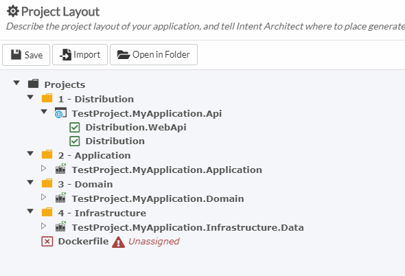
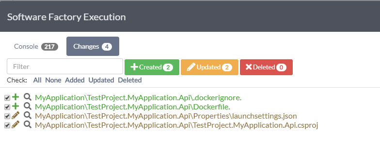
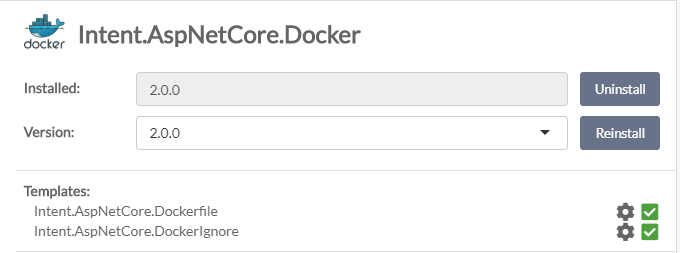

# Project Layout (with Roles)

## Overall layout

Since we need to generate code at the end of the day, we need to tell Intent Architect where to place it.

This can be located by clicking on `Project Layout`, located on the left-hand panel.

You'll notice a gray folder called `Projects`. This is there by default. It cannot change.

Inside that folder there are yellow folders. At the moment, they represent the virtual folders found in Visual Studio.

Within those folders you may add different project types. In the sample image above you will notice a `Web project` type and a couple of `Class project` types.

You may customize your solution to your hearts content by creating different folders and moving/modifying the projects already contained within.

If you were to open up Visual Studio, you will find that the layout above corresponds with the Visual Studio tree layout:

## Roles

One thing we need to cover in particular is the concept known as `Roles`.
Roles play an important "role" in telling Intent Architect where to generate some files.
You will notice that there are many green checkmarks found in the image above. Those are commonly known as `Roles`.
A `Role` associates an Intent Architect [Module](xref:Modules) with a Project or Folder.
When a developer installs a new Module, a typical new Role gets created and placed inside the Project Layout but as "unassigned".

In order to assign that `Role`, the developer needs to drag that `Role` to a `Project` or `Folder`.

So let's assume for a minute that we don't have any Docker modules installed. The moment we install `Intent.AspNetCore.Docker`, it will add a new `Role`.

To assign this `Role`, you need to click and drag it to where it needs to be.

So now if you were to run the Software Factory, you will notice that it will put the `Dockerfile` in the project where we assigned it (i.e. `TestProject.MyApplication.Api`).

Should we drag `Dockerfile` now to `TestProject.MyApplication.Application`, we will see that the Software Factory run will attempt to generate the file there.

And so, each Module will have potentially their own `Roles` that they will install that the developer will need to assign to a given Folder or Project.

At the moment, there is no way to determine which Module installs which `Role` other than manually opening the Module settings and inspecting them one-by-one (unless you can inspect the source code).

