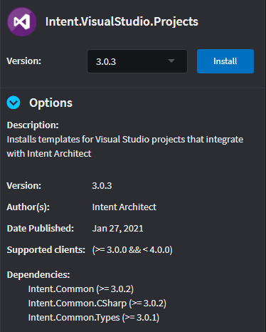

# 2. Install and run the Module

When creating Modules it is often very useful to have a _test_ Application that we can use to test that our Modules are working correctly. This tutorial explains how to create this _test_ Application and how to install and run the Module we created in the [previous tutorial](1-create-a-simple-module.md).

## Create an empty Application
To get started, let's create an empty Application.
1. From the home view, click `Create a new application`.
2. Set the Application's name, location and Solution name. _NOTE: You can ignore which Application Template is selected. It won't affect an empty application._
3. Click `CREATE EMPTY`.
4. When prompted with a confirmation, click `YES` to continue.
5. Close the `Application Installation` dialog.

>[!NOTE]
>We typically create Applications with an [Application Template](create-an-application-template.md). Empty Applications are useful when there isn't an Application Template that fulfils our needs.

## Set up Visual Studio projects
Application's need a way to know where to output specific code files. Since we're working in .NET we can install the `Intent.VisualStudio.Projects` - a module that installs a Designer to configure our project structure.

To install this module we must navigate to the `Modules` tab within our application.
1. Search for the `Intent.VisualStudio.Projects` Module by typing "visual" into the filter.
2. Select the Module.

3. In the details pane, Click `Install` to install the latest version.

4. Intent Architect will install the module and it's dependencies. Close the `Installation Manager` once it's finished.

You may have noticed that a new `Visual Studio` Designer was installed into our Application. It will allow us to structure the C# projects in our codebase. For this tutorial, we can set up a typical web application project structure which separates Domain, Infrastructure and Api concerns.

1. Click on the `Visual Studio` Designer
2. Create a new `Visual Studio Solution` package by clicking on the `CREATE NEW PACKAGE` button.

3. Fill in the name of the Visual Studio solution, then click `DONE`.

4. Next, create a set of projects by right-clicking on the new Visual Studio Solution package and selecting the project type. We will create an `ASP.NET Core Web Application` and two `Class Library (.NET Core)` projects in this tutorial.

The application structure should look as follows:

## Install the Module

## Run the Module

## Debugging the Module