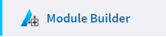
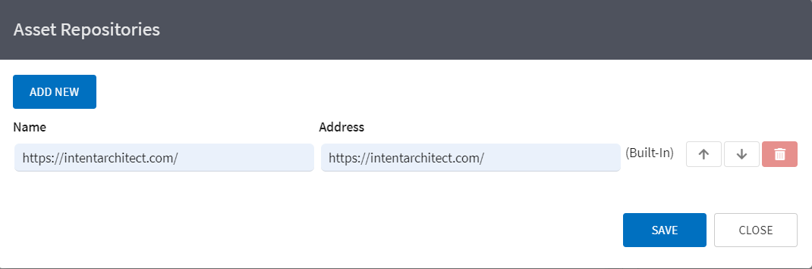

# Create a simple Module

## Prerequisites

This guide has the following prerequisites:

 - Please ensure that you have followed this [article](xref:CreateWorkspace) first before attempting this one. You should have a simplistic Workspace with one application that you will use for testing your Module that you are going to create now.
 - Visual Studio doesn't offer T4 Template highlighting. We advise you get this extension before starting: [https://t4-editor.tangible-engineering.com/T4-Editor-Visual-T4-Editing.html](https://t4-editor.tangible-engineering.com/T4-Editor-Visual-T4-Editing.html). 

## New Module Application

Our aim for this tutorial is to create a Module that will generate a single file in our Workspace application. This tutorial will be another stepping stone which will lead us to a further feature extensions down the line.

Go to your Intent Architect solution view (the view that shows all your applications). This can be achieved by clicking on the top-most option of the left-hand panel (right underneath the Intent Architect logo).

You will notice where your created application is, that there is another button that will allow you to create another Application. Click on it to open the new Application dialog.

Choose the `Intent Module Builder` Application Template and give it the name (for example) "ClassEntityModule".
Don't create an Empty project, rather click on Next. 

Please select the Module `Module Builder - C#`.

Once you have created the Application and allowed the setup to complete, please navigate to the `Module Builder` designer. 

Create the package and call it (for example) "Class Entity".
Right click on the Package and select `New C# Template`.
Give it the name `ClassEntity` and the type should be `Single Model`.

You are now ready to run the Software Factory. 

Click on the `Play` button in the top right corner.

Apply the changes that it recommends to you.
Once it is done, navigate to the folder where the ClassEntityModule Application has been generated to and open the Visual Studio solution.

Go to the `ClassEntityModule` Project and expand the `Templates` folder as well as the `ClassEntity` folder. You should observe there to be 3 files:

 - `ClassEntityTemplate.tt` - This is a T4 Template.
 - `ClassEntityTemplatePartial.cs` - This is the code-behind for the Template.
 - `ClassEntityTemplateRegistration.cs` - This will register the template in order to generate code during the Software Factory run.

We are not going to change or explain those files at this time. But feel free to open them and see what they are about, especially the T4 file since this will give you an indication of what the final output will look like.

Right click on your Project and select `Rebuild`.
You will notice in the build output that it created a file called `Class Entity.1.0.0.imod`. This is our Module file. It will be located in your `Intent.Modules` folder.

Now please navigate to your Workspace Application in Intent Architect. You can quickly switch between Applications by clicking on your Application name on the left-hand panel and observing a dropdown appearing, allowing you to select between two Applications.
Open up the Modules display by clicking on the `Modules` option on the left-hand panel.

Since this is the first time that we are installing a custom Module that we have created inside this Solution, we need to add a Module Repository that will look in our local Module directory. So on the far right you will notice a dropdown called `Repository Source` and next to it, it will have a Gear icon. Click on that icon.

Add the following entry:
 - Name: `Local`
 - Source: `Intent.Modules`

Once you have saved, select that newly created Repository source from the dropdown control and observe that your module will appear.
Select it and click on the `Install` button on the far-right side of the screen.

Once the installation is complete, click on the `Visual Studio` option on the right-hand panel.
You will notice an item being created called `Class Entity.ClassEntity`. This is the template that exists in your Module.
We need to assign that Template to a project in order to tell it where to generate the file output during the Software Factory run.
So click and drag that item to your Project underneath it and click on Save.

Once you run the Software Factory process again, you will notice some changes that wants to be applied to your Workspace Project. You will see that the template you created in your module wants to create a file called `ClassEntity.cs` in your Project (that you assigned it to). Apply those changes and open your Workspace Project to confirm that the file is generated and that it correlates to the Template contents.

