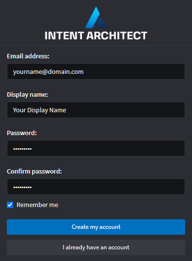

# Get the application

## Install Intent Architect
The latest version of Intent Architect can be downloaded for either Windows or iOS from the website **[HERE](https://intentarchitect.com/#/downloads)**.

Once downloaded, execute the installation file. 

>[!NOTE]
>Our releases are digitally signed, safe and unintrusive.

## Create an account
As a new user, creating an account can be done from within Intent Architect. Follow these steps to create your new account:
1. Launch Intent Architect
2. Fill in your account email address, display name (e.g. first name and surname) and password

3. Click **Create my account**.

Intent Architect will automatically log in once your account has been created.

>[!NOTE]
>Your information is kept 100% private and secure. We do not share any of your personal information with third parties.

## What's Next
#### [Take a tour of Intent Architect](xref:getting-started/take-a-tour)
Discover the key concepts in Intent Architect.