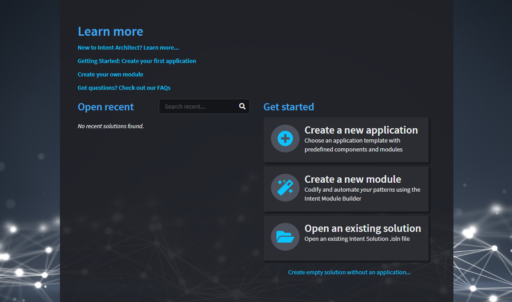
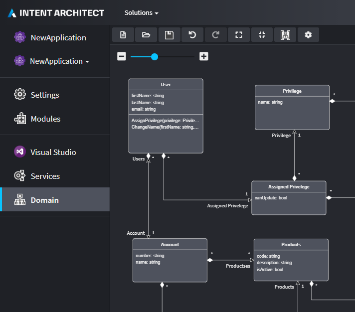

# Take a tour

## Introduction
This tour covers the key concepts in Intent Architect at a high-level. The aim is to introduce each concept without going into too much detail. Let's get started.

Once [installed and logged in with your account](get-the-application.md), you will be routed to the home view of Intent Architect. From here you have options to `Create a new application`, `Create a new module`, or `Open an existing solution workspace`.

Previously opened solutions will be listed under the **Open recent** header for quick access later on.

## Applications
Applications in Intent Architect represent a _scope of code files_ that we want to automate. It could be a full-stack monolithic application, a microservice, or even just a single folder in which we wish to generate and manage files.

Applications are fundamentally composed of installed Modules, Designers and some high-level configuration settings. These concepts will be discussed later in the tour.

Creating a new application in Intent Architect can be done by clicking on the "Create a new application" button in the home view to launch the _Create application_ wizard.

The first page of the wizard lists the available [Application Templates](#Application-Templates) in the selected repository (by default this will be Intent Architect's website [http://intentarchitect.com] but could be a local directory or network location. [Learn how to change your default repositories here](../how-to/change-user-settings.md)).
Here you can search and choose which application template you want and set key settings like the Application's name, directly location and [Solution](#Solution) name.

>[!NOTE]
>It is possible to create an empty application by clicking on the `CREATE EMPTY` button instead of `NEXT`. This would create a new application without any Modules or metadata installed.

### Application Templates

Application Templates are pre-configured templates for new Applications that ultimately define and constrain which Modules to install and what default metadata should be created in the [Designers](#Designers).

To illustrate this, let's create a sample .NET Core Application using the `Clean Architecture .NET Core 3.1` Application Template. Following the steps we took above, select the template and fill out the Application's name, location, and the Solution name, then click `NEXT`. The wizard then moves to next page which displays the high-level _Components_ that make up the template.

The Components listed represent one or more Module that must be installed into the new Application. Each component may be included or excluded as required. To see exactly which Modules will be installed, we can expand the Component list on the right side of the page.

Here we can see exactly which modules would be installed from the selected Components.

To create the Application we then click on the `CREATE` button.

Intent Architect will download and install the Modules correlating to the selected Components, as well as create any default metadata that is required.

_The modules downloaded in the example above are specifically related to the `Clean Architecture .NET Core 3.1` Application Template._

>[!NOTE]
>Although this example is based in .NET, this process would work in the same way for other Application Templates that are designed for other languages.

## Application Settings
Once Intent Architect has finished installing the application, it will open it automatically on the _Settings_ tab.

Here you will be able to rename the Application, change it's icon, add a description and change the _Relative Output Location_.

Below the _Relative Output Location_, Intent Architect shows the full path into where code will be created. To open this location in the default file explorer, you can simply click on the full path _link_.

>[!NOTE]
>If the path doesn't exist yet, it won't be able to open.

## Modules
Modules are the _building blocks_ and artifacts of pattern reuse in Intent Architect.

Typically, the purpose of a Module is to generate and manage a set of code files in a codebase, usually around a particular architectural pattern. This could for example be the entities in our domain, simple bootstrapping files, ORM mappings, controllers in our Api, etc.

Modules have similarities with package systems such as Nuget, NPM, and Maven. However, where the primary objective of these system is to make code-reuse easier, the primary objective of Modules is _pattern-reuse_. 

Modules have versions and dependencies, and don't directly introduce any runtime dependencies. The can, however, be configured to introduce package dependencies if the designer of the Module so chooses.

_This example shows the list of Installed Modules in our sample application. The `Intent.Application.MediatR` module has been selected, with its details displayed in the pane on the right._

>[!NOTE]
>When you select an installed Module, Intent Architect gives a view into the internals of that module (i.e. the Templates, Decorators, and Factory Extensions it is made up of).

## Designers
Designers in Intent Architect allow you describe aspects of your application's design as visual models and hierarchical concepts. For example, this may include the entities in a domain, the services that make up the applications API, and events that are published and subscribed. 

Designers are added to the Application when a Module that has designer configuration is installed. You can therefore choose which Designers you would like to use in your Application.

In our sample application, the following image shows a Domain model inside of the Domain Designer.

## Software Factory Execution

## Solution