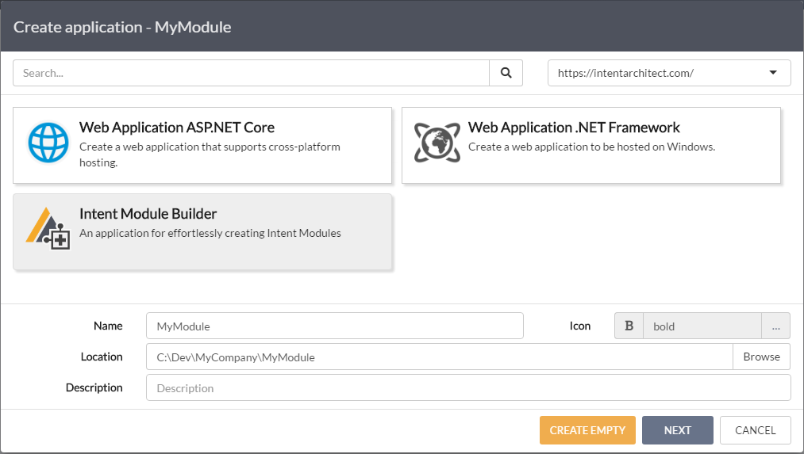
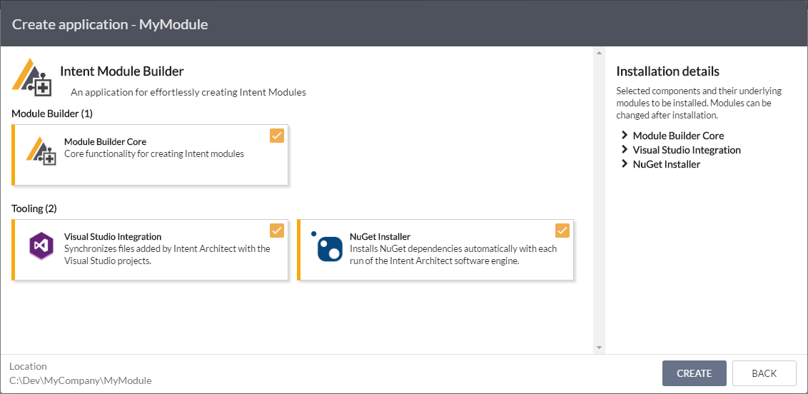
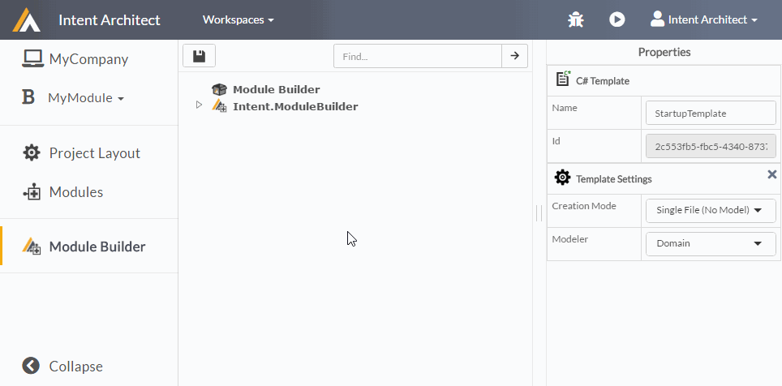
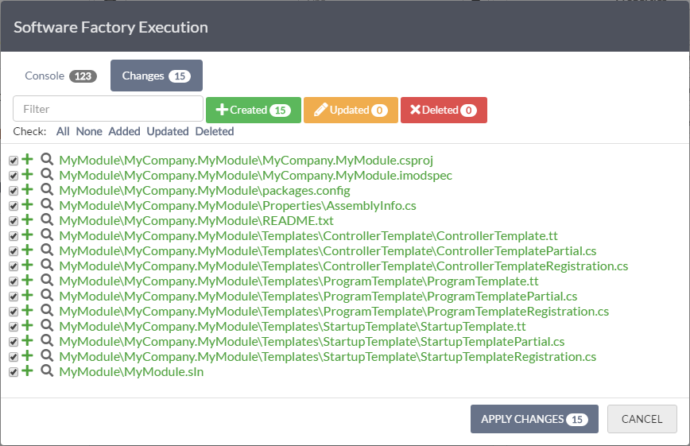
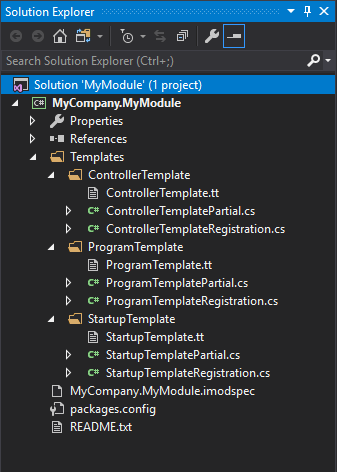

# Create your own Module

Modules are the building blocks and extension points of Intent Architect. They typically encapsulate _how_ your metadata should be realized as code in your application. 

By creating modules to automate the repetitive coding tasks that you as a developer do, you effectively save yourself (and your team!) all that time and effort. In addition, you no longer have to manage the each instance of the automated pattern, but rather can upgrade the Module and update all instances at once.

_**"Automation is to your time, what compounding interest is to your money"** ~ Rory Vaden_

This guide will take you through the process of creating an Intent Architect Module using the _Intent Module Builder_ application template.

The aim is to create a Module to automate the setup of ASP.NET Core web services. In th


>[!TIP]
>A basic knowledge of Intent Architect is required for this guide. If you are new to Intent Architect, it is recommended that you do the [Create an ASP.NET Core web app](create_an_aspnetcore_web_app.md) tutorial before attempting this one.

## Prerequisites

This guide has the following prerequisites:
 - Visual Studio 2015 or later
 - Intent Architect is installed. [See here for installation instructions](create_an_aspnetcore_web_app.md#1-installing-and-running-intent-architect).
 - A workspace has been created. [See this for how to create a workspace](create_an_aspnetcore_web_app.md#2-create-a-workspace).

## 1. Creating an Intent Module Builder application

To create an Intent Module Builder application, **click the New Application tile from within the workspace.**

A `Create application` wizard will be displayed, presenting a set of `application templates`.

- Select the `Intent Module Builder` application template.
- Capture the Name, Location, Icon and Description (option) of your module builder.


*Select the Intent Module Builder application template*

**Click `NEXT`.**

The `Intent Module Builder` application template provides a set of components which are required for the module builder to work out the box.

**Leave all components selected and click `CREATE`.**


*Select the Intent Module Builder application template*

Intent Architect will download the necessary Modules, and once complete the application will open automatically. You can **close the Installation Manager** once this process is complete.


## 2. Defining Templates

For a basic ASP.NET web application, we need our module to create the following classes when executed:
 - `Program.cs` - the standard ASP.NET Core Program class
 - `Startup.cs` - the standard ASP.NET Core Startup class
 - `{Service.Name}Controller.cs` - a controller for every service that we define within the Intent Architect `Services` modeler.

To do this we must navigate to the `Module Builder` modeler and **create a `C# Template` for each of the above.** 

>[!TIP]
>Templates represent file outputs that a Module must make. The Intent Module Builder supports two types of templates:
>1.	**File Templates** – any text file can be created using this template types.
>2.	**C# Templates** – since Intent supports intelligent weaving in C# files, this template type wires this up. It is recommended to use this type of template for all C# classes as the weaving systems allow user-managed code to co-exist with Intent-managed code within the same file.
     

Both the `Program.cs` and `Startup.cs` files are single files. To ensure that only a single file is created we need to set the `Creation Mode` template setting to `Single File (No Model)`. On the contrary, the `Controller` template must create a class for every Service that we create. We therefore set the `Creation Mode` to `File per Model` and the `Modeler` setting to `Services`.

How to do this is illustrated below:


*Create C# Templates in the Module Builder*

>[!TIP]
>The `Creation Mode` setting of a template determines what metadata format the template expects, and how files from a template must be created:
>1.	**Single File (No Model)** – create a single file without any additional metadata needed. A standalone C# class or ReadMe file would be examples of this template setting. 
>2.	**Single File (Model List)** – create a single file which takes in a list of metadata models. This is useful for creating classes which register other classes.
>3.	**File per Model** – create a file per metadata model. This is useful for creating a file based on a model such as a Domain class, Service, or DTO.
>4. **Custom** – you're on your own on this one. A `Registration` class (responsible for constructing template instances) won't be created for this template. You will have to create one yourself. This is useful when you want to create instances of a file in ways that are not supported by the previous options.

>The `Modeler` setting determines which _type_ of modeler the metadata should be fetched from for the template. This can be `Domain`, `Services`, `Eventing`, etc. When setting up your Module, the `Intent Module Builder` will automatically add the modeler dependency depending on which `Modeler` you have selected. Nice :)


## 3. Run the `Software Factory`

To run the `Software Factory`, **click the _'play'_ button** in the top right hand corner (or press F5).

The following outputs are staged before being applied:


*Software Factory Execution - staged outputs*

**Click the `APPLY CHANGES` button.**

The `Software Factory` will apply the staged code changes from the list, and install the required NuGet packages. Once the NuGet packages have been installed, we can close the `Software Factory Execution` window.

**Click the `CLOSE` button.**

Our module has now been created and wired up. Next, we need to implement our templates to give the desired output.

## 4. Implementing the Module Templates

**Open the generated Module solution in Visual Studio.** The Visual Studio Solution (`.sln`) file is located in the application folder. A shortcut to navigate here is to click on the 'Open in Folder' button in the 'Project Layout' view the application.

The solution will be layed out as follows:



*Module layout in Visual Studio*

>[!TIP]
>In the solution we will find an [Intent Module Specification](../modules/imodspec_file.md) (`.imodspec`) file, a `README.txt` file, and our three templates under the 'Templates' folder.

>Notice that each template has three files:
>1.	**T4 Template file** – defines the template logic and output. [Learn more about T4 Templates.](https://docs.microsoft.com/en-us/visualstudio/modeling/code-generation-and-t4-text-templates?view=vs-2017)
>2.	**Template Partial file** – this is a partial class to the T4 template and is responsible for defining the settings of the template and any ‘code-behind’ methods for the T4.
>3.	**Template Registration file** – this file determines how the template is created (i.e. it determines how many output instances must be created, and what _metadata_ should be loaded and passed to each template instance.)

Let's begin with the `ProgramTemplate`. **Open the `ProgramTemplate.tt` T4 file**. The file is generated as follows:

```csharp
<#@ template language="C#" inherits="IntentRoslynProjectItemTemplateBase<object>" #>
<#@ assembly name="System.Core" #>
<#@ import namespace="System.Collections.Generic" #>
<#@ import namespace="System.Linq" #>
<#@ import namespace="Intent.Modules.Common" #>
<#@ import namespace="Intent.Modules.Common.Templates" #>
<#@ import namespace="Intent.Metadata.Models" #>

using System;
<#=DependencyUsings#>
// Mode.Fully will overwrite file on each run. 
// Add in explicit [IntentManaged.Ignore] attributes to class or methods. Alternatively change to Mode.Merge (additive) or Mode.Ignore (once-off)
[assembly: DefaultIntentManaged(Mode.Fully)]

namespace <#= Namespace #>
{
    public class <#= ClassName #>
    {
    }
}
```

The template above will simply output an empty C# class. The `ClassName` and `Namespace` are determined by the Template's metadata, which can be found by opening the `ProgramTemplatePartial.cs` file and viewing the `DefineRoslynDefaultFileMetaData` method:

```cs
protected override RoslynDefaultFileMetaData DefineRoslynDefaultFileMetaData()
{
    return new RoslynDefaultFileMetaData(
        overwriteBehaviour: OverwriteBehaviour.Always,
        fileName: "Program",
        fileExtension: "cs",
        defaultLocationInProject: "",
        className: "Program",
        @namespace: "${Project.Name}"
    );
}
```

Here we can see that the `ClassName` will be `"Program"`, and the namespace will be dynamically set to the name of the project in which it is outputted (`${Project.Name}`).

>[!TIP]
>Visual Studio unfortunately doesn't offer syntax highlighting on T4 files out the box. We recommend installing the [tangible T4 Editor](https://t4-editor.tangible-engineering.com/T4-Editor-Visual-T4-Editing.html) extension for Visual Studio.

>It isn't required to implement Templates using T4, although we do recommend it. If you'd like to implement a template using a `StringBuilder` or other technology, delete the T4 file and implement the `string TransformText()` method in the Template Partial file.

**Update the contents of the `ProgramTemplate.tt` as follows:**

```csharp
<#@ template language="C#" inherits="IntentRoslynProjectItemTemplateBase<object>" #>
<#@ assembly name="System.Core" #>
<#@ import namespace="System.Collections.Generic" #>
<#@ import namespace="System.Linq" #>
<#@ import namespace="Intent.Modules.Common" #>
<#@ import namespace="Intent.Modules.Common.Templates" #>
<#@ import namespace="Intent.Metadata.Models" #>

using System;
<#=DependencyUsings#>
[assembly: DefaultIntentManaged(Mode.Fully)] // Overwrite file on each Software Factory run.

namespace <#= Namespace #>
{
    public class <#= ClassName #>
    {
        public static void Main(string[] args)
        {
            BuildWebHost(args).Run();
        }

        public static IWebHost BuildWebHost(string[] args) =>
            WebHost.CreateDefaultBuilder(args)
                .UseStartup<Startup>()
                .Build();
    }
}
```

