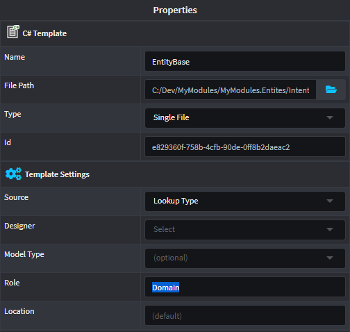

# Auto-assign Template Outputs

Intent Architect allows Template Outputs to be automatically assigned when a Module is installed or updated. This is done through _Roles_.

By creating a _Role_ in the Output Location (e.g. C# Project or Folder) and assigning that name to the Template, Intent Architect will automatically create the Template Output in the Output Location.

## Creating a Role

For example, in the `Visual Studio` Designer, to create a Role:

1. Right-click the Project or Folder that you would like to add the Role under.
2. Save your changes.
    

## Assigning a Role to a Template

For a Template Output to automatically find this Role, we need to assign it to the Template.

1. Open the `Module Builder` of your Module.
2. Select the Template to assign the Role.
3. Set the Role field in the Template's `Template Settings` as the same name as the Role we created above.

    

## Install the Module

Now, when you install the Module, Intent Architect will automatically assign the Template Output under the project with the same Role.

![Template Output Assigned](images/visual-studio-template-output-assigned.png
