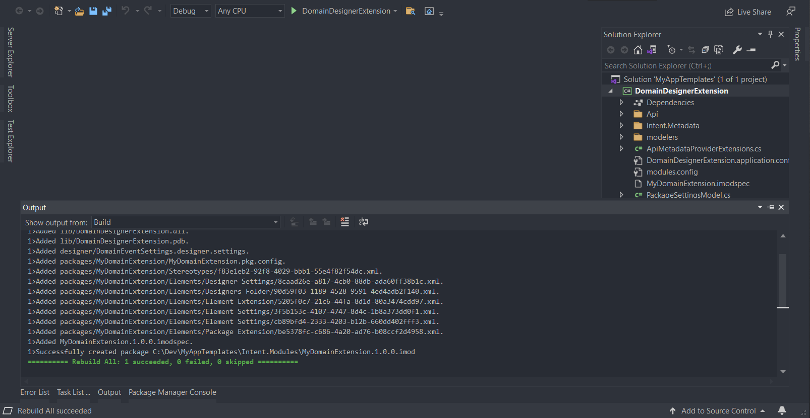

# Create a Designer Extension

If you have worked in Intent Architect's available set of designers such as the Services or the Domain designer, chances are you might have asked yourself the question whether you could change them to some extent.
In this how-to you will learn how to add your own Element to a Domain designer (or any other designer) and be able to reference it in the designer as if it is an actual type and be able to generate content from that new element.

Create a new Module Builder application and give it the name `DomainDesignerExtension`.

And select the `Module Builder - C#` option and click on `Create`.

Once the installation dialog is complete you can click on `Close`.

Click on the `Module Builder` designer and create a package with the name `MyDomainExtension`.

After that, go ahead and install the metadata for the Domain designer.

<video style="max-width: 100%" muted="true" loop="true" autoplay="true" src="videos/install-domain-module-metadata.mp4"></video>

Return to the `Module Builder` designer and setup the following:

Reference the Domain designer in the `MyDomainExtension` package.
This will make our elements bundled with the `MyDomainExtension` package and targeting the `Domain` designer.

<video style="max-width: 100%" muted="true" loop="true" autoplay="true" src="videos/design-setup-designer-reference.mp4"></video>

Create our `Domain Event` Element with its `Property` Element so that we have something to install in the `Domain` designer.

<video style="max-width: 100%" muted="true" loop="true" autoplay="true" src="videos/design-setup-element.mp4"></video>

Create the Package extension and Folder extension elements which will allow us to setup the Creation of our `Domain Event` element within Packages and Folders inside the `Domain` designer.

<video style="max-width: 100%" muted="true" loop="true" autoplay="true" src="videos/design-setup-element-creation.mp4"></video>

Lastly, let's setup a Stereotype that will allow us to reference our newly created `Domain Event` within a `Class` element.

<video style="max-width: 100%" muted="true" loop="true" autoplay="true" src="videos/design-setup-stereotype.mp4"></video>

Run the Software Factory to apply the following changes in staging

You can click on `Apply` and once that is done continue to build the solution in Visual Studio.

# Test your Designer Extension Module

Open up the [Repository Manager](xref:how-to-guides.manage-repositories) to point to your newly created Module folder.

Add your Repository to the list as shown in the image above. Let it point to your folder where your compiled Module is located.

Open or create the Intent Architect application where you want to install your newly created Module.
Click on the Modules option on the panel to the left.
Select your repository from the drop-down on the right and locate your Module to install.

Now you can see your new Designer extension in action

<video style="max-width: 100%" muted="true" loop="true" autoplay="true" src="videos/test-module-domain.mp4"></video>
