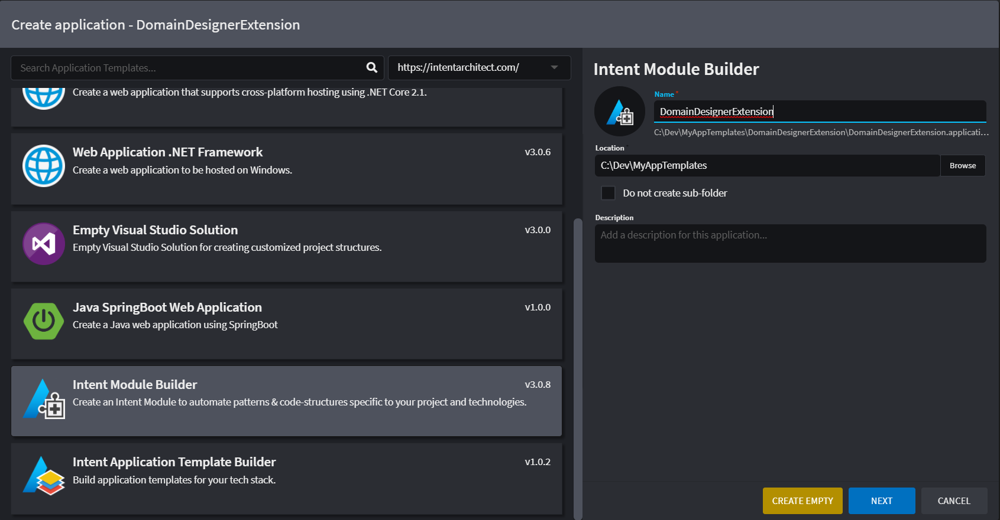
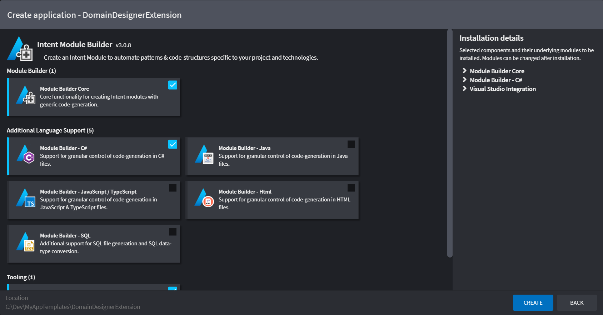
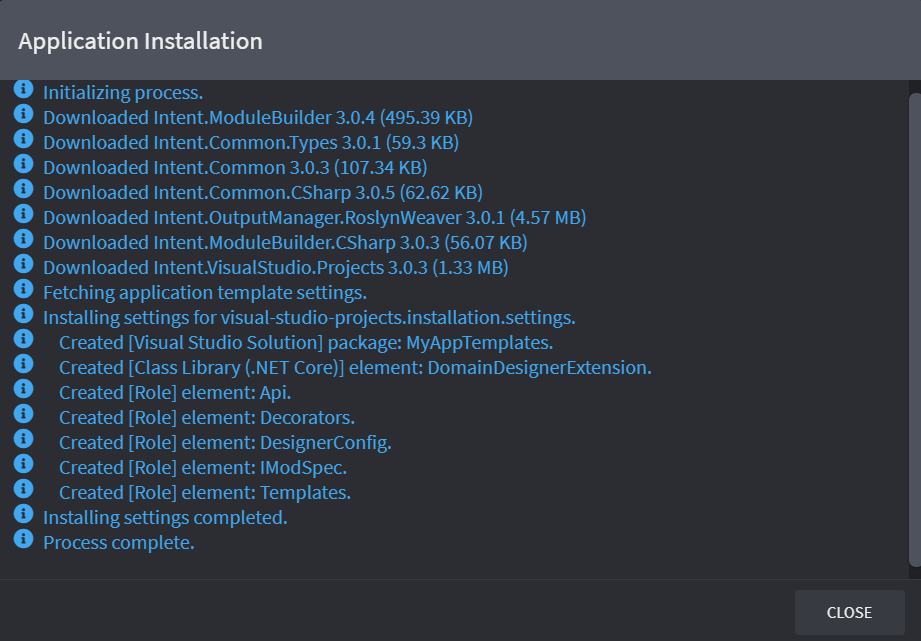
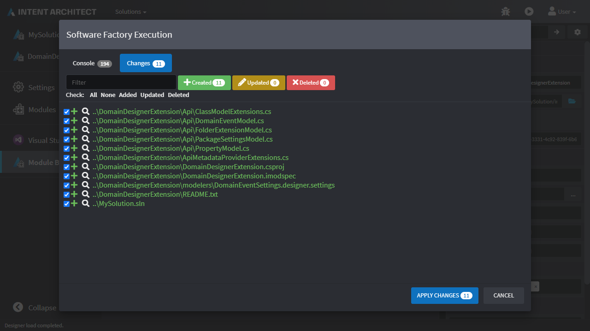
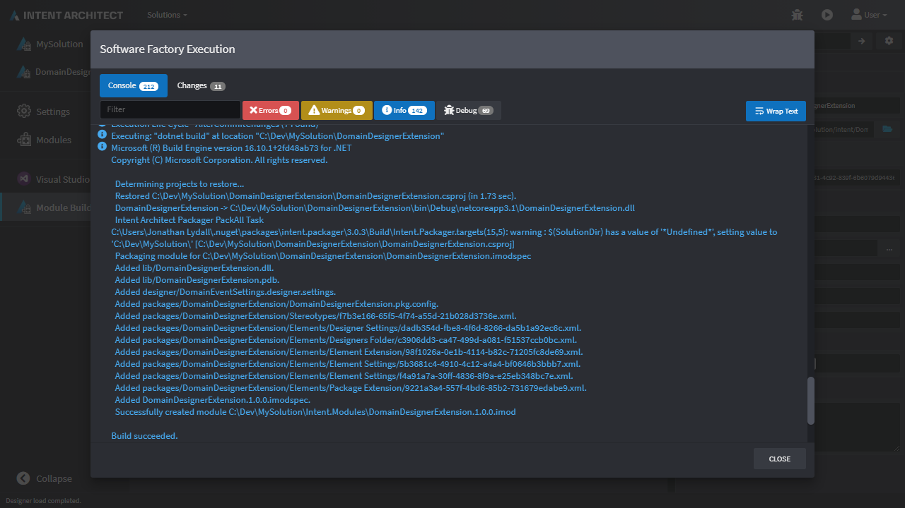
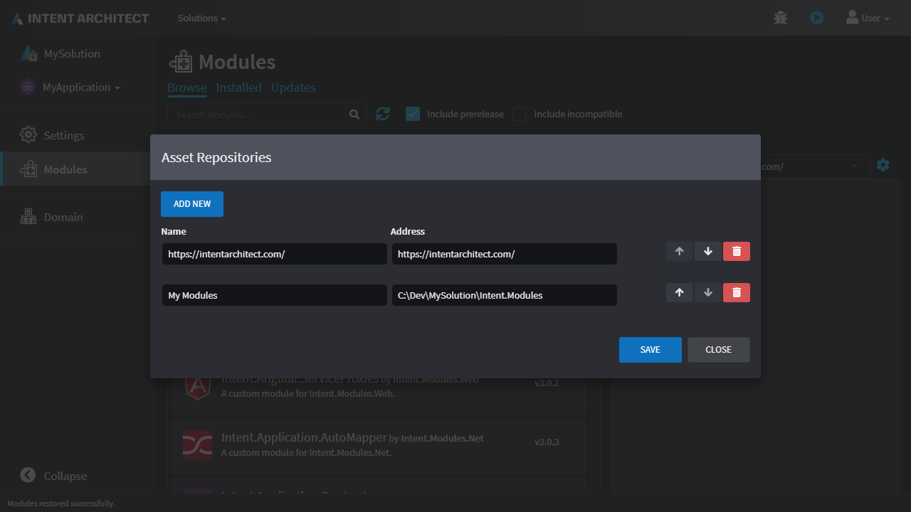
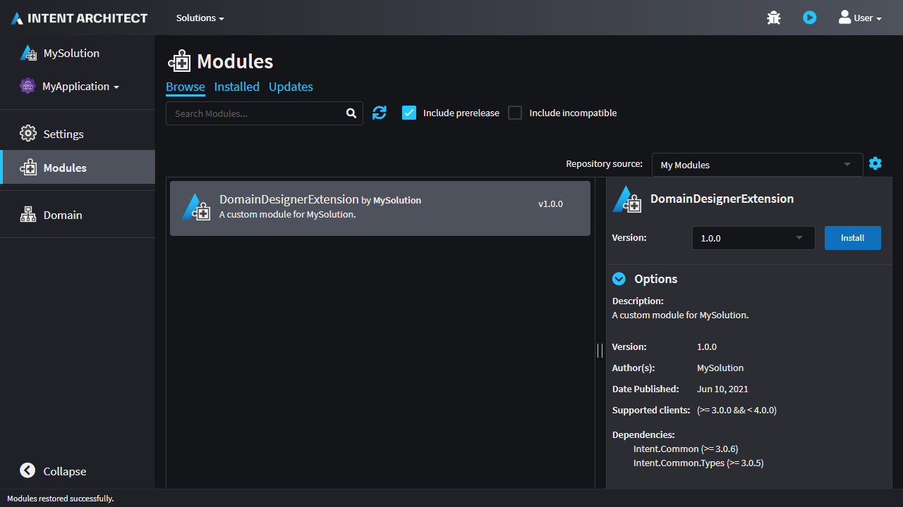

# Create a Designer Extension

This how-to guide will walk you through creating a [Designer Extension](xref:references.designer-extensions) which extends the [Domain Designer](https://github.com/IntentSoftware/Intent.Modules/tree/master/Modules/Intent.Modules.Modelers.Domain) such that in addition to everything it already supports, it will also allow:

- Adding a new element of type `Domain Event` which can be added through a context menu option on folders.
- Ability to apply a new Stereotype to `Class` elements.
- Have a property on the above Stereotype which allows selection of `Domain Event` element types created in that Designer's Package.

## Create a new Application

Create a new `Module Builder` application and give it the name `DomainDesignerExtension`:



Click `NEXT` and on the following screen ensure that the following extra options are ticked:

- `Module Builder - C#`.
- `Auto-Build Module`:



Click `CREATE`:



Once the `Application Installation` is complete, click `CLOSE`.

## Install the Domain designer

- Click on `Modules` on the left.
- Search for `Intent.Modelers.Domain`.
- Expand `Options` on the right.
- Check `Install metadata only`.
- Click `Install`:

<p><video style="max-width: 100%" muted="true" loop="true" autoplay="true" src="videos/install-domain-module-metadata.mp4"></video></p>

## Configure the package to reference the domain designer

- Click on the  `Module Builder` Designer on the left.
- Select the top-level Package node and in the Properties pane on the right:
  - Check `Include in Module`.
  - Add `Domain` to `Reference in Designer`.

<p><video style="max-width: 100%" muted="true" loop="true" autoplay="true" src="videos/design-setup-designer-reference.mp4"></video></p>

## Create and configure the `Domain Event` element

- Right-click the root Package element and click the `Add Designers Folder` option.
- Right-click the `designers` element and click the `New Designer Settings` option.
- Give the new element a name of `DomainEventSettings`.
- Select the `DomainEventSettings` element and in the Properties pane on the right:
  - For `Extend Designers` add `Domain`.
- Right-click the `DomainEventSettings` element and click the `New Element Type` option.
- Give the new element a name of `Domain Event`.
- Right-click the `Domain Event` element and click the `Add Element Settings` option.
- Give the new element a name of `Property`
- Select the `Property` element and in the Properties pane on the right:
  - Change `Mode` to `Required`.
  - For `Target Types` add `Class`, `Enum` and `Type-Definition`.
- Right-click the `[context-menu]` element (the one directly within `DomainEventSettings`) and click the `Add Element Creation` option.
- Give the new element a name of `Add Property` and select the `Property` type for it:

<p><video style="max-width: 100%" muted="true" loop="true" autoplay="true" src="videos/design-setup-element.mp4"></video></p>

## Create an `Add Event` context menu option for `Folder` elements

- Right-click the `DomainEventSettings` and click the `New Element Extension` option.
- Give the new element a name of `Folder Extension` and select the `Folder` type for it.
- Right-click the `Folder Extension` element and click the `Add Menu Options` option.
- Right-click the `[context-menu]` element (the one directly within `Folder Extension`) and click the `Add Element Creation` option.
- Give the new element a name of `Add Event` and select the `Domain Event` type for it:

<p><video style="max-width: 100%" muted="true" loop="true" autoplay="true" src="videos/folder-add-event-context-menu-option.mp4"></video></p>

## Create an `Add Event` context menu option for `Package` elements

- Right-click the `DomainEventSettings` and click the `New Package Extension` option.
- Give the new element a name of `Package Settings` and select the `Domain Package` type for it.
- Right-click the `[context-menu]` element (the one directly within `Package Settings`) and click the `Add Element Creation` option.
- Give the new element a name of `Add Event` and select the `Domain Event` type for it:

<p><video style="max-width: 100%" muted="true" loop="true" autoplay="true" src="videos/package-add-event-context-menu-option.mp4"></video></p>

## Create the Stereotype

- Right-click the root Package element and click the `New Stereotype-Definition` option.
- Give the new Stereotype Definition a name of `Has Domain Event`.
- Select the `Has Domain Event` element and in the Properties pane on the right:
  - For `Targets` add `Class`.
- Right-click the `Has Domain Event` element and click the `Add Property` option.
- Give the Property a name of `Event`.
- Select the `Event` element and in the Properties pane on the right:
  - Change `Control Type` to `Select`.
  - Change `Option Source` to `Lookup Element`.
  - For `Lookup Types` add `Domain Event`:

<p><video style="max-width: 100%" muted="true" loop="true" autoplay="true" src="videos/create-the-stereotype.mp4"></video></p>

## Run the Software Factory to generate the module

Run the Software Factory and optionally review the proposed changes:



Click `APPLY CHANGES`.

After the Software Factory has applied the changes, you'll see that it runs `dotnet build` on the generated `Visual Studio` solution:



Take note of the following line in the output for the following step:

```text
Successfully created module C:\Dev\MySolution\Intent.Modules\DomainDesignerExtension.1.0.0.imod
```

Click `CLOSE`.

## Test your Designer Extension Module

Ensure you have added the output path as noted in the above step as a repository in the [Repository Manager](xref:how-to-guides.manage-repositories). For the above output, the full path of the module is `C:\Dev\MySolution\Intent.Modules\DomainDesignerExtension.1.0.0.imod`, so the repository would point to its folder, which is `C:\Dev\MySolution\Intent.Modules`:



- Open or create the Intent Architect application where you want to install your newly created Module.
- Click on the Modules option on the panel to the left.
- Ensure the application has the `Intent.Modelers.Domain` module installed.
- Select your repository from the drop-down on the right and locate your Module to install:



You will now have the option of creating the new `Domain Event` element and using it in the `Has Domain Event` Stereotype that was added by the Designer Extension we created above:

<p><video style="max-width: 100%" muted="true" loop="true" autoplay="true" src="videos/test-module-domain.mp4"></video></p>

## See also

- [](xref:references.designers)
- [](xref:references.designer-extensions)
