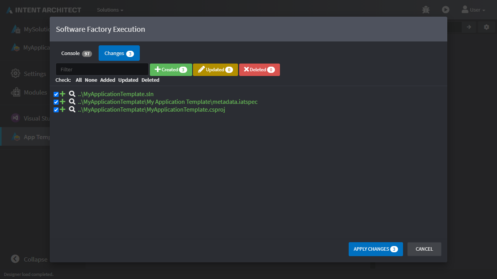
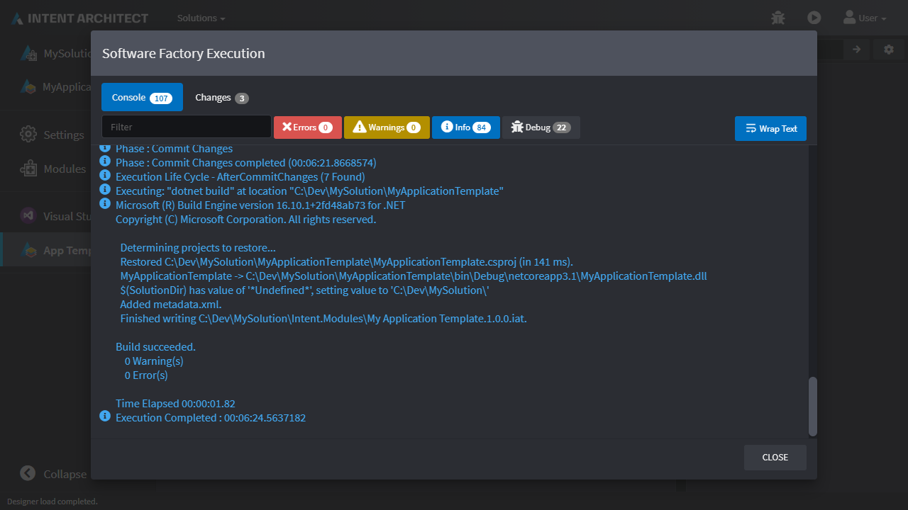
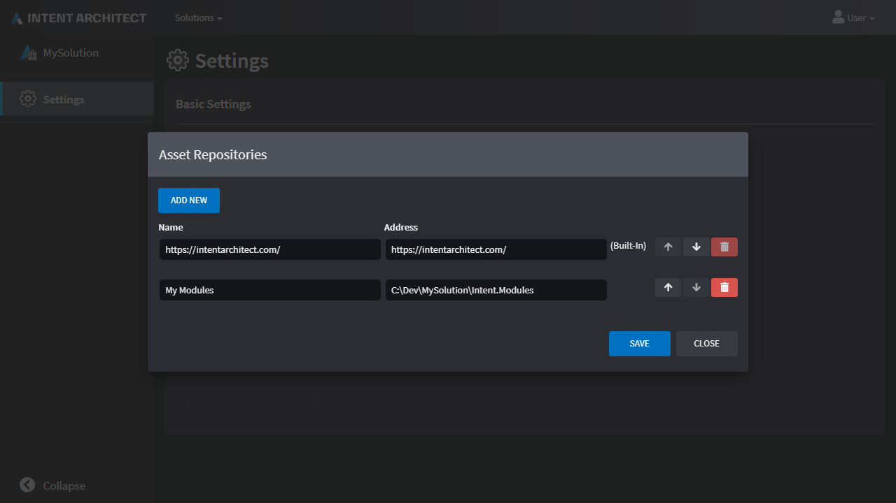
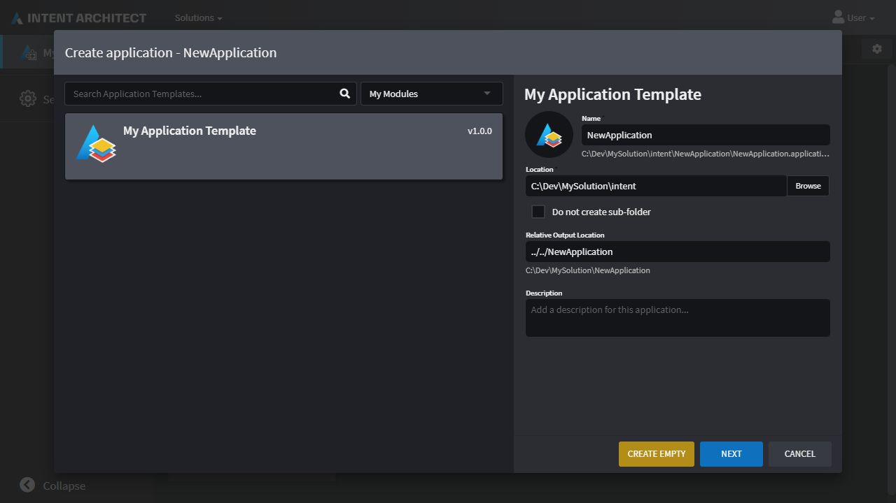
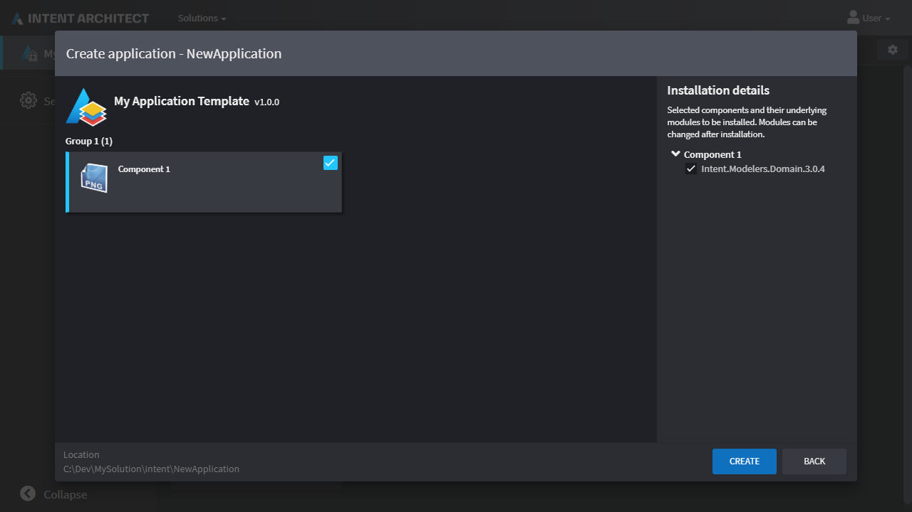

# Create an Application Template

This how-to guide will walk you through creating your own [Application Template](xref:references.application-templates) using the `Intent Application Template Builder` [Designer](xref:references.designers).

## Create a new Application

Create a new `Intent Application Template Builder` application and give it the name `MyApplicationTemplates`:


- Click `NEXT`.
- Leave the ticked options as is and click `CREATE`:


Once the `Application Installation` is complete, click `CLOSE`.

## Create a new Package

- Click on the `App Templates` Designer on the left.
- Click `CREATE NEW PACKAGE`.
- Give the package a name of `My Application Template`.
- Click `DONE`.
- Click the root Package element and in the Properties pane on the right:
  - For `Display Name` enter `My Application Template`:

<p><video style="max-width: 100%" muted="true" loop="true" autoplay="true" src="videos/create-package.mp4"></video></p>

## Specify a Group and a Component

- Right-click the root Package element and click the `New Group` option.
- Give the new element a name of `Group 1`.
- Right-click the `Group 1` element and click the `Add Component` option.
- Give the new element a name of `Component 1`.
- Click the root `Component 1` element and in the Properties pane on the right:
  - For `Icon` use the ellipses to [choose an icon](xref:how-to-guides.use-the-change-icon-dialogue):

<p><video style="max-width: 100%" muted="true" loop="true" autoplay="true" src="videos/create-group-and-component.mp4"></video></p>

## Add a Module

- Right-click the `Component 1` element and click the `Add Module` option.
- Give the new element a name of `Intent.Modelers.Domain`.

    > [!IMPORTANT]
    > This must be the exact name of a [module](xref:references.modules) which is to be installed by the Application Template.
- Click the root `Intent.Modelers.Domain` element and in the Properties pane on the right:
  - For `Version` enter `3.0.4`.

    > [!IMPORTANT]
    > This must be a valid version for the Module name chosen above.

<p><video style="max-width: 100%" muted="true" loop="true" autoplay="true" src="videos/add-a-module.mp4"></video></p>

## Run the Software Factory to generate the module

Run the Software Factory and optionally review the proposed changes:



Click `APPLY CHANGES`.

After the Software Factory has applied the changes, you'll see that it runs `dotnet build` on the generated `Visual Studio` solution:



Take note of the following line in the output for the following step:

```text
Finished writing C:\Dev\MySolution\Intent.Modules\My Application Template.1.0.0.iat
```

Click `CLOSE`.

## Test your Application Template

Ensure you have added the output path as noted in the above step as a repository in the [Repository Manager](xref:how-to-guides.manage-repositories). For the above output, the full path of the Application Template is `C:\Dev\MySolution\Intent.Modules\My Application Template.1.0.0.iat`, so the repository would point to its folder, which is `C:\Dev\MySolution\Intent.Modules`:



Ensure your module repository is selected in the drop down and you should see your application template:



Give it a name and click `NEXT`.



Observe that it's showing all the elements we created in the [Specify a Group and a Component](#specify-a-group-and-a-component) and [Add a Module](#add-a-module) steps.

## Next steps

You can use the `App Templates` Designer to add/change Groups, Components and Modules, re-run the Software Factory and see the affect it has on your Application Template when used in Intent Architect.

## See also

[](xref:references.application-templates)
