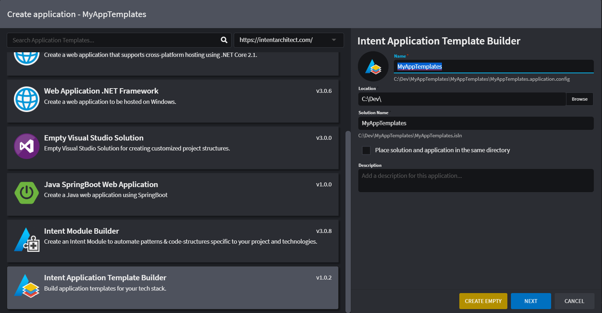
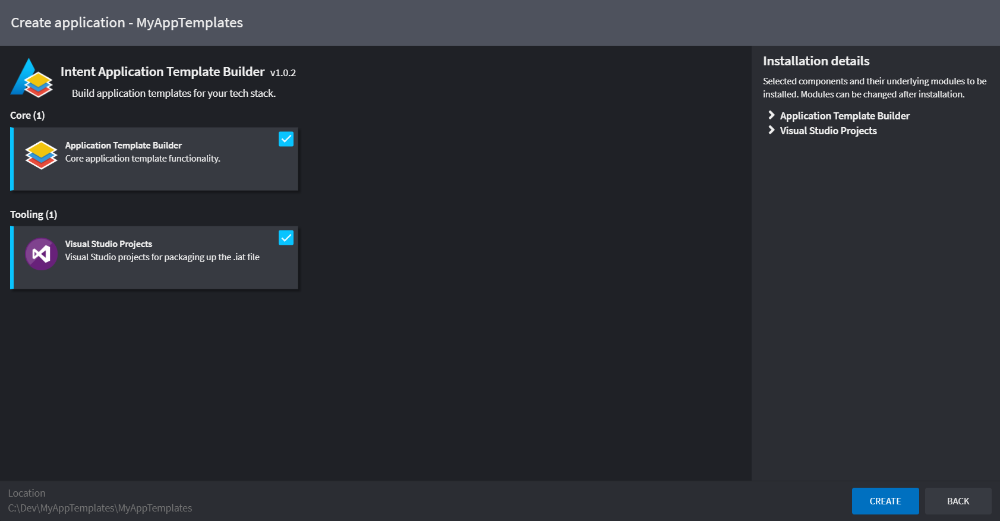
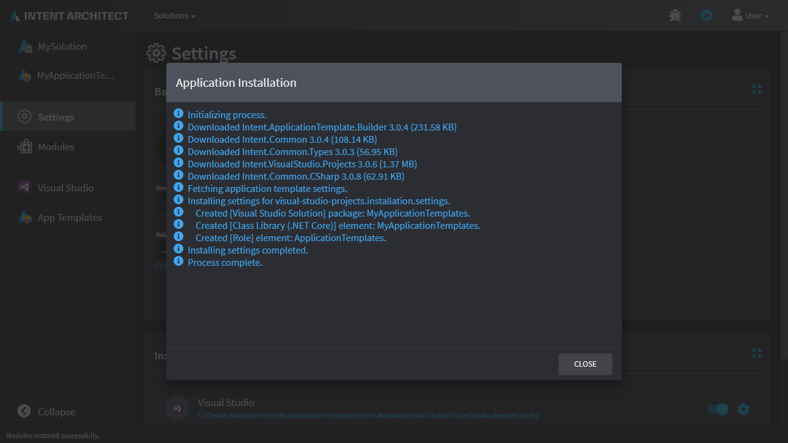
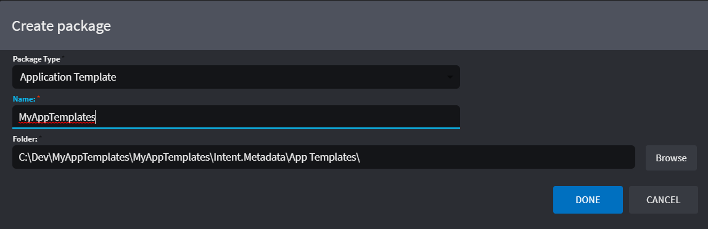
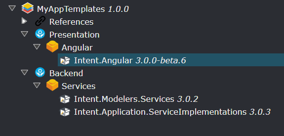
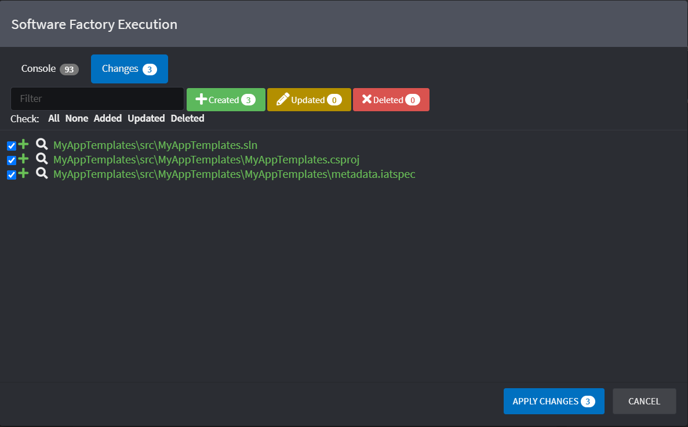
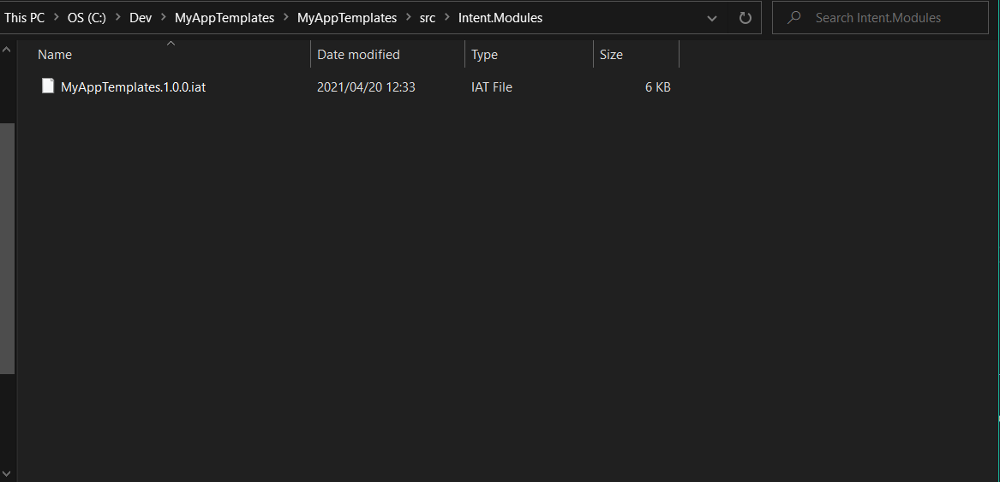
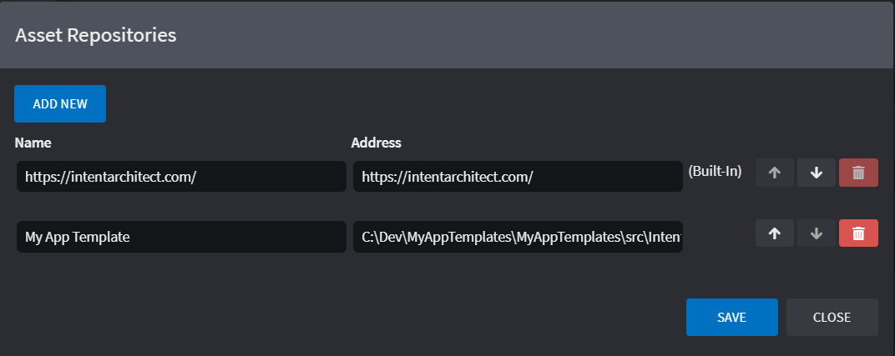
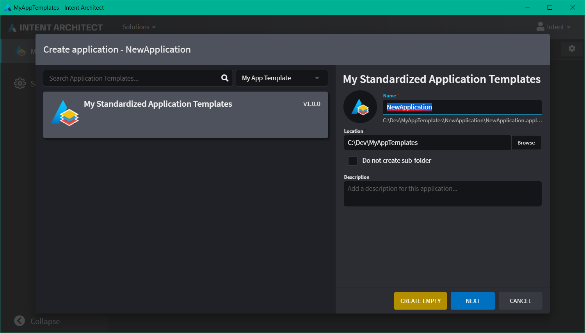
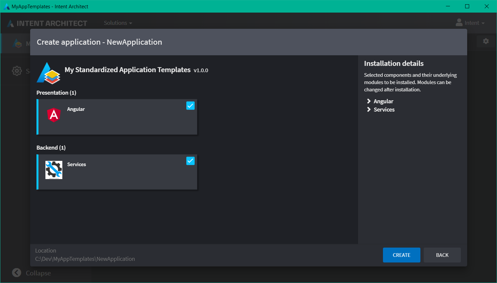

# Create an Application Template

Do you find yourself creating new applications in Intent Architect by choosing a very simple application template and customizing it by installing lots of modules?
Working in a small team or organization can become daunting when someone else needs to create a new application and are not sure what the configuration settings should be.

In this how-to we will explain how to setup your own team or organizational application template list which can run side-by-side to the official application template list and allows developers not only to create their own applications with ease, but they can easily customize it without having too much in-depth knowledge upon creation.

In Intent Architect, choose to create a new application and select the `Intent Application Template Builder`.
Give it the name of `MyApplicationTemplates`.

When clicking on `Next` you will be presented with the following page. There is nothing to customize here so you can click on `Create` to begin your own application templates.

Once the installation dialog is complete, click on `Close`.

Open the `App Templates` designer and click on `Create new pacakge`.

Upon creation, you will notice that the package is highlighted in red. This is to prompt you to complete the following fields:

| Name | Description |
|-|-|
| Version | You can give it a default value of `1.0.0`. **It needs to have 3 version components.** |
| Display Name | Give it a display friendly name. Example: `My Standardized Application Templates` |
| Supported Client Versions | Which versions of Intent Architect does this target? Click [here](xref:references.notations#version-ranges) to find out about the version scheme. Use the default of: `[3.0.0,4.0.0)` |

Once this is specified, follow through with the following steps (as an example) on how to setup Groups, Components and Modules.

<video style="max-width: 100%" muted="true" loop="true" autoplay="true" src="videos/create-group-components.mp4"></video>

As per the video, create a Group called `Presentation` and a Component in it called `Angular` (give it the icon URL of `https://www.elemental.co.za/cms/resources/uploads/blog/89/05bd53609c4c.png`, you can click on the `...` button which will allow you to paste the image data in as well from the OS clipboard), then to finish it off, create a Module in the Component that is the same name as the actual Module that you wish to import into your application: `Intent.Angular`. Specify that Module to use version `3.0.0-beta.6`.

As a further exercise, complete the design so that it looks like this:

The Services Component uses this URL `https://image.shutterstock.com/image-vector/service-tool-icon-this-isolated-260nw-274711127.jpg`.

The Modules being used are:
 * Intent.Modelers.Services (3.0.2)
 * Intent.Application.ServiceImplementations (3.0.3)

Now you can run the Software Factory to see the following staging changes:

Click on `Apply` and open up the newly generated solution in Visual Studio.
Perform a Build on the solution in order to build our new Application Template Module.

You will then notice the compiled module in the Intent.Modules folder.

# Test your Application Template

Open up the [Repository Manager](xref:how-to-guides.manage-repositories) to point to your newly created App Template Module folder.

Add your Repository to the list as shown in the image above. Let it point to your folder where your compiled Application Template Module is located.

>[!TIP]
>You can arrange your Repository to be on top so it automatically shows your Application Template first when you create a new Application in Intent Architect.

Go to your Intent Architect solution where you want to create a new Application.

Give it a name and click on `Next`.

Notice that you can decide which Components to install by checking the relevant check-boxes next to them. You should now be able to create the Application and begin to develop. You can go back to your App Template designer to modify or enhance the Components and Modules as you see fit.