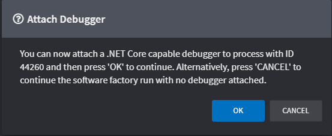
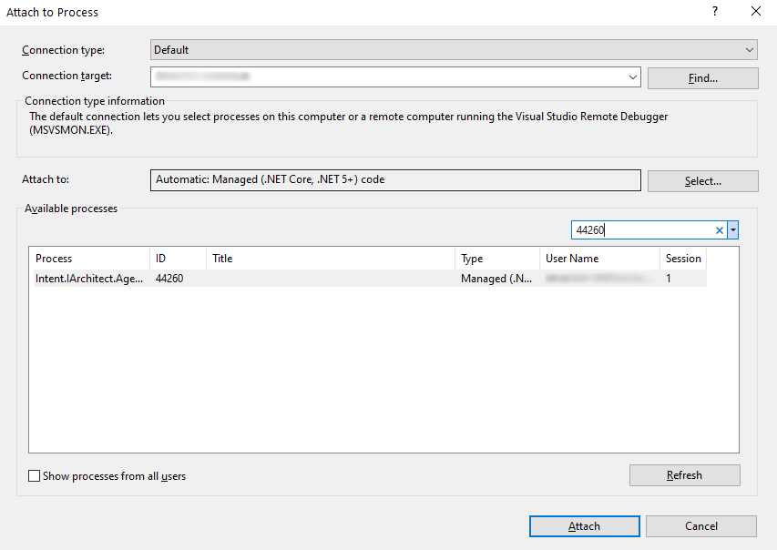

# Debug your Module code
When developing Modules, it's very useful to be able to debug into the Module code. Intent Architect supports this by allowing you to pausing the Software Factory Execution to connect a debugger to the process.

For example, to debug using Visual Studio:

1. Run the Software Factory Execution in _DEBUG_ mode by clicking on the _Debug_ icon to the left of the usual _Play_ button. The Software Factory Execution will begin but pause with a `Attach Debugger` dialog awaiting confirmation to proceed.
    
    

2. Use the process ID to attach the debugger in you IDE.
   
    

3. Click the `OK` button on the `Attach Debugger` dialog.

The breakpoints in your module will now be hit:

<video style="max-width: 100%" muted="true" loop="true" autoplay="true" src="videos/debugging-a-module.mp4"></video>

