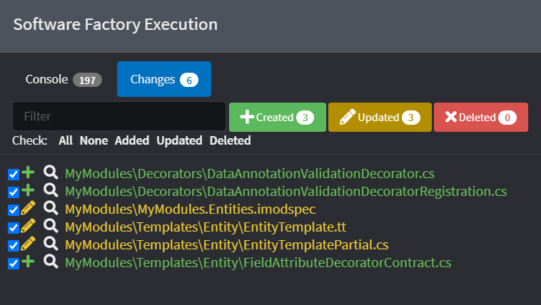
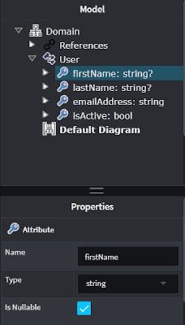
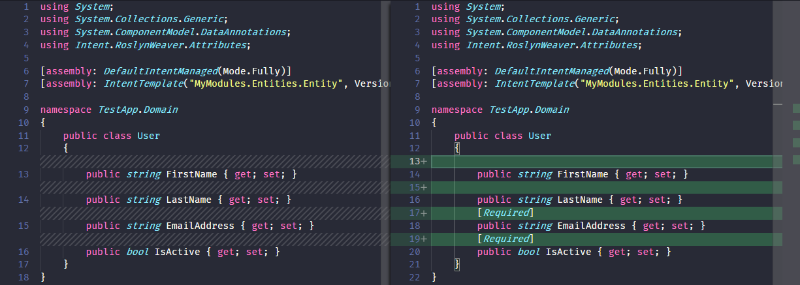

# Decorate a Template

Even though Templates are simple for a developer to change, Intent Architect does offer another mechanism for extending the content that gets generated by a Template without you having to actually modify the template itself. This mechanism is referred to as a Decorator.

If you have followed through the [Create Module](xref:tutorials.creating-modules-net.create-templates-per-model) tutorial, it will be useful to note that we will be extending the Template in order to allow Decorators to be applied to the Entity template at runtime and to have a Decorator that adds validation logic to our Entity class.

## Creating a Decorator Contract

In Intent Architect, open the `MyModule` solution (as was created in the tutorial) and select the `MyModule.Entities` Project that represents the Module that will generate the code for a C# Entity.

Right click on the Entity Template and select `Add Decorator Contract`. Give this contract a name of `FieldAttributeDecoratorContract`.

<p><video style="max-width: 100%" muted="true" loop="true" autoplay="true" src="videos/template-decorator-contract.mp4"></video></p>

## Creating a Decorator

Right click on the package and select `New Template Decorator`.
Give it the name of `DataAnnotationValidationDecorator` and select (as the type) `FieldAttributeDecoratorContract`.

<p><video style="max-width: 100%" muted="true" loop="true" autoplay="true" src="videos/create-decorator.mp4"></video></p>

>[!NOTE]
>Make sure to Run the Software Factory as this will generate the Decorator as well as the Contract for the Template.
>
>

## Update the Module

Open your `MyModules.Entities` Visual Studio project and locate the `FieldAttributeDecoratorContract.cs` file and open it.

Update this class to look like the one below:

```cs
using Intent.Modelers.Domain.Api;
using Intent.RoslynWeaver.Attributes;
using Intent.Templates;
using System.Collections.Generic;

[assembly: DefaultIntentManaged(Mode.Ignore)]
[assembly: IntentTemplate("Intent.ModuleBuilder.Templates.TemplateDecoratorContract", Version = "1.0")]

namespace MyModules.Templates.Entity
{
    [IntentManaged(Mode.Merge, Signature = Mode.Fully)]
    public abstract class FieldAttributeDecoratorContract : ITemplateDecorator
    {
        public int Priority { get; protected set; } = 0;

        public abstract IEnumerable<string> GetEntityFieldAttributes(AttributeModel attributeModel);
    }
}
```

Next open the `EntityTemplate.tt` file and modify it so that it looks like the one below:

```cs
<#@ template language="C#" inherits="CSharpTemplateBase<Intent.Modelers.Domain.Api.ClassModel, MyModules.Templates.Entity.FieldAttributeDecoratorContract>" #>
<#@ assembly name="System.Core" #>
<#@ import namespace="System.Collections.Generic" #>
<#@ import namespace="System.Linq" #>
<#@ import namespace="Intent.Modules.Common" #>
<#@ import namespace="Intent.Modules.Common.Templates" #>
<#@ import namespace="Intent.Modules.Common.CSharp.Templates" #>
<#@ import namespace="Intent.Templates" #>
<#@ import namespace="Intent.Metadata.Models" #>
using System;
using System.Collections.Generic;
using System.ComponentModel.DataAnnotations; <# /* Add this namespace */ #>
[assembly: DefaultIntentManaged(Mode.Fully)]
namespace <#= Namespace #>
{
    public class <#= ClassName #>
    {
<#  foreach(var attribute in Model.Attributes) { #>
        <#= GetAttributesForClassAttribute(attribute) /* Add this method expression */ #>
        public <#= GetTypeName(attribute) #> <#= attribute.Name.ToPascalCase() #> { get; set; }
<#  } #>
    ...
```

Next open the `EntityTemplatePartial.cs` file and add the following method implementation:

```cs
public string GetAttributesForClassAttribute(AttributeModel attributeModel)
{
    return GetDecoratorsOutput(decorator => string.Join(
        separator: $"{Environment.NewLine}{base.CurrentIndent}",
        values: decorator.GetEntityFieldAttributes(attributeModel)));
}
```

Finally open the `DataAnnotationValidationDecorator.cs` file and add the following method implementation:

```cs
public override IEnumerable<string> GetEntityFieldAttributes(AttributeModel attributeModel)
{
    if (!attributeModel.Type.IsNullable)
    {
        yield return "[Required]";
    }
}
```

>[!IMPORTANT]
>Make sure to compile your module project before continuing.

## Applying the Decorator

Install the `MyModule.Entities` to to your `TestApp` in Intent Architect. Follow these [steps](xref:tutorials.create-a-module.install-and-run-the-module#install-the-module) if you are not sure how. Remember to click on Re-install for your updated module.

Open your Domain designer and select the `User` Entity. Let's make the `firsName` and `lastName` fields `nullable` to test that our decorator works.



Now run the Software Factory to see that it adds the `[Required]` attribute only on the fields that are not-nullable.

