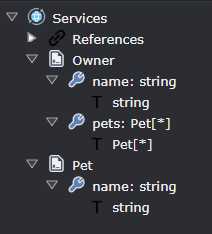

# Determine the name and namespace of a class which is generated in a different template

Intent Architect makes it easy to determine the name of classes for referenced types so that one template can output the name of a class, interface or any type which is generated by a different template.

In your template you call the appropriate overload of the `GetTypeName` method and the Software Factory will find the correct name of the type, including potentially getting the `ClassName` value of a different template instance. The Software Factory will also automatically add a `using` directive to the top of the file if required.

> [!NOTE]
> We recommend _against_ using strategies like conventions to work out type names of classes which are generated by other templates. There are many edge cases you will have to solve for yourself including handling collections or ensuring that appropriate `using` directives are also generated. Managing such complexities yourself invariably leads to more complicated templates which might not be able to handle all scenarios correctly.

## Scenario: the same template for the type

You want to create a template which generates [POCO](https://en.wikipedia.org/wiki/Plain_old_CLR_object)s for DTOs defined in the Services Designer and where the DTOs may have with fields whose type is another DTO, for example:



We want our template to output the following for the `Owner` DTO:

```csharp
public class OwnerDto
{
    public string Name { get; set; }
    public IEnumerable<PetDto> Pets { get; set; }
}
```

Notice that we intend to have the template automatically suffix the type names with `Dto`.

### The template

The `.cs` partial file for the template would be:

```csharp
partial class DtoTemplate : CSharpTemplateBase<DTOModel>
{
    public const string TemplateId = "MyModule.Dto";

    public DtoTemplate(IOutputTarget outputTarget, DTOModel model) :
        base(TemplateId, outputTarget, model)
    {
    }

    protected override CSharpFileConfig DefineFileConfig()
    {
        return new CSharpFileConfig(
            className: $"{Model.Name}Dto",
            @namespace: $"{this.GetNamespace()}",
            relativeLocation: $"{this.GetFolderPath()}");
    }
}
```

And the `.tt` file would be:

```text
[assembly: DefaultIntentManaged(Mode.Fully)]

namespace <#= Namespace #>
{
    public class <#= ClassName #>
    {
<# foreach(var field in Model.Fields) { #>
        public <#= GetTypeName(field) #> <#= field.Name.ToPascalCase() #> { get; set; }
<# } #>
    }
}
```

Note the `<#= GetTypeName(field) #>` which will instruct the Software Factory to automatically "get" the correct name of the type by finding a template instance using the passed in `field` and reading the `ClassName` property from it.

## Scenario: different template for the type

You want to create two template, one which which generates an interface for each service and another which generates an implementation of that interface.

For the interface template, we want it to output the following:

```csharp
public interface IOwnerService
{
}
```

For the implementation template, we want it to output the following:

```csharp
public class OwnerService : IOwnerService
{
}
```

### The templates

The partial file for the interface template would be:

```csharp
partial class ServiceInterfaceTemplate : CSharpTemplateBase<ServiceModel>
{
    public const string TemplateId = "MyModule.ServiceInterface";

    public ServiceInterfaceTemplate(IOutputTarget outputTarget, ServiceModel model) :
        base(TemplateId, outputTarget, model)
    {
    }

    protected override CSharpFileConfig DefineFileConfig()
    {
        return new CSharpFileConfig(
            className: $"I{Model.Name}Service",
            @namespace: $"{this.GetNamespace()}",
            relativeLocation: $"{this.GetFolderPath()}");
    }
}
```

The partial file for the implementation template would be:

```csharp
partial class ServiceTemplate : CSharpTemplateBase<ServiceModel>
{
    public const string TemplateId = "MyModule.Service";

    public ServiceTemplate(IOutputTarget outputTarget, ServiceModel model) :
        base(TemplateId, outputTarget, model)
    {
    }

    protected override CSharpFileConfig DefineFileConfig()
    {
        return new CSharpFileConfig(
            className: $"{Model.Name}Service",
            @namespace: $"{this.GetNamespace()}",
            relativeLocation: $"{this.GetFolderPath()}");
    }
}
```

The `.tt` file for the interface template would be:

```text
[assembly: DefaultIntentManaged(Mode.Fully)]

namespace <#= Namespace #>
{
    public interface <#= ClassName #>
    {
        // ...
    }
}
```

The `.tt` file for the implementation template would be:

```text
[assembly: DefaultIntentManaged(Mode.Fully)]

namespace <#= Namespace #>
{
    public class <#= ClassName #> : <#= GetTypeName("MyModule.ServiceInterface", Model) #>
    {
        // ...
    }
}
```

Note the `<#= GetTypeName("MyModule.ServiceInterface", Model) #>` which will instruct the Software Factory to automatically "get" the correct name of the type by finding a template instance with a `TemplateId` of `MyModule.ServiceInterface` using the passed in `Model` and then reading the `ClassName` property from it.
