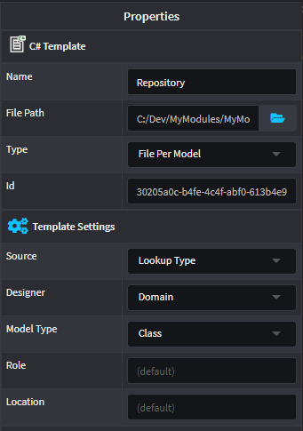

# Filter Template Instances
When creating Templates that are configured to create a _File per Model_, you may need to filter which Models create Template Instances. An easy place to do this is in the Template Registrations.

For this How-to Guide, we will imagine a use case where we want to _only_ create Repositories for Entities that have been flagged with a [Stereotype](xref:how-to-guides.use-stereotypes). Let's assume that we have an `Entity Settings` Stereotype with a check-box (boolean) property `Has Repository`. It is configured to automatically apply to `Domain` entities. 

Finally, we will assume that a C# Template called `RepositoryTemplate` has been created with the type `File Per Model` and Designer and Model Type set to `Domain` and `Class` retrospectively:



_Properties of the Repository Template, specified in the Module Builder._

To apply filtering to our Template, in the Visual Studio solution:
1. Navigate to the `RepositoryTemplateRegistration.cs` file.
2. Alter the `GetModels` method to filter based on the Stereotype, as follows:
    ```csharp
        public override IEnumerable<ClassModel> GetModels(IApplication application)
        {
            return _metadataManager.Domain(application).GetClassModels()
                .Where(x => x.GetEntitySettings().HasRepository())
                .ToList();
        }
    ```
3. Recompile the Project (`.csproj`).
4. Reinstall the Module and rerun the Software Factory Execution.

>[!TIP]
>Any metadata can be used to filter the creation of Template Instances. You may decide to use Stereotypes to be explicit or base the filtering on a convention like the name of the entity.