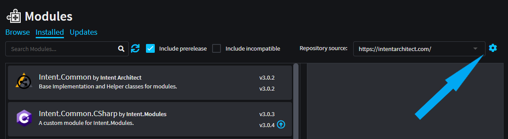
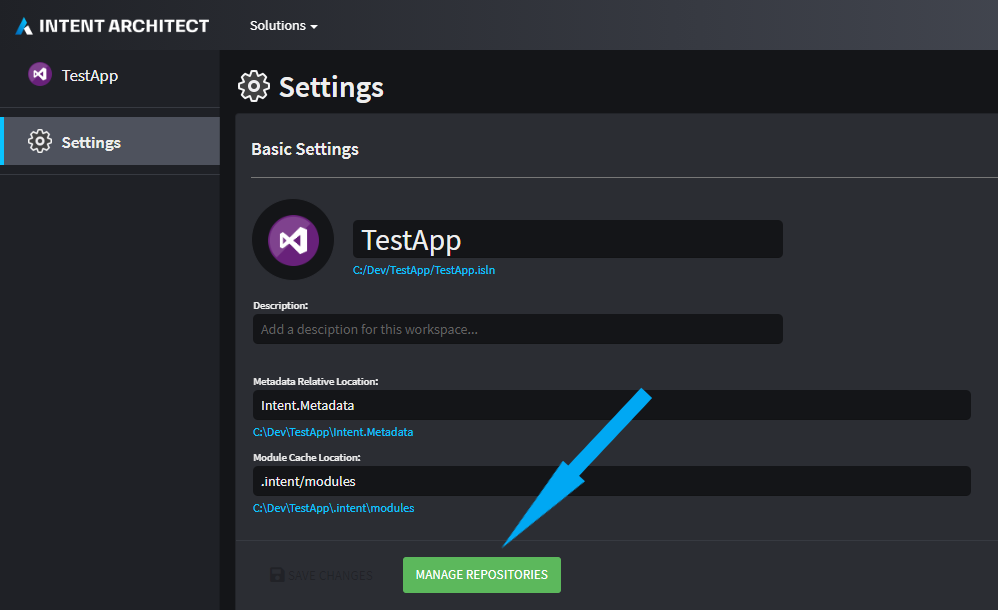

# Manage Repositories

Intent Architect has a hierarchical system to know which Asset Repositories should be available in any particular application.
Think of this as similar to _Git_'s repository settings, where you can define your user and email address on a global scope, then on a repository scope.

1. First, it will look for an _Application-specific_ repository file (an `intent.repositories.config` file in same folder as the Application's `.application.config` file). Setting these repositories is done by clicking on the _Cog_ icon next to the Repositories dropdown in the Modules tab.

    

2. If not found, it will look a repository file for the _Solution_ (an `intent.repositories.config` file in same folder as the Solution's `.isln` file).

    

3. Finally, if neither exist, Intent Architect will use the global Repositories which are managed in the [User Settings](xref:how-to-guides.change-user-settings).

> [!TIP]
> To remove repository settings at either the Application or Solution level, simply delete the `intent.repositories.config` file.

## Adding a new Repository

To add a new repository at an Application or Solution level:

1. Open the Asset Repositories dialog.
2. Click the `ADD NEW` button.
3. Type in the Name (this is just a display name) and Address (this can be either a network location, a fully qualified file path, or a relative file path to the underlying `intent.repositories.config` file).
4. Set the order of the Repositories

> [!IMPORTANT]
> The order of Repositories sets the default Repository that will be used (the first one) as well as the order in which Intent Architect will search the Repositories to _restore_ Modules if they don't exist.
>
> [!TIP]
> Relative locations are a great way to set the Repository location in a way that each member of the team will find the directory regardless of which directory they check the source code into on their local machine.
