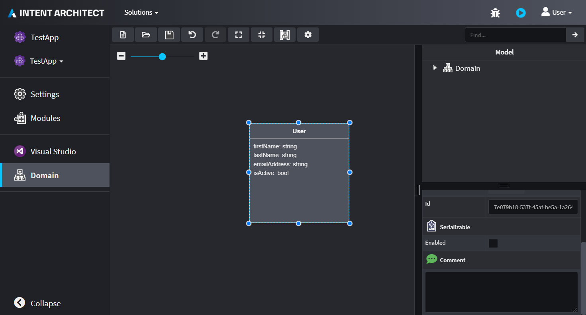
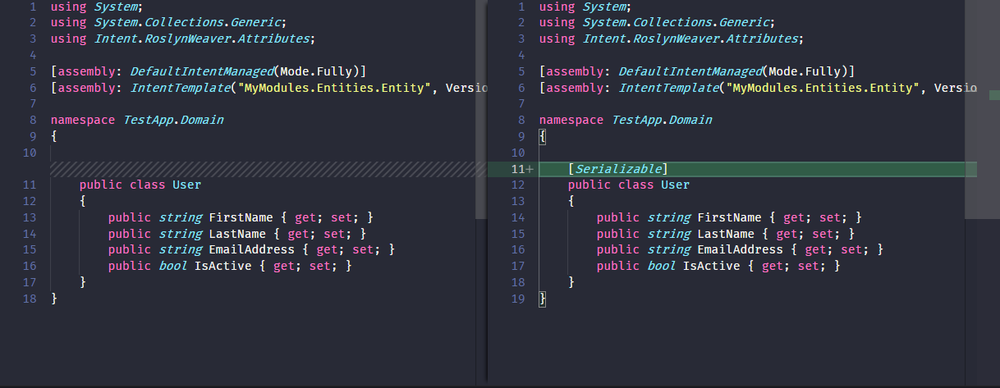

# Use Stereotypes

Extending meta-data in Intent Architect is commonly achieved through Stereotypes. This guide will describe how to create one and how to use it inside a template in order to affect how the source code gets generated.

If you have followed through the [Create Module](xref:tutorials.creating-modules-net.create-templates-per-model) tutorial, it will be useful to note that we will be extending the Template in order to add a C# attribute `[Serializeable]` depending on whether the `Serializeable` stereotype is applied to an Element or not.

## Create a Stereotype Definition

In Intent Architect, open the `MyModule` solution (as was created in the tutorial) and select the `MyModule.Entities` Project that represents the Module that will generate the code for a C# Entity.

Inside the Module Builder designer you will need to create a Stereotype Definition first before it can be applied. Right click on any of the Tree view folders (found on the right-hand-side panel) and select `New Stereotype-Definition`.

>[!NOTE]
>You may find that you need to include the package where this new Stereotype Definition was created in to be included with the current Module. In order to do that, click on the Package itself and set the Properties:
>
> * Include in Module: _Checked_
> * Reference in Designer: `Domain`

Supply the following in the Stereotype Definition:

 * Name: Serializable
 * Target Mode: Elements of Type
 * Targets: Class
 * Apply mode: Always

Now we want to add a Property to this Stereotype Definition. Right click on this Stereotype Definition and select `Add Property`.

Supply the following Property values for this Stereotype Property:

 * Name: Enabled
 * Control Type: Checkbox
 * Default value: _Unchecked_

<p><video style="max-width: 100%" muted="true" loop="true" autoplay="true" src="videos/stereotype-definition.mp4"></video></p>

>[!NOTE]
>Make sure to Run the Software Factory as this will generate a `ClassModelExtensions` class that provides a convenient way to access your Stereotype from within your Template code.
>
>

## Update Entity Templates

Open your `MyModules.Entities` Visual Studio project and locate the `EntityTemplate.tt` file and open it.

Make changes to the template so that it looks like this:

```cs
<#@ template language="C#" inherits="CSharpTemplateBase<Intent.Modelers.Domain.Api.ClassModel>" #>
<#@ assembly name="System.Core" #>
<#@ import namespace="System.Collections.Generic" #>
<#@ import namespace="System.Linq" #>
<#@ import namespace="Intent.Modules.Common" #>
<#@ import namespace="Intent.Modules.Common.Templates" #>
<#@ import namespace="Intent.Modules.Common.CSharp.Templates" #>
<#@ import namespace="Intent.Templates" #>
<#@ import namespace="Intent.Metadata.Models" #>
using System;
using System.Collections.Generic;

[assembly: DefaultIntentManaged(Mode.Fully)]

namespace <#= Namespace #>
{
    <#= GetClassAttributes() /* Add this method expression */ #>
    public class <#= ClassName #>
    {
        ...
```

Then from the `EntityTemplatePartial.cs` file, we need to define the method `GetClassAttributes`.

```cs
public string GetClassAttributes()
{
    return Model.GetSerializable()?.Enabled() == true
        ? "[Serializable]"
        : string.Empty;
}
```

You may find that in order to use the `GetSerializable` method, you need to add the namespace `MyModules.Entities.Api` as part of your namespace declarations.

>[!IMPORTANT]
>Make sure to compile your module project before continuing.

## Applying the Stereotype

Install the `MyModule.Entities` to to your `TestApp` in Intent Architect. Follow these [steps](xref:tutorials.create-a-module.install-and-run-the-module#install-the-module) if you are not sure how. Remember to click on Re-install for your updated module.

Open up the Domain designer and select one of your Entity Classes that are found on your current selected diagram. You will notice that all of them will have the `Serializable` stereotype present in their property displays and that there is one field that has a `checkbox`. 


*Notice the Serializable stereotype in the bottom right corner*

The net result will be determined by the state of that check-box.
For a given Entity class, if in the designer the check-box is checked, then it will generate that C# class with the `[Serializable]` attribute. If not, it will omit the generation of that attribute.

