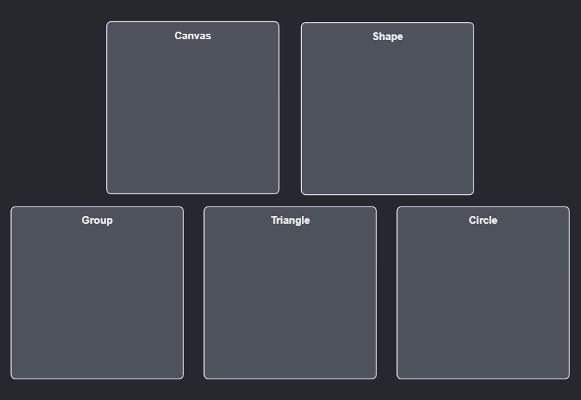
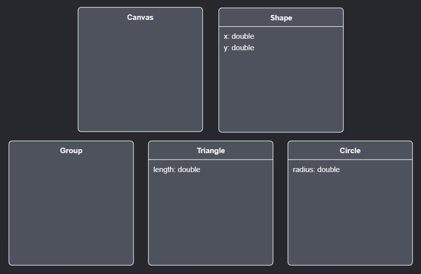
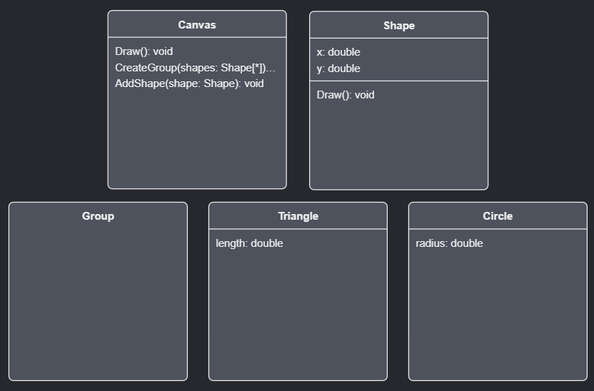
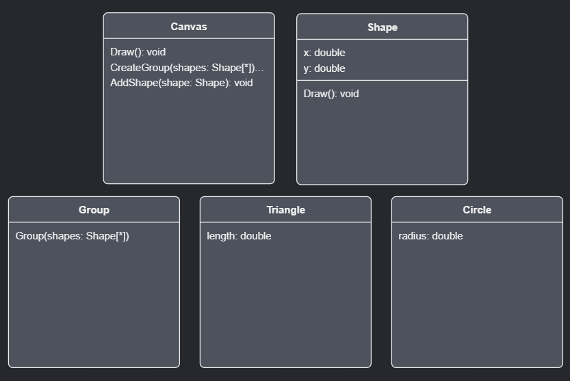
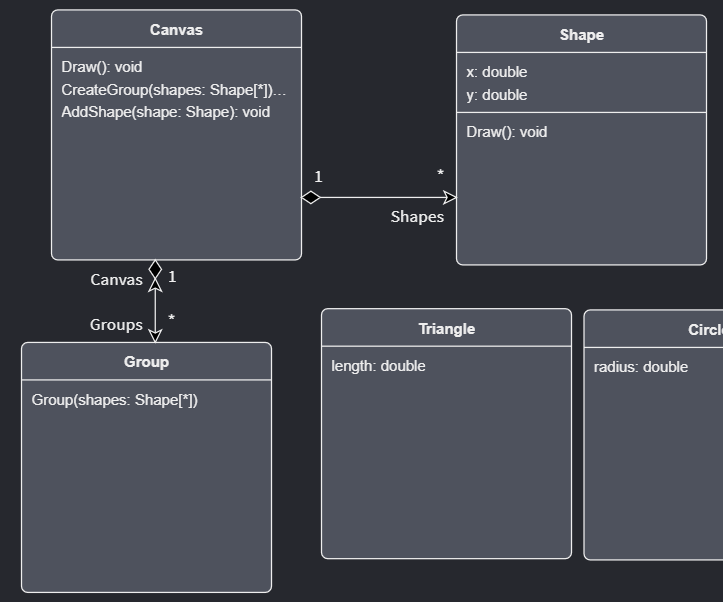
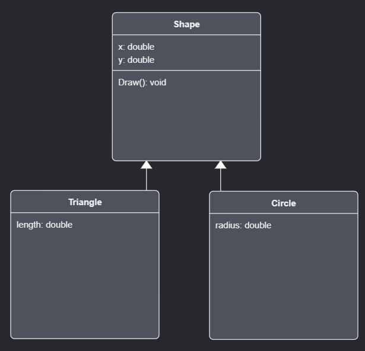

# Use the Domain Designer

This how-to will walk you through using the Domain Designer by working through an example where you will model conceptually how `Shapes` can be drawn on a `Canvas`.
Ensure you have the `Intent.Modelers.Domain` module installed and open up the `Domain` designer by clicking on `Domain` in left pane of the screen.

## Add new Classes

- Right-click the background and click the `New Class` option.
- Give it a name of `Shape`.

<video style="max-width: 100%" muted="true" loop="true" autoplay="true" src="videos/create-shape-class.mp4"></video>

Similarly, create the following additional Classes:

- `Canvas`
- `Group`
- `Triangle`
- `Circle`

## Add Attributes to the Classes

- Right-click on the `Shape` element and click the `Add Attribute` option.
- Give it the name `x` and set its type to `double`.
- Add another attribute the a name of `y` and also set its type to `double`.

- Right-click on the `Triangle` element and click the `Add Attribute` option.
- Give it the name `length` and set its type to `double`.

- Right-click on the `Circle` element and click the `Add Attribute` option.
- Give it the name `radius` and set its type to `double`.

<video style="max-width: 100%" muted="true" loop="true" autoplay="true" src="videos/add-attributes.mp4"></video>

## Add Operations to the Classes

- Right-click on the `Shape` element and click the `Add Operation` option.
- Give it the name of `Draw` and leave the return type blank.

- Right-click on the `Canvas` element and click the `Add Operation` option.
- Give it the name `Draw` and leave the return type blank.
- Add another Operation giving it a name of `CreateGroup` and again leave the return type blank.
- Right-click on the `CreateGroup` element and click the `Add Parameter` option.
- Give it the name `shapes` and set its type to `Shape`.
- In the properties pane on the bottom right of the window, ensure that `Is Collection` is checked.
- Add another Operation on `Shapes` called `AddShape` with a blank return type and add a parameter called `shape` with its type set to `Shape`.

<video style="max-width: 100%" muted="true" loop="true" autoplay="true" src="videos/add-operation-with-parameter.mp4"></video>

## Add a Constructor to one of the Classes

- Right-click on the `Group` element and click the `Add Constructor` option.
- Right-click on this constructor and click the `Add Parameter` option.
- Give it the name of `shapes`, set its type to `Shape` and ensure that `Is Collection` is checked in the Properties pane.

## Add a Composite association between Classes

Space out the diagram elements so that there is some distance between them vertically in order to show an arrow clearly. Feel free to resize the elements too.

Right click on `Canvas` and select `Add Association`. Click thereafter on `Shape`. Click on the newly created arrow.
In the `Target End` section of the Properties panel (located right of the screen) tick the `Is Collection` field. Then in the `Source End` un-tick the `Is Collection` field.

Now create the same association between `Canvas` and `Group` in the same way except that when you click on that new arrow to set the field properties, ensure that `Navigable` is checked in the `Source End` section.

<video style="max-width: 100%" muted="true" loop="true" autoplay="true" src="videos/add-composite-association.mp4"></video>

## Add an Aggregate association between Classes

Right click on `Group` and select `Add Association`. Click thereafter on `Shape`. Click on the newly created arrow.
In the `Target End` tick the `Is Collection` field and in the `Source End` un-tick the `Is Collection` and tick the `Is Nullable` field.

>[!NOTE]
>To learn more about these associations, visit [this article](xref:references.domain-designer.associations) for more information.

<video style="max-width: 100%" muted="true" loop="true" autoplay="true" src="videos/add-aggregate-association.mp4"></video>

## Add a new Diagram

On the tree-view located right of the screen, right click on the `Domain` package. Select `New Diagram`. Give it the name `Shapes Diagram`.
Draw a selection box around the `Shape`, `Triangle` and `Circle` Classes and ensure that they highlight once you release the mouse cursor.
Right click on any of the selected items and select `Hide`.

Now double-click on `Shapes Diagram` located in the tree-view on the right side of the screen to open that diagram.
Perform a drag-and-drop from the tree-view and onto the diagram by selecting (or multi-selecting by clicking on each item while holding in the `CTRL` key) these three items: `Circle`, `Triangle` and `Shape`.

Spread them out so that `Shape` is located center-top of the diagram, `Triangle` bottom left and `Circle` bottom right.

>[!NOTE]
>Once you've moved those Classes over to another diagram, they are still associated with the other Classes you've assigned them to before.
>You can inspect this by going over to the tree-view on the right, locate `Shape` (for instance), expand it to show its contents and you will notice that there are four associations: `Group`, `Canvas`, `Circle` and `Triangle`.

>[!TIP]
>Inspect the properties panel when you click on a diagram in the tree-view and notice the field `New diagram elements`.
>This will allow you to select which package to place newly created elements in when you add them from the diagram view itself.

<video style="max-width: 100%" muted="true" loop="true" autoplay="true" src="videos/new-diagram-and-move-over.mp4"></video>

## Add inheritance to Classes

Right click on the `Triangle` and select `Add Inheritance`. Thereafter click on `Shape`. Do the same with `Circle`.

