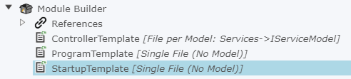

# How do I make a Template, Decorator Ready?

If you are not sure what a Decorator is, please have a look [here](xref:Decorator).

So building off what we've done in the [Module Creation tutorial](xref:TutorialCreateModule) where we have created a Module that generated a simple ASP.NET output project.

So we want to update the `StartupTemplate` to be extendable for new kinds of configuration installed by Intent Architect Modules.

TODO