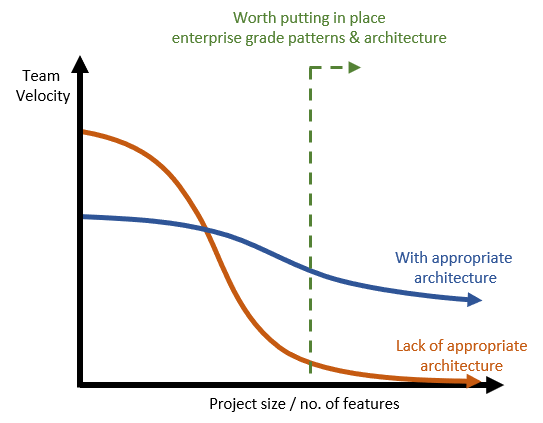

# Why Intent Architect

## The problem when building software

When interviewing developers, we often ask the following questions:

_Have you ever worked on a greenfields project that over time became a [big ball of mud](https://en.wikipedia.org/wiki/Big_ball_of_mud)?_

And then the really interesting question... _Have you ever worked on a greenfields project that __didn't__ become a big ball of mud?_

Most developers acknowledge that almost every system they've ever worked on has become a spaghetti-code jungle, while all developer agree that this is the fate of most software systems. The only systems that escape this fate are either too small to have become unwieldy, are a rewrite (_of the last rewrite_) by the same team, or have a significant amount of code-automation. 

The unfortunate truth is that the vast majority of software systems tend to become increasingly unwieldy, and the cost of maintaining and extending these systems continues to rise exponentially. We call this the **cost curve**, and it looks as follows.

**_The cost to change a software system grows exponentially as the system grows in size and complexity._**

So often you will see software systems in successful businesses, with sometimes hundreds of developers, that are barely able to make any significant changes to them. They have become so fragile and difficult to reason about that no matter how much manpower is assigned, the results are the same.

The implications of this on project outcome can be dire, especially for larger projects. The following table, published in the [Standish Group](https://www.standishgroup.com/) CHAOS report of 2015 shows the significant drop in project success for any project considered Moderate in size or bigger.

This problem is as old as the software industry, and while significant improvements in technologies, methodologies and tooling have helped, the problem persists because the software systems we are building have become so much more complex.

## What about Agile?

Agile methodologies have significantly improved the success rate of projects over the (now outdated) waterfall approach. Agile also claims to flatten the cost of change curve, which is true but not to the extent that agile evangelists would have us believe. The fundamental problem that agile tackles is that of building the wrong thing. By shortening the feedback cycle, validation and correction of the software can be done sooner, thus saving massive reworking costs down the line. In essence, agile helps prevent the need to make significant changes down the line.

The reality, however, is that the growing cost of making changes hasn't been alleviated, but rather that the need to make these changes has largely been _avoided_. The cost of change curve can't be flattened by a methodology, since the causes are primarily of a technical nature.

## Causes of the _cost curve_

We believe there are several fundamental reasons why software tends to become unwieldy, causing costs to grow exponentially. We discuss each of these below:

### 1. Cost of architecture

The obvious cause of a system become unwieldy is that it lacks an appropriate architecture to support it's growth in the first place. Without patterns to keep coupling low, cohesion high, and the separation of concerns, the spaghetti-code jungle gets thick very quickly. 

Putting these architectural patterns in place is very costly and slows the team down significantly. In the short term this cost is felt the hardest, but as the system grows, the architecture (if done correctly) ensures that the team can maintain a decent velocity into the future.

The challenge lies in knowing what level of architecture is required and when. The work done by the [Scaled Agile Framework (SAFe)](https://www.scaledagileframework.com/) organization attempts to structure an approach to this problem.

The implications of ignoring architecture often lead to a completely unmanageable codebase, in addition to often being unable to meet the non-functional requirements (e.g. performance, scalability, etc.). These are the dreaded systems that developers loath, keeping a vomit-bucket nearby as they attempt to reason about its inner workings.

Reaching a point of near-zero velocity is a real phenomenon, and occurs when making any significant change breaks another part of the system, which when changed breaks yet another part of the system, and so on. The web of changes eventually becomes too complex and risky, and the developer has no choice but to roll back. This is unfortunately the state of most large (_legacy_) systems.

#### How Intent Architect helps: automated patterns

Intent Architect's Module system allows developers to codify, package and ultimately automate code structures and design patterns. Architectural code is ideally suited to be automated because of it's patternized nature. This means that developers can use Intent Architect's automation systems to generate and manage their architecture, thus reducing it's cost of implementation by orders of magnitude.

Automated source code has the same cost regardless of whether the patterns are simple or complex. Even Proof of Concepts and MVPs (Minimum Viable Products) can be built with production-ready, enterprise-grade architecture, and it would cost less than the most unsophisticated architecture being coded by hand.

### 2. Software entropy

_"As a system is modified, its disorder, or entropy, tends to increase. This is known as software entropy."_ ~ [Software entropy, Wikipedia](https://en.wikipedia.org/wiki/Software_entropy)

Disorder in a system is a form of [technical debt](https://en.wikipedia.org/wiki/Technical_debt) which creeps in as a system is modified. It's an insidious form of technical debt which over time leads to the big ball of mud. As developers, we try avoid it but the cost of correcting software entropy becomes unaffordable as the system becomes larger. Needing another week or month to refactor the code is a luxury most developers (and businesses) don't have.

Software entropy can take many different forms, from different coding styles to different architectures scattered throughout the application. All successful software gets changed, and so all successful software is subject to entropy.

In teams, every developer has different styles, experience, level of technical expertise, knowledge of the technologies, and design capabilities. This makes it incredibly difficult to ensure consistency in the codebase. Governance processes, code reviews, and code analyzers (e.g. [StyleCop](https://github.com/StyleCop/StyleCop)) all attempt to prevent this source of entropy, each with their own cost overhead.

#### How Intent Architect helps: enforced consistency

Patterns under automation are 100% consistent, and not susceptible to the entropy that developer-managed code is. Since the large majority of source code can (and should) be patternized, Intent Architect is able to automate this and therefore protect it from entropy.

Entropy in developer-managed code and at the design level must still be prevented where possible, but the danger it poses has been significantly reduced.

### 3. Architectural rigidity

Code that _enables_ the functions of a system to be performed is surprisingly pervasive in any system. This is the code that handles service requests, sets transactional boundaries, manages persistance of the application's state, enforces security, etc. While a modern technology exists to handle any of these concerns, the code required to wire this up still makes up the vast majority of code in any system. By some definitions, this is the applications architecture - _the glue of the system_.

As systems get larger, growing in features and functions, so this architectural code is "replicated" as patterns that are unique enough to prevent developers from consolidating them. When a pattern needs to be changed (e.g. to change or upgrade a technology, fix a vulnerability, implement a cross-cutting concern, etc.), each instance of that pattern must be changed. In a large system, this could mean months of rework. Thus developers find themselves constrained by architectural rigidity, and are often forced to compromise leading to entropy and technical debt.

#### How Intent Architect helps: agile architecture

Intent Architect's _code management_ system is by default continuous and therefore allows generated source code to be changed holistically at a later stage. This changes the paradigm where developers manage each implementation of a pattern by hand, to developers managing the pattern itself.

This shift in control allows developers to achieve large scale refactoring, technology upgrades, and even technology changes by altering the pattern itself. Effectively, this enabled a truly _agile architecture_. Regardless of the size of the system, the cost to alter the pattern remains the same, with changes that would have taken months of team effort being possible in half a day of a single developers time.

### 4. Hidden design

Software design is invisible from the outside, and it's vague essence lies scattered throughout its implementation. Developers are often forced to trace through countless programming constructs while trying to reason about the design of a particular subsystem. The more confounding this process is, the more the developers wonder what the designer was even thinking.

Without a clear understanding of the design of a subsystem, changing it becomes risky and prone to breaking existing functionality without the developers being aware of it. Often the subsystem wasn't originally designed to handle the new requirement, and the lack of clarity forces developers to inappropriately _hack_ the change in, thus introducing further entropy and technical debt.

Some organizations rely heavily on the project's _veteran_ developers (those that have been on the project for a long time) for their understanding of the design and where changes can and should be made. However, these key-man dependencies create a major risk when those developers decide to move on.

With staff turnover being unavoidable, the only alternative is documentation. While some is almost always better than none, documentation is rife with it's own challenges. First, it's incredibly expensive and can at times cost the same as (if not more than) the software implementation it describes. Second, it becomes outdated and even incorrect the moment the code it describes is changed. Third, it may be vague, hard to read, misleading (_possibly even flat-out wrong_) and difficult to consume. Lastly, the majority of software engineers are both reluctant documenters and reluctant consumers of documentation, which poses it's own unique set of challenges.

#### How Intent Architect helps: self-documented system design

Intent Architect's modeling systems allow developers to describe an application at a higher level, and then specify how these descriptions are realized into tangible code. Developers can know what the underlying implementation is by simply looking at the high-level model. This serves as documentation of the system's design, and has the added advantage that it can be trusted - _the document is a true representation of the underlying source code._

The self-documentation provided by using Intent Architect has many benefits:
 - It is the mechanism by which the system is altered and extended, meaning that the document will exist before the implementation is complete.
 - Teams have visibility of the system design, greatly improving communication and common understanding between members and the business. 
 - The model provides a concise view and doesn't attempt to visualize all the moving parts in the design. This makes it consumable and at an effective level of abstraction from the details. If more detail is required, developers will know exactly where to look in the codebase to find it.
 - The ramp-up of new developers is greatly accelerated. They can use Intent Architect to extend the system without having to first understand all the underlying patterns and architecture.

## How Intent Architect helps

Intent Architect effectively alleviates these causes by allowing developers to describe their systems at a higher level, and then allowing them to choosing how these descriptions are realized into tangible code. It then intelligently manages this code for the developer so that it can be easily changed at a later stage. While source-code generation using high-level models is not a new concept, the unique way in which Intent Architect does it has many benefits.

>[!TIP]
>Click here to learn more about how Intent Architect works.

### 1. Automated patterns

Intent Architect's Module system allows developers to codify, package and ultimately automate code structures and design patterns. Architectural code is ideally suited to be automated because of it's patternized nature. This means that developers can use Intent Architect's automation systems to generate and manage their architecture, thus reducing it's cost of implementation by orders of magnitude.

Automated source code has the same cost regardless of whether the patterns are simple or complex. Even Proof of Concepts and MVPs (Minimum Viable Products) can be built with production-ready, enterprise-grade architecture, and it would cost less than the most unsophisticated architecture being coded by hand.

### 2. Agile architecture

**Move to another document:**
***
Most source-code generation systems provide a once-off generation experience. The benefit of this is the productivity boost that developers achieve. The code, once generated, is then customized and managed by the developer.

Another form of source-code generation is continuous and overwrites the generated code on each run. Productivity is also a major benefit but with the added advantage that the code remains _managed_ by the generation mechanism (usually some kind of template). This means that the developer can manage and upgrade the pattern, instead of each instance of it's implementation (of which there could be hundreds). This offers great refactoring power but comes with a critical disadvantage. 

The disadvantage of this is that any particular instance of the pattern cannot be customized, and for many developers this is a deal breaker. The generated pattern may be perfect for 95% of the cases but 5% of the time it needs customization and the inability to do this easily is often enough to negate the positive upside.
***

Intent's _code management_ system continuously manages the automated patterns in a codebase. The continuous nature of this allows developers to manage the pattern and not the individual instances of the pattern. This has powerful advantages.

Intent Architect solves this with 

Manage the pattern, not the instances

Mass scale refactoring

Upgrade the pattern in one place

### 3. Ensured consistency

### 4. Self-documented system design

## Additional Benefits

### Build faster

### Share patterns and leverage those built by others

### Create Intellectual Property

### Focused Testability
