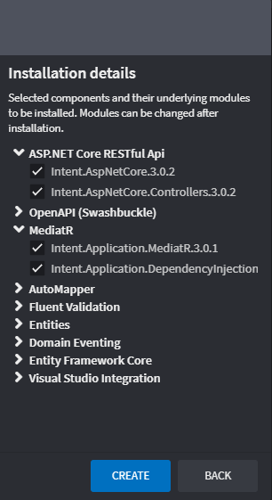

# Application Templates

Application Templates allow specifying a pre-defined set of options of which [Modules](xref:references.modules) and [Metadata](xref:references.metadata) (for [Designers](xref:references.designers)) to automatically install into the new [Application](xref:references.applications) during its creation.

To illustrate this, from the home screen create a sample .NET Core Application using the `Clean Architecture .NET Core 3.1` Application Template. Fill out the Application's name, location, and the Solution name, then click `NEXT`. The wizard then moves to next page which displays the high-level _Components_ that make up the Application Template.

Each block is a _Component_ and each represents one or more Modules that must be installed into the new Application. Each Component may be included or excluded as required. To see exactly which Modules will be installed depending on our selection of Components, we can expand the Component list on the right side of the page.

_This screenshot of the component list on the left of the screen shows exactly which modules would be installed from the selected Components._

To create the Application using the selected Application Template and its selected Components, click on the `CREATE` button.

Intent Architect will download and install the Modules correlating to the selected Components, as well as create any default metadata that is required.

_The modules downloaded in the example above are specifically related to the `Clean Architecture .NET Core 3.1` Application Template._

> [!NOTE]
> Although this example is based in .NET, this process would work in the same way for other Application Templates that are designed for other languages.

## See also

- 
