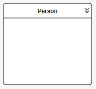
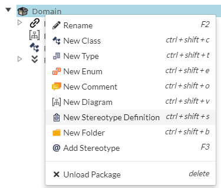
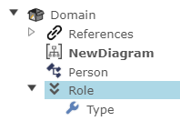
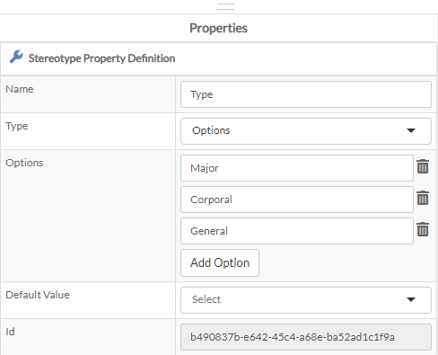

# Stereotypes

## What is a Stereotype?

>Stereotype is a profile class which defines how an existing metaclass may be extended as part of a profile. It enables the use of a platform or domain specific terminology or notation in place of, or in addition to, the ones used for the extended metaclass.

_from: [uml-diagrams.org](https://www.uml-diagrams.org/stereotype.html)_

According to the quote from the UML Diagrams website, a stereotype defines in UML terms that a given Class will have additional meta-data (in a simplified way).

Intent Architect has adopted this notation called `Stereotype` in order to apply additional meta-data on-top of existing Elements.

## What does Stereotypes look like?

Stereotypes are quite flexible in how they appear. You can have a visible indicator on the Element that you work on or it might be only a field where you need to supply additional information in the form of a text field or the like.

Notice in this image the two downward arrows. That is a stereotype.

When you inspect the properties of the `Person` Class/Element, you will notice the there is a section called `Role` with the two downward arrows next to it. This is a stereotype that we have applied.
Also, notice that it contains a filed called `Type` and it has a value that has been selected from a dropdown menu.
You will begin to understand that Stereotypes allow developers to define their applications in more "domain specific" terms, rather than technical terms.

>[!TIP]
>This is the power of Stereotypes. Instead of having a developer bogged down with how the technical things work under the hood and trying to interpret from source code what the business function is supposed to do, Intent Architect allows Module creators and developers to define their own language of how the application is supposed to look like with the help of stereotypes. This would help business analysts and developers to scan the models quickly to infer what is going on, while the Modules would interpret the Stereotypes to generate the source code accordingly.

## How do I get Stereotypes?

Stereotypes are typically created by Module creators, so when you install a new Module for Intent Architect, it typically comes bundled with a set of Stereotypes that a developer can use to describe their application in a richer fashion.

You may however create your own Stereotype Definition from within Intent Architect. Please note however, it will not be used by any of the Modules that you have installed in order to generate any source code. You may however like to add some comments or indicators with the use of Stereotypes that would give developers some visual and informational cues as to what to do or understand about the model they are working in.

To create a custom Stereotype, create a new Stereotype definition.

Name|Description
-|-
Name|Name of your Stereotype
Targets|Which elements are the Stereotype applicable for?
Icon|A nice visual representation of your Stereotype
Display Icon|Should the icon be displayed in the modeler?
Auto Add|Should this Stereotype be automatically added on the creation of a new element found in your `Targets` list?
Display Text|Writes out text on the element where the stereotype is applied and with the use of expressions, display certain information about the stereotype for that element. An example would be for Web API where an operation would need to have a POST/GET/etc verb and adding a `HTTP` stereotype will render on the screen what kind of `HTTP` verb is required.
Id|This is for debugging and troubleshooting purposes.

Notice that this is not all. Stereotypes can also have fields assigned to them.

|Name|Description
|-|-
|Name|The name of the field
|Type|The field Type (see list below)
|Options|If you have selected `Options` as the Type, you can define them here
|Default value|If you have selected `Options` as the Type and you have defined a list of options, you can select the default one here

### Types

|Type|Description
|-|-
|String|Single-line piece of text
|Text|Multi-line text
|Number|An integer number
|Boolean|True / False
|Options|Create your own options that can be selected
|Lookup Type|Define the list of element-types that will feature in a drop-down list for this field
|Lookup Internal|Same as `Lookup Type` except that as you select a type, it will bring up a nested drop-down with all the types which that nested type is allowed to show, and so on

## How do I apply Stereotypes?

Adding stereotypes are very simple. Right click on an Element and select `Add Stereotype`.

