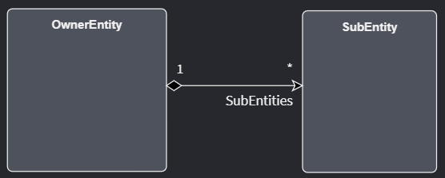
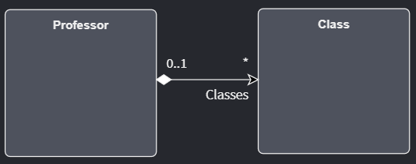

# Domain Designer Associations

Intent Architect's Domain Designer was originally built with the idea of being able to model Class Diagrams similar to how the UML specification would have it.
Once a `Class` has been defined by its `members` and `operations` it would be useful to also model how it would relate with another class using some visual arrow and some symbol notation denoting the kind of relationship between the two `Classes`.
Wikipedia provides some information regarding the concept of [Relationships](https://en.wikipedia.org/wiki/Class_diagram#Relationships) if you want to find out more.

In the UML world, an `Association` is a kind of `Relationship` while in Intent Architect's Domain Designer the term `Association` represents the kind of relationship between two `Entities` (or `Classes`). 

## Association Types

### Composition Association

The word `composition` would imply that an `Entity` is made up of more `Entities`. This would imply that one `Entity` owns one or more `Entities`.
To illustrate this in Intent Architect's Domain Designer, one would look for a Black Diamond symbol on the visual line being represented between two Entities.
The direction of the Black Diamond denotes the `Owner` in the `Association`.

In this example, there is an `OwnerEntity` who has one-or-more `SubEntities`. Notice the Black Diamond located on the side of the `OwnerEntity`, it denotes that `OwnerEntity` is composed of multiple `SubEntities`. So a `SubEntity` cannot exist without an instance of an `OwnerEntity` but an `OwnerEntity` can exist without any instances of `SubEntities`. Also when an `Ownerentity` is "destroyed", all instances of `SubEntities` associated with that particular `OwnerEntity` will also be "destroyed", yet any `SubEntity` being "destroyed" will not affect the `OwnerEntity`.

>[!NOTE]
>This association is useful because real-world models reflect composition in many ways. Think of a Car engine that is composed of many parts or an Invoice that's composed of multiple billing items.

### Aggregation Association

An `aggregation` is an association that represents a part of a whole. This is the opposite of a `composition` but it doesn't mean that it is "owned" by any `Entity`. 

In this example, there is a `Professor` that has multiple `Classes` to teach. Notice the White Diamond located on the side of the `Professor`, it denotes that a `Professor` has many `Classes` but doesn't own them. Both a `Class` and a `Professor` can exist without any instances of the other. If a `Class` is "destroyed", a `Professor` will still exist. If a `Professor` is destroyed, the `Classes` will still exist.

>[!NOTE]
>This association is useful because you're modeling Entities that make up a greater whole but those Entities can be exchanged with other greater Entities. Think for instance of a Car Engine (ENG01) that is used within a certain Car Model (Zoyota) but it can also be used in another Car Model (Plexus).

## Multiplicity Types

You may have noticed numbers and `*` being used on the visual arrows in the Intent Architect Domain Designer. Just like in UML, those denote "multiplicity" in the `association`.

### One to One

`ClassA` must have one instance of `ClassB` in order to exist and `ClassB` must have one instance of `ClassA` in order to exist. This would mean that `ClassA` is composed of `ClassB` but it needs to create an instance of `ClassB` in order to function properly.

### One to Many

`ClassA` can exist without any instance of `ClassB` but it can be composed of multiple instances of `ClassB`. `ClassB` must have 1 instance of `ClassA` to exist.

### Many to One

`ClassA` can exist only if it has one instance of `ClassB` and `ClassB` can exist even if no instances of `ClassA` exist but it can be associated with multiple instances of `ClassA`. Though `ClassA` needs an instance of `ClassB` to exist, its not owned by `ClassB` the same way in a `composition` relationship.

### Many to Many

`ClassA` can have zero or more instances associated of `ClassB` and vice versa.

## Navigability

Though not found in the UML specifications, it is a useful feature to have on the Domain Designer to assist ORMs ([Object Relational Mappers](https://en.wikipedia.org/wiki/Object%E2%80%93relational_mapping), i.e. Entity Framework) with knowing which Entity relationships are accessible when querying information.

Looking at this one-to-one mapping:

You will notice that only `ClassA` can access `ClassB` because of the arrow head present on `ClassB`. `ClassB` cannot refer to `ClassA` again. This is referred to as a `unidirectional association`.

Here you will notice that both `ClassA` can access `ClassB` and `ClassB` can access `ClassA`. This is referred to as a `bidirectional association`.