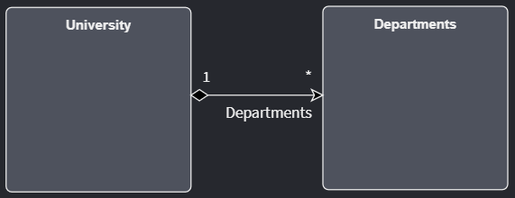
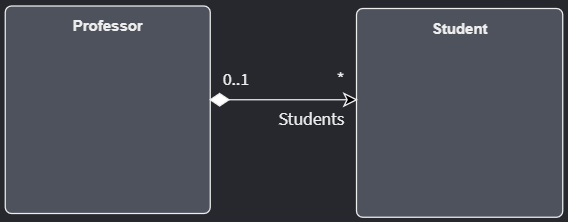
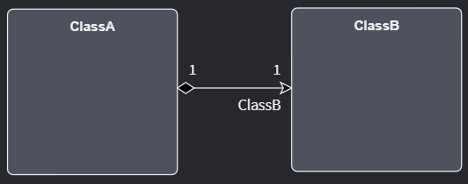
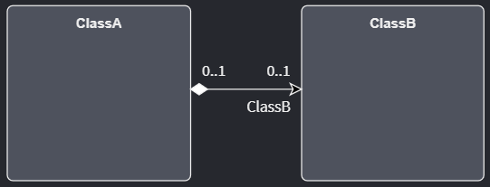
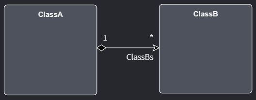
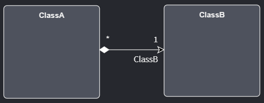
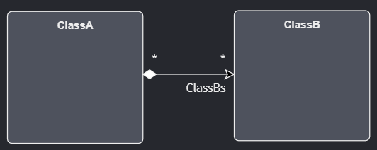
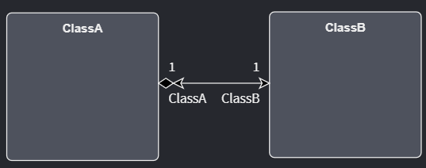

# Domain Designer Associations

Intent Architect's Domain Designer was originally built with the idea of being able to model Class Diagrams similar to how the UML specification would have it.
Once a `Class` has been defined by its `members` and `operations` it would be useful to also model how it would relate with another class using some visual arrow and some symbol notation denoting the kind of relationship between the two `Classes`.
Wikipedia provides some information regarding the concept of [Relationships](https://en.wikipedia.org/wiki/Class_diagram#Relationships) if you want to find out more.

In the UML world, an `Association` is a kind of `Relationship` while in Intent Architect's Domain Designer the term `Association` represents the kind of relationship between two `Entities` (or `Classes`). 

The following information around associations can be modeled in Intent Architect:

- [Association Types](xref:references.domain-designer.associations#association-types) - Relationship ownership between Entities
- [Multiplicity Types](xref:references.domain-designer.associations#multiplicity-types) - Cardinality between related Entities
- [Navigability](xref:references.domain-designer.associations#navigability) - Constraining the direction of accessing Entities from other Entities

## Association Types

>[!NOTE]
>Reference to the `Source End` and `Target End` properties will be made in this document. You will find this in Intent Architect
>when you locate the Properties panel on the screen to the right.

### Composition Association

>Composition relationship
>
>1. When attempting to represent real-world whole-part relationships, e.g. an engine is a part of a car.
>2. When the container is destroyed, the contents are also destroyed, e.g. a university and its departments.

*[Wikipedia - Composition](https://en.wikipedia.org/wiki/Class_diagram#Composition)*

This can be achieved by setting the association like this:

|Source End|Target End|
|-|-|
|⬜ Navigable|✅ Navigable|
|⬜ Is Nullable|⬜ Is Nullable|
|⬜ Is Collection|✅ Is Collection|

### Aggregation Association

>Aggregation relationship
>
>1. When representing a software or database relationship, e.g. car model engine ENG01 is part of a car model CM01, as the engine, ENG01, may be also part of a different car model.[8]
>2. When the container is destroyed, the contents are usually not destroyed, e.g. a professor has students; when the professor dies the students do not die along with them.

*[Wikipedia - Composition](https://en.wikipedia.org/wiki/Class_diagram#Composition)*

This can be achieved by setting the association like this:

|Source End|Target End|
|-|-|
|⬜ Navigable|✅ Navigable|
|✅ Is Nullable|⬜ Is Nullable|
|⬜ Is Collection|✅ Is Collection|

## Multiplicity Types

>Multiplicity is a definition of cardinality - i.e. number of elements - of some collection of elements by providing an inclusive interval of non-negative integers to specify the allowable number of instances of described element.

*[UML Diagrams](https://www.uml-diagrams.org/multiplicity.html)*

In the Domain Designer, multiplicity comes across in the following combinations:

|Range|Description|
|-|-|
|0..1|No instances, or one instance|
|1|Exactly one instance|
|*|Zero or more instances|

### One to One

`ClassA` has an association to only one instance of `ClassB` and `ClassB` also has only one instance of association with `ClassA`.

This can be achieved by setting the association like this:

|Source End|Target End|
|-|-|
|⬜ Navigable|✅ Navigable|
|⬜ Is Nullable|⬜ Is Nullable|
|⬜ Is Collection|⬜ Is Collection|

### Zero-or-one to Zero-to-One

`ClassA` has an association of zero or one instances of `ClassB` and `ClassB` also has zero or one instance of association with `ClassA`.

This can be achieved by setting the association like this:

|Source End|Target End|
|-|-|
|⬜ Navigable|✅ Navigable|
|✅ Is Nullable|✅ Is Nullable|
|⬜ Is Collection|⬜ Is Collection|

### One to Many

`ClassA` has many instances of association with `ClassB` but `ClassB` only has one instance of association with `ClassA`.

This can be achieved by setting the association like this:

|Source End|Target End|
|-|-|
|⬜ Navigable|✅ Navigable|
|⬜ Is Nullable|⬜ Is Nullable|
|⬜ Is Collection|✅ Is Collection|

### Many to One

`ClassA` has only one instance of association with `ClassB` but `ClassB` has many instances of association with `ClassA`.

This can be achieved by setting the association like this:

|Source End|Target End|
|-|-|
|⬜ Navigable|✅ Navigable|
|⬜ Is Nullable|⬜ Is Nullable|
|✅ Is Collection|⬜ Is Collection|

### Many to Many

Both `ClassA` and `ClassB` have many instances of association with each other.

This can be achieved by setting the association like this:

|Source End|Target End|
|-|-|
|⬜ Navigable|✅ Navigable|
|⬜ Is Nullable|⬜ Is Nullable|
|✅ Is Collection|✅ Is Collection|

## Navigability

>End property of association is navigable from the opposite end(s) of association if instances of the classifier at this end of the link can be accessed efficiently at runtime from instances at the other ends of the link.

*[UML Diagrams](https://www.uml-diagrams.org/association.html#navigability)*

### Uni-directional Association

`ClassA` can access `ClassB` via the `ClassB` association property but `ClassB` cannot access `ClassA` directly.

|Source End|Target End|
|-|-|
|⬜ Navigable|✅ Navigable|
|⬜ Is Nullable|⬜ Is Nullable|
|⬜ Is Collection|⬜ Is Collection|

### Bi-directional Association

`ClassA` can access `ClassB` via the `ClassB` association property and `ClassB` (vice-versa) can access `ClassA` via the `ClassA` association property.

|Source End|Target End|
|-|-|
|✅ Navigable|✅ Navigable|
|⬜ Is Nullable|⬜ Is Nullable|
|⬜ Is Collection|⬜ Is Collection|

### Reflexive Association

This demonstrates how to set up an association where a `Class` can access another instance of type `Class` via the `Class` association property.

<video style="max-width: 100%" muted="true" loop="true" autoplay="true" src="videos/association-reflexive.mp4"></video>

