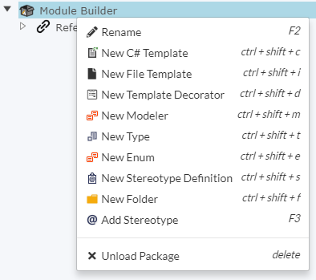

# Module Builder

The Module Builder is one of the powerful features of Intent Architect which allows a developer to craft their own code-generation module. This will allow a developer to generate custom defined code at the click of a button once that module is installed (while its being Intent Architect Managed). Think of the power!

>[!NOTE]
>The scope of this article is to explain the concepts found in the Module Builder. If you wish to find out more about Modules or Templates themselves, please navigate to the relevant section on the panel to the left.

## Breakdown

_Module Builder Components_

For the purposes of this document, we will only stick to the following components below. For information on the rest of the components outlined in the image above, please visit the [Intent Architect Concepts](intent_architect_concepts.md) page.

### File Template
Creates a Template class that will allow you to generate a text file for any type of text content (including any programming language).

### C# Template
Since Intent Architect supports intelligent weaving in C# files, it will create a template that will set this up for you. It is recommended to use this type of template for all C# classes as the [weaving](xref:RoslynWeaver) systems allow user-managed code to co-exist with Intent-managed code within the same file.

### Template Decorator
Creates a Decorator class that you can use to add content to an existing template by hooking into its extensibility points. Think of this as a Object Oriented Class that extends an Abstract class and has to implement all the virtual / abstract methods but in a Template sense.

### Modeler
If you need to fetch meta-data from a modeler that is other than `Domain` or `Services`, you need to add it here with the appropriate name so that your template can reference it. See [below](#modeler).

### Type
Template classes need a Type to represent meta-data in which then gets generated into a text file. See [below](#model-type) for more info.

## Template Settings

Notice that when you click on a Template element in Intent Architect, that it will display these fields:

_Template Settings_

### Creation Mode
The `Creation Mode` setting of a template determines what metadata format the template expects, and how files from a template must be created:
1.	**Single File (No Model)** – create a single file without any additional metadata needed. A standalone C# class or ReadMe file would be examples of this template setting. 
2.	**Single File (Model List)** – create a single file which takes in a list of metadata models. This is useful for creating classes which register other classes.
3.	**File per Model** – create a file per metadata model. This is useful for creating a file based on a model such as a Domain class, Service, or DTO.
4. **Custom** – you're on your own on this one. A minimalistic `Registration` class will be created whereby you will need to determine how many instances of that template will be created and from where.

### Modeler
The `Modeler` setting determines which _type_ of modeler the metadata should be fetched from for the template. This can be `Domain`, `Services`, `Eventing`, etc. When setting up your Module, the `Intent Module Builder` will automatically add the modeler dependency depending on which `Modeler` you have selected. Nice :)

### Model Type
The `Model Type` setting specifies the object that you will be working with once the module code has been generated. You can select this Type based on `Types` that Intent Architect has been able to detect. More around this topic can be found [here](intent_architect_concepts.md).