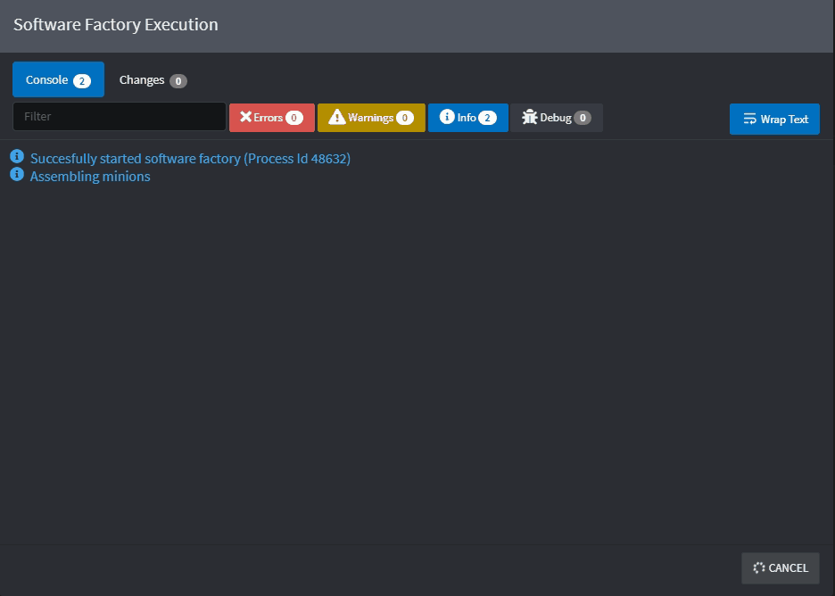
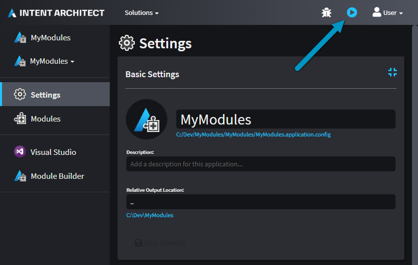

# Software Factory Execution

The Software Factory Execution is the process that executes the installed [Modules](xref:references.modules) with the metadata from the [Designers](xref:references.designers) within an [Application](xref:references.applications). The result is changes to the codebase which are **staged** before being accepted or rejected.

Intent Architect will not make changes to your codebase without your consent. The changes will be listed and can be clicked on which launches a Diff tool for you to view the changes between the files - like a _pull request_ from your robot developer friend.

_An example diff of changes made to a C# interface that's managed by Intent Architect._

The Software Factory Execution is initiated from within an Application by clicking on the _Play_ button in the top nav-bar. The execution is typically kicked off after completing some design changes, or installing / updating Modules.

# TODO

Perhaps how to configure diff tool, or anything else we need to cover.
