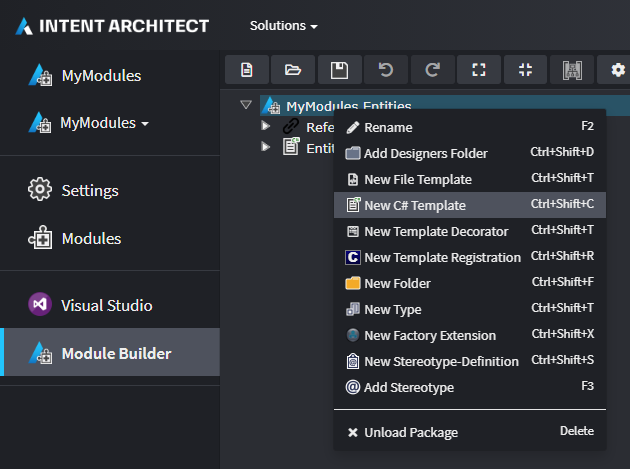
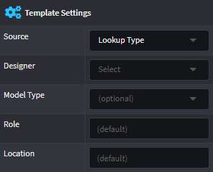

# Templates (C#)

Intent Architect has first class support for generation and code management of C# files. Out of the box it has [many features](#convenience-and-utility-features-for-c-file-generation) to enable painless authoring C# templates, for example managing things like namespaces, class names, using clauses, automatic resolution of type names, etc.

The easiest way to create a C# template is by using the [Module Builder](xref:references.modules.module-builder) and ensuring you have the `Intent.ModuleBuilder.CSharp` Module installed. If you selected the `Module Builder - C#` component during the `Create new Module` wizard it will already have been installed, otherwise it can be added at any time through the [Modules](xref:references.modules) screen for your [Application](xref:references.applications).

When the Module is installed, inside the Module Builder [Designer](xref:references.designers) you will then have the option to create a `New C# Template`.



## C# Template type overviews

The Module Builder has three available options for C# Template types, they are briefly described in the following table and more detail on each is covered later in this article.

| Type                              | Brief description                                  |
| --------------------------------- | -------------------------------------------------- |
| [Single File](#single-file)       | Single file is generated for the application.      |
| [File Per Model](#file-per-model) | A file is generated per model in your application. |
| [Custom](#custom)                 | For advanced use cases.                            |

## Files generated during the Software Factory Execution of the Module Builder

Regardless of the type selected, during the [Software Factory Execution](xref:references.software-factory-execution) the Module Builder will always generate the following three files for each C# Template created in the Module Builder designer.

### 1. Template file

| Generated file name |
| ------------------- |
| `<Name>Template.tt` |

This file is for authoring the output of the template in [T4 syntax](https://docs.microsoft.com/en-us/visualstudio/modeling/writing-a-t4-text-template). Every time this file is saved the IDE will auto "pre-compile" it and re-generate the backing `<Name>Template.cs` file which contains a [partial](https://docs.microsoft.com/en-us/dotnet/csharp/programming-guide/classes-and-structs/partial-classes-and-methods) class named `<Name>Template`.

### 2. Template partial file

| Generated file name        |
| -------------------------- |
| `<Name>TemplatePartial.cs` |

This file contains the other part of the `<Name>Template` partial class. On initial generation it contains the class constructor and the `DefineFileConfig` method.

In it you can control the instantiation of the template or adjust its config, but it is exceptionally useful though as a place to create helper methods or properties which can be conveniently used in your `.tt` file.

While it's possible to make methods in the `.tt` file itself, we've found (from a code organisation and ergonomics perspective) it works much better to create methods in a partial file to the template.

Any method or property in this partial class are accessible in the `.tt` as easily as doing `<# =PropertyName #>` (for properties) or `<# =MethodName() #>` for methods.

### 3. Template registration file

| Generated file name             |
| ------------------------------- |
| `<Name>TemplateRegistration.cs` |

This file contains the code for _registering_ one or more _instances_ of the template for use during the Software Factory Execution.

> [!IMPORTANT]
> A key concept to understand about Intent Architect is that the Software Factory Execution will output a single file per registered template _instance_. A template may have none, a single or multiple _instances_ of it registered during Software Factory Execution. For example the [Single File](#single-file) C# Template Type will register a single instance of its template, while the [File Per Model](#file-per-model) C# Template Type will register an instance of its template for each occurrence of a model type in a Designer.

## Details of the C# Template types

### Single File

An example use case for this C# Template type is generation of infrastructural files, such as `Startup.cs` in an ASP.NET Core project.

The generated [Template registration file](#3-template-registration-file) derives from `SingleFileTemplateRegistration` and the code will register a single instance of the template. The registration class derives from `SingleFileTemplateRegistration` which allows the amount of code to be kept simple and to a minimum.

The generated [Template partial file](#2-template-partial-file)'s class uses `object` for its generic type parameter with the assumption that there is no `model` to be used, but it is there for use cases where you need to pass in metadata.

### File Per Model

This C# Template type is for when you want a separate `.cs` file for each instance of a model in a desiger of a type, EG: domain entities, WebApi endpoint, DTO, etc.

The generated [Template registration file](#3-template-registration-file) derives from `FilePerModelTemplateRegistration<TModel>` and the code will register an instance of the template per model.

The generated [Template partial file](#2-template-partial-file)'s class uses `TModel` for its generic type parameter.

For both the template registration and partial files, the generated value for `TModel` is determined by the selected `Model Type` in the `Template Settings`:



Unlike [Single File](#single-file) above, The `model` for this type of C# Template is essential as each registered template instance will have a seperate output file generated with its name and content dependant upon details on the incoming `model`.

### Custom

This C# Template type is used far less than the other types and is when the other types' template instance registration doesn't doesn't quite work for a particular use case.

Custom is largely the same as [Single File](#single-file) except that the generated [Template registration file](#3-template-registration-file) derives from `ITemplateRegistration` and therefore allows complete control over the implementation.

## Convenience and utility features for C# file generation

Through extensive experience of building templates for generating C# files, we have added many features which we consider essential to making the C# template authoring process a painless experience.

### Code Management

A core feature of Intent Architect is [Code Management](xref:references.code-management) where parts of a file are managed fully by Intent Architect while other parts in the same file are hand crafted and Intent Architect will leave those particular parts alone.

For C# files, you can use [C# attributes](https://docs.microsoft.com/en-us/dotnet/csharp/programming-guide/concepts/attributes/) anywhere in the file to opt-out a particular element of code within a file from being overwritten during Software Factory Execution.

For example you could place `[IntentManaged(Mode.Ignore)]` on a particular method and when Intent Architect sees this during Software Factory execution it will make sure to never change anything for it.

### Class Name

When working with C# templates, you should always use `<#= ClassName #>` for a class's name:

```csharp
public class <#= ClassName #>
{
}
```

Intent Architect will then ensure it handles all the rules and edge cases for the name of your class, including (but not limited to) things like:
- Applying CamelCase naming convention.
- Removing invalid characters, like spaces or punctuation.
- Applying other class name rules like that they can't begin with a number.

### Namespace

When working with C# templates, you should always use `<#= Namespace #>` to declare the file's namespace:

```csharp
namespace <#= Namespace #>
{
}
```

Intent Architect will then automatically generate the namespace based on the following:
- The [Application](xref:references.applications) name.
- The project name and folder of the Template as per your configuration in the [Visual Studio Designer](xref:references.modules.visual-studio#designer).
- The folder of the particular model for the template instance (for [File Per Model](#file-per-model) Templates only).

### Using statements

Intent Architect will automatically add required [using statements](https://docs.microsoft.com/en-us/dotnet/csharp/language-reference/keywords/using-statement) to generated C# files based on specified template dependencies as [`GetTypeName(...)`](#resolving-type-names-of-other-template-instances) usages.

To specify a template dependency, use the `AddTypeSource(...)` method in the constructor of the template in the [Template File](#1-template-file):

```csharp
partial class EntityBaseTemplate : CSharpTemplateBase<object>
{
    public EntityBaseTemplate(IOutputTarget outputTarget, object model = null)
        : base(TemplateId, outputTarget, model)
    {
        AddTypeSource(DifferentTemplate.TemplateId);
    }
}
```

During Software Factory Execution, Intent Architect will [determine the namespaces](#namespace) of those other Template instances and add them as using statements.

### Resolving type names of other template instances

Similar to how Intent Architect automatically determines the [class name for the current Template instance](#class-name), it can resolve the determined class names of other Template instances.

This is essential for templates which refer to types generated in other template instances as doing so manually would require consideration not only of the the other Template instance's class name, namespace and use generic parameters, but also that Intent Architect allows customization through its UI of the resolution of these, meaning that the rules you thought applied, might have been overridden.

To resolve a type name for a [Single File](#single-file) template instance, you can use the `GetTypeName(string templateId)` method:

```csharp
// Template File
namespace <#= Namespace #>
{
    public class <#= ClassName #> : <#= GetEntityBaseTypeName() #>
    {
    }
}

// Template Partial File
public string GetEntityBaseTypeName()
{
    return GetTypeName(EntityBaseTemplate.TemplateId);
}
```

To resolve a type name for a [File Per Model](#file-per-model) template instance you can use the `GetTypeName(string templateId, IMetadataModel model)` overload:

```csharp
// Template File
namespace <#= Namespace #>
{
    public class <#= ClassName #>
    {
<# foreach (var property in Model.Property) { #>
        public <#= GetPropertyTypeName(property)#> <#= property.Name.ToPascalCase() #> { get; set; }
<# } >
    }
}

// Template Partial File
public string GetPropertyTypeName(Property property)
{
    return GetTypeName(EntityTemplate.TemplateId, property);
}
```

### NuGet package dependencies

Intent Architect will automatically install NuGet packages for projects based on specified NuGet package requirements in Templates.

To specify a NuGet package dependency, use the `AddNugetDependency(...)` method in the constructor of the template in the [Template File](#1-template-file):

```csharp
partial class EntityBaseTemplate : CSharpTemplateBase<object>
{
    public EntityBaseTemplate(IOutputTarget outputTarget, object model = null)
        : base(TemplateId, outputTarget, model)
    {
        AddNugetDependency(NuGetPackages.MediatR);
    }
}
```

And then at the root location of the Module's `.csproj`, create a class as follows:

```csharp
public class NuGetPackages
{
    public static INugetPackageInfo MediatR = new NugetPackageInfo("MediatR", "9.0.*");
}
```

> [!NOTE]
> While it's not necessary to create a separate static class like the `NuGetPackages` class above, it's highly recommended as a Module will often have multiple Templates using the same NuGet package. By having all your Templates share the same `NugetPackageInfo`, you can more easily upgrade the package version globally or find all usages.

### GAC Assembly dependencies

Intent Architect will automatically add [GAC](https://docs.microsoft.com/en-us/dotnet/framework/app-domains/gac) Assembly references to `.csproj` files based on specified requirements in Templates.

To specify a GAC Assembly reference requirement, use the `AddAssemblyReference(...)` method in the constructor of the template in the [Template File](#1-template-file):

```csharp
partial class EntityBaseTemplate : CSharpTemplateBase<object>
{
    public EntityBaseTemplate(IOutputTarget outputTarget, object model = null)
        : base(TemplateId, outputTarget, model)
    {
        AddAssemblyReference(new GacAssemblyReference("System.Runtime.Serialization"));
    }
}
```
