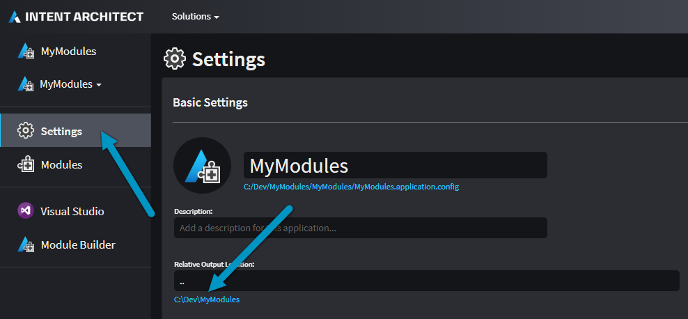

# Create a simple module

In this step of the tutorial we will create a new Module Builder Application in Intent Architect, use the Designer to add a template to it, run the Software Factory against this Application to generate a .NET Core C# solution, which we will then finally build in our IDE to generate the Module.

## Create a new application

On the home screen click `Create a new module`.

Fill in a `Name` (such as `MyModules`), review/change the `Location` as desired and click `NEXT`.

Ensure the following components are selected:
- `Module Builder Core`
- `Module Builder - C#`
- `Visual Studio Integration`

Click `CREATE`.

An `Application Installation` dialogue will pop up showing the progress of downloading and installing Modules and Metadata for the Application, once it's finished it will show `Process complete.` and you can click the `CLOSE` button:

<p><video style="max-width: 100%" muted="true" loop="true" autoplay="true" src="videos/create-a-new-module.mp4"></video></p>


## Create a package

Click on `Module Builder` on the left of the screen to enter the designer.

Click `CREATE NEW PACKAGE`.

Enter a name for the [Package](xref:references.packages) (such as `MyModules.Entities`) and click `DONE`.

<p><video style="max-width: 100%" muted="true" loop="true" autoplay="true" src="videos/create-the-package.mp4"></video></p>

## Create a template

Right-click the Package and click the `New C# Template` option:

Name it `EntityBase` and for its type select `Single File`:

<p><video style="max-width: 100%" muted="true" loop="true" autoplay="true" src="videos/create-the-template.mp4"></video></p>

## Run the software factory

We are now ready to run the software factory. Press the play button near the top right of the screen and the execution will start.

> [!NOTE]
> If your changes are unsaved you will be asked if you want to save them before proceeding.

Once the Software Factory has executed the templates, it pauses to give you an opportunity to review the proposed changes (called staging). You can click an entry and it will open in a diff tool. If you are satisfied with the proposed changes you can press the `APPLY CHANGES` button to continue. When the Software Factory Execution is complete, you will be presented with the `CLOSE` button to end the session.

<p><video style="max-width: 100%" muted="true" loop="true" autoplay="true" src="videos/run-the-software-factory.mp4"></video></p>

## Edit the template in Visual Studio

During the Software Factory Execution, Intent Architect generated a Visual Studio solution along with the `EntityBase` template which was added in the [create a template](#create-a-template) step above.

Navigate to the folder where the `.sln` solution file (and associated files) have been placed and open it with Visual Studio.

> [!TIP]
> Intent Architect can open the folder where the generated content was placed by you going to the Application `Settings` and clicking on the path hyperlink located under the `Relative Output Location` input:
> 
> 

Go to the `MyModules` Project and expand the `Templates` folder and then the `EntityBase` folder.

Open the `EntityBaseTemplate.tt` file and update its content to the following:

```csharp
<#@ template language="C#" inherits="CSharpTemplateBase<object>" #>
<#@ assembly name="System.Core" #>
<#@ import namespace="System.Collections.Generic" #>
<#@ import namespace="System.Linq" #>
<#@ import namespace="Intent.Modules.Common" #>
<#@ import namespace="Intent.Modules.Common.Templates" #>
<#@ import namespace="Intent.Modules.Common.CSharp.Templates" #>
<#@ import namespace="Intent.Templates" #>
<#@ import namespace="Intent.Metadata.Models" #>
using System;

[assembly: DefaultIntentManaged(Mode.Fully)]

namespace <#= Namespace #>
{
    public abstract class <#= ClassName #>
    {
        public DateTime CreatedDate { get; set; }

        public DateTime UpdatedDate { get; set; }

        public string CreatedBy { get; set; }

        public string UpdatedBy { get; set; }
    }
}
```

Save your changes and build the project.

<p><video style="max-width: 100%" muted="true" loop="true" autoplay="true" src="videos/edit-template-and-build-in-visual-studio.mp4"></video></p>

Once the build has been completed you will notice that the `Build` log includes the following line:
`Successfully created package C:\Dev\MyModules\Intent.Modules\MyModules.Entities.1.0.0.imod`

This was output by the Intent Packager and lets you know where it has placed the built Module.

## Summary

You have successfully created an Intent Architect Module.

## Next Steps

#### [Install and run the module](xref:tutorials.create-a-module.install-and-run-the-module)
Create a test Application to install and run our Module.
