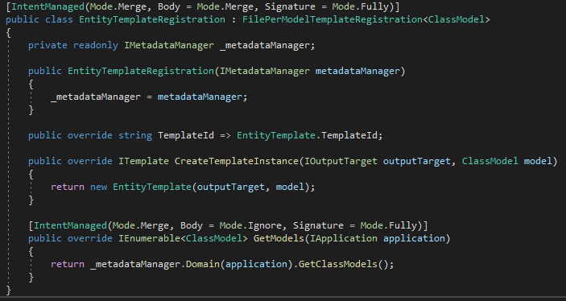
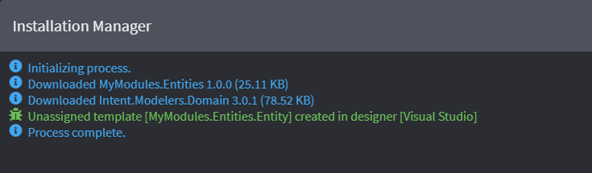
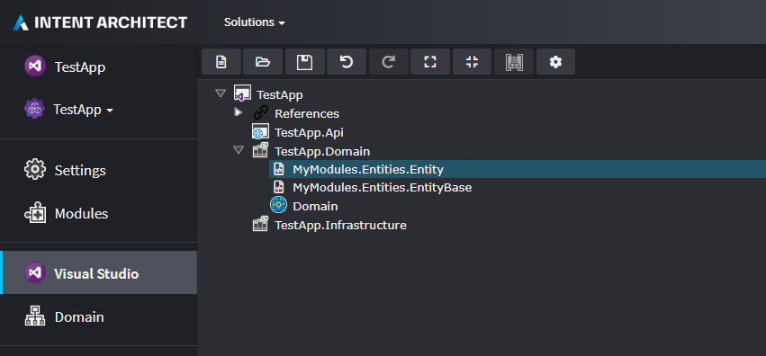

# Create files per Model
In this next tutorial we will extend our `MyModules.Entities` Module to create and manage domain entities based off the `Domain` Designer. To do this we will create a Template that generates a new file for each entity we create in the `Domain`.


## Install the `Domain` Metadata
First, to access the `Domain` types so that we can configure our Template correctly, we must install metadata from the `Intent.Modelers.Domain` Module into our Module Builder.

1. Open the `MyModules.Entities` Application.
2. Navigate to the `Modules` tab.
3. Select the Intent Architect website repository https://intentarchitect.com.
4. Search for the `Intent.Modelers.Domain` Module.
5. In the Module details pane, expand the `Options` and check the `Install Metadata only` checkbox.
    >[!NOTE]
    >By selecting the `Install Metadata only` option, Intent Architect will not install the Designer or run the Module during a Software Factory Execution. This feature is typically used in the Module Builder.

6. Click `Install` to install the Module.

<p><video style="max-width: 100%" muted="true" loop="true" autoplay="true" src="videos/modules-install-domain-metadata-only.mp4"></video></p>


## Create a new Template
Next, we will create a new Template that we can configure to receive the models from the `Domain` Designer and create a new C# class for each entity.

1. Navigate to the `Module Builder` Designer
2. Create a new Template, call it `Entity` and set it's type to be `File per Model`.
3. In the properties, under `Template Settings`, set it's `Designer` to `Domain` and Model Type to `Class`.

    >[!NOTE]
    >These options are available because we installed the `Intent.Modelers.Domain` Module's metadata in the previous step.

4. Save you changes.
5. Rerun the Software Factory Execution.
6. Click `APPLY CHANGES`.

<p><video style="max-width: 100%" muted="true" loop="true" autoplay="true" src="videos/module-builder-create-entity-template.mp4"></video></p>

>[!WARNING]
>It is always recommended to inspect the changes that Intent Architect wants to make to your codebase _before_ applying the changes.

>[!NOTE]
>You may notice that the `EntityTemplateRegistration.cs` class is wired up to create a new Template _instance_ for each `ClassModel` that is retrieved from the `Domain` Designer by Intent Architect's metadata management system. 
>
>
>
>Filtering which `ClassModel`s create an `EntityTemplate` can be cleanly done in the `GetModels(...)` method. [Learn more here](xref:how-to-guides.filter-templates).

## Implement Template Logic
Next, we will implement the logic of the `Entity` Template, essentially _templatizing_ our entities pattern. In this tutorial we will create `public` properties for each _attribute_ and _association_ that we describe in the `Domain` Designer.

1. Open the `MyModule.Entities` code solution in your IDE (e.g. Visual Studio).
2. Open the `EntityTemplate.tt` file.
3. Implement the following logic to create the properties for the attributes and associations of each `Domain` entity:
    ```csharp
    <#@ template language="C#" inherits="CSharpTemplateBase<Intent.Modelers.Domain.Api.ClassModel>" #>
    <#@ assembly name="System.Core" #>
    <#@ import namespace="System.Collections.Generic" #>
    <#@ import namespace="System.Linq" #>
    <#@ import namespace="Intent.Modules.Common" #>
    <#@ import namespace="Intent.Modules.Common.Templates" #>
    <#@ import namespace="Intent.Modules.Common.CSharp.Templates" #>
    <#@ import namespace="Intent.Templates" #>
    <#@ import namespace="Intent.Metadata.Models" #>
    using System;
    using System.Collections.Generic;

    [assembly: DefaultIntentManaged(Mode.Fully)]

    namespace <#= Namespace #>
    {
        public class <#= ClassName #> : <#= GetBaseType() #>
        {
    <#  foreach(var attribute in Model.Attributes) { #>

            public <#= GetTypeName(attribute) #> <#= attribute.Name.ToPascalCase() #> { get; set; }
    <#  } #>
    <#  foreach(var associationEnd in Model.AssociatedClasses.Where(x => x.IsNavigable)) { #>

            public <#= GetTypeName(associationEnd) #> <#= associationEnd.Name.ToPascalCase() #> { get; set; }
    <#  } #>
        }
    }
    ```

    >[!NOTE]
    >The Module Builder has automatically wired up our Template so that the  `Model` property is of the type `ClassModel` (the `Class` model for the Domain which will represent our entities). From the `Model` the can access the `Attributes` and `AssociatedClasses` collections.
    >
    >The `GetTypeName(...)` method returns the referenced type that was specified as a qualified and namespace-normalized C# type. It also tracks dependencies between this template and others, allowing it to dynamically add `using` clauses to managed classes (created by Intent Architect) in different namespaces.
    >
    >Also note that we filter the `AssociatedClasses` by those those that are _Navigable_:
    >```
    ><#  foreach(var associationEnd in Model.AssociatedClasses.Where(x => x.IsNavigable)) { #>
    >```
    >This prevents ever association relationship from being expresses as bidirectional in our code. 

<!-- TODO: Add a link to C# template documentation as well as Domain API documentation -->
4. Open the `EntityTemplatePartial.cs` file. Add the `GetBaseType()` method, that we call in the `EntityTemplate.tt` file, as follows:
    ```csharp
    private string GetBaseType()
    {
        return GetTypeName(EntityBaseTemplate.TemplateId);
    }
    ```
    >[!NOTE]
    >Here the `GetTypeName(...)` method is passed the Template Identifier of our `EntityBaseTemplate`. Since this is a single-file and the outputs will be in the same namespace, Intent Architect will resolve it as the class name `EntityBase`. If the classes were in different namespaces, the namespace would be introduced as a `using` class.

5. Rebuild the module by recompiling the project.

<p><video style="max-width: 100%" muted="true" loop="true" autoplay="true" src="videos/templatizing-entities-t4.mp4"></video></p>


>[!TIP]
>The Intent Module Builder configures T4 (`.tt`) files to operate in the same way a `StringBuilder`. The _code-behind_ is regenerated every time the `.tt` file is saved.


## Reinstall the Module
Finally, our Module is ready and can reinstall it into our `TestApp` that we created in the [previous tutorial](xref:tutorials.create-a-module.install-and-run-the-module).

1. Open the `TestApp` Application in Intent Architect.
2. Navigate to the `Modules` tab.
3. Click on the `MyModules.Entities` Module and click `Reinstall` in the details pane. Note that a new unassigned Template Output has been created for our new Template. We will need to assign it.
    
4. Navigate to the `Visual Studio` Designer and assign the `MyModules.Entities.Entity` Template Output to the `TestApp.Domain` project. The configuration should look as follows:
    

>[!NOTE]
>Notice that the `Domain` Designer has now been installed. When we configured our `Entity` Templates to use the `Domain` Designer, the Module Builder automatically added a dependency to the `Intent.Modelers.Domain` Module in the `.imodspec` file.

## Visually model a test domain
Next, we will use the `Domain` Designer to model out a basic test domain. We will use this test our _entities pattern_.

1. Navigate to the the `Domain` Designer tab.
2. Create a new `Domain Package`.
3. Create classes on the diagram by right-clicking, and selecting `Create a Class`. For this example, let's create the following classes:
    - `User`
    - `Privilege`
    - `AssignedPrivilege`
4. We can now add attributes to each of the classes as follows:
    - `User`
        - `firstName: string`
        - `lastName: string`
        - `emailAddress: string`
        - `isActive: bool`
    - `Privilege`
        - `name: string`
    - `AssignedPrivilege`
        - `canUpdate: bool`
5. Next, let's create relationships between each class as follows:
    - `User` 1 --> * `AssignedPrivilege` (one-to-many)
    - `AssignedPrivilege` * --> 1 `Privilege` (many-to-one)

    >[!TIP]
    > Associations in the `Domain` Designer have a Source End and Target End. To set the multiplicity of relationships we change the `Is Collection` and `Is Nullable` settings of each end. For example a _one-to-many_ relationship will be set up that the Target End `Is Collection` is `true` and the Source End `Is Collection` is `false`.
6. Save your changes.
7. Run the Software Factory Execution. A new C# entity class should be created for each of our entities with their properties for each Attribute and Association.
8. Click `APPLY CHANGES`.

<p><video style="max-width: 100%" muted="true" loop="true" autoplay="true" src="videos/domain-visually-modelling.mp4"></video></p>

## Summary
In summary, this tutorial introduced how to use the Module Builder to create a Module - composed of a _single file_ Template as well as a _file per model_ Template - and then run it in a separate application. We covered how to templatize our entity pattern inside of the T4 `.tt` files, and how to set up methods in the Template's partial class that we call them from the T4. We also covered how to install and reinstall Modules, some basic domain modelling using the `Domain` Designer, as well as how to assign Template Outputs to projects in the `Visual Studio` Designer.

## What's Next

#### [Use Stereotypes](xref:how-to-guides.use-stereotypes)
Stereotypes provide powerful metadata extensions, allowing you to add extra custom information to your Designers. This information can be used to make all kinds of decisions in your Modules.

#### [Decorate a Template](xref:how-to-guides.decorate-a-template)
Sometime you may want to optionally extend a Template from another Module. Decorators allow you achieve this and can help keep your Modules cohesive with a good separation of concerns.