# Create Pet Clinic for the .NET C# Technology Stack

## Prerequisites

- Ensure Intent Architect has been [installed](xref:getting-started.get-the-application).
- The latest [Microsoft Visual Studio for Windows/Mac](https://visualstudio.microsoft.com/), [JetBrains Rider](https://www.jetbrains.com/rider/download/) or any other IDE capable of working with .NET Core projects.

## Create a new Application

On the home screen click `Create a new application`.

Select the `Web Application ASP.NET Core 5.0` Application Template.

Fill in a `Name` (such as `PetClinicRest`), review/change the `Location` as desired and click `NEXT`.

Ensure that the following Modules are selected:

- `ASP.NET Core RESTful Api`
- `OpenAPI (Swashbuckle)`
- `Basic Service Implementation`
- `Entities`
- `Entity Framework Core`
- `Visual Studio Integration`

An `Application Installation` dialogue will pop up showing the progress of downloading and installing Modules and Metadata for the Application, once it's finished it will show `Process complete.` and you can click the `CLOSE` button:

<p><video style="max-width: 100%" muted="true" loop="true" autoplay="true" src="videos/create-new-app.mp4"></video></p>

## Create a package for the Domain designer

Click on `Domain` on the left of the screen to enter the designer.

Click `CREATE NEW PACKAGE`.

Leave the name with its default value of `Domain` and click `DONE`.

This is where you will model your "business domain" using an [UML](https://en.wikipedia.org/wiki/Unified_Modeling_Language) class relationship diagram which Intent Architect will use to generate C# classes and ultimately a database schema.

<p><video style="max-width: 100%" muted="true" loop="true" autoplay="true" src="videos/create-domain-package.mp4"></video></p>

### Create the Domain Entities

This PetClinic application's business domain requires the following [entities](https://en.wikipedia.org/wiki/Domain-driven_design#Building_blocks) (concepts) to be modeled:

- `Pet`
- `Owner` (to which a `Pet` "belongs to")
- `Visit` (to represent each visit by a `Pet` to the PetClinic)

Entities can be added to the domain modeler by right-clicking on the background of it and clicking the `New Class` option. Alternatively, they can also be added in the tree view by right-clicking on a folder and similarly clicking the `New Class` option.

Create a `Pet` entity and then right-click it (on either the visual diagram's block, or the tree view element) and click the `Add Attribute` option to add the following attributes:

- `id` of type `int`
- `name` of type `string`
- `birthDate` of type `date`

<p><video style="max-width: 100%" muted="true" loop="true" autoplay="true" src="videos/create-entity-pet.mp4"></video></p>

Before the `Pet` is complete, there are two minor adjustments that would need to be made to help indicate to the backend persistence layer (i.e. the Database) that the `id` attribute will act as a `Primary Key` and another concern is to limit the length of the `name` field to 30 characters. This can be achieved by adding [Stereotypes](xref:references.stereotypes) to Class attributes.

To do this, right click on the `id` attribute and select `Add Stereotype`. This will present a list of stereotypes for you to add. Select the `Primary Key` stereotype from the list.

Next select the `name` attribute and add the `Text Constraints` stereotype.
Once added, you will need to specify the `Max Length` to be 30.

<p><video style="max-width: 100%" muted="true" loop="true" autoplay="true" src="videos/add-pet-stereotypes.mp4"></video></p>

Create an `Owner` entity with the following attributes:

- `id` of type `int` (Primary Key)
- `firstName` of type `string` (Max Length: 30 characters)
- `lastName` of type `string` (Max Length: 30 characters)
- `address` of type `string` (Max Length: 255 characters)
- `city` of type `string` (Max Length: 80 characters)
- `telephone` of type `string` (Max Length: 20 characters)


## Specify the relationships between entities

Specifying [relationships](https://en.wikipedia.org/wiki/Class_diagram#Instance-level_relationships) between entities in the Intent Architect modelers are initiated by right-clicking an entity in the visual diagram, then clicking the `New Association` option and then completed by clicking on the other class which you want to be the target of the relationship.

Create an association between `Owner` and `Pet`:

- Right-click on `Owner` entity.
- Click on the `New Association` option.
- Click on the `Pet` entity which completes the creation of the association.
- In the property pane (in the bottom-right corner of the screen) within the `Target End` section ensure that `Is Collection` is checked.
- In the property pane within the `Source End` section ensure that `Is Collection` is *un*checked and that `Navigable` is checked.

<p><video style="max-width: 100%" muted="true" loop="true" autoplay="true" src="videos/add-owner-pet-association.mp4"></video></p>

>[!NOTE]
>To learn more about these associations, visit [this article](xref:references.domain-designer.associations) for more information.

Create an association between `Owner` and `Pet`:

- Right-click on `Owner` entity.
- Click on the `New Association` option.
- Click on the `Pet` entity which completes the creation of the association.
- In the property pane (in the bottom-right corner of the screen) within the `Target End` section ensure that `Is Collection` is checked.
- In the property pane within the `Source End` section ensure that `Is Collection` is *un*checked and that `Navigable` is checked.

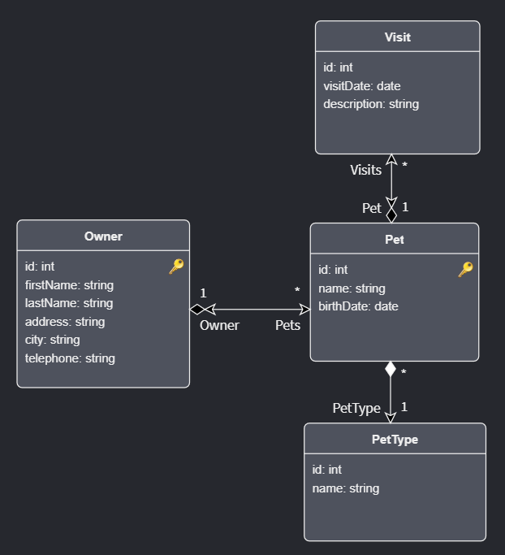

## Create a package for the Services designer

Click on the `Services` designer located on the left panel. Here you will model API Services for the domain models you have created.

Click `CREATE NEW PACKAGE`.

Leave the name with its default value of `Services` and click `DONE`.

<p><video style="max-width: 100%" muted="true" loop="true" autoplay="true" src="videos/create-services-package.mp4"></video></p>

Create the `OwnerRestController` service in the `Services` package by right clicking on the `Services` package and selecting `New Service`.

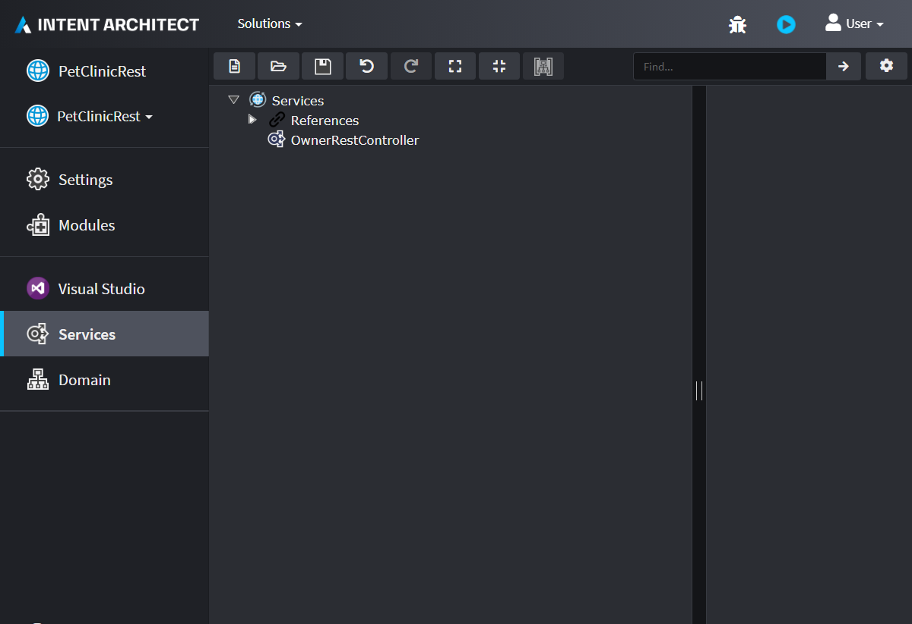

You will now create `DTO` objects. You can [read here](https://en.wikipedia.org/wiki/Data_transfer_object) about Data Transfer Objects to know more.

Create a new Package and call it `DTOs`.
Right click in the background and select `Create new package`.
Give it the name `DTOs`.
Click on the `Save` button.
Right Click on the References item located in the `Services` package, select `Add Package Reference...` and select the newly created `DTOs` package.
Click on `Save` again.

<p><video style="max-width: 100%" muted="true" loop="true" autoplay="true" src="videos/create-services-dtos-package.mp4"></video></p>

Right click on the `DTOs` package and create a new `DTO`. Name the DTO, `OwnerDTO`.
Also create also the following:

- `PetDTO`
- `PetVisitDTO`

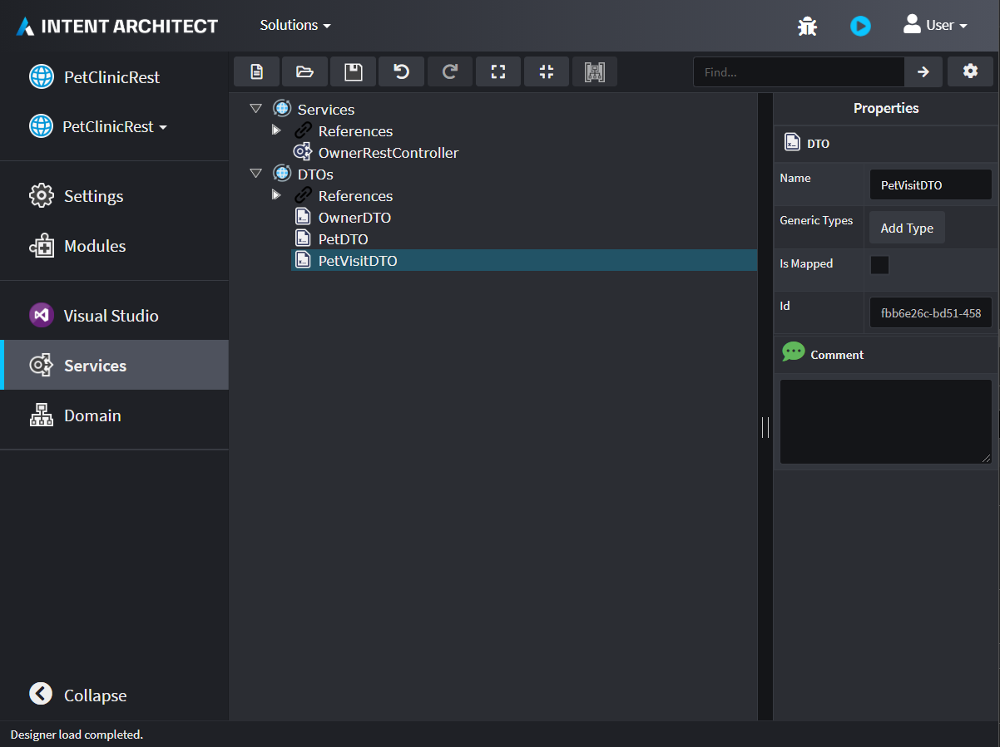

## Map Domain Entities to DTOs

On the `PetVisitDTO`, right click on it and select `Mapping...`.
Click on the drop-down named `Select an element to map from`.
Notice that you will now see all your Domain Entities in that drop-down.
Choose the `Visit` Entity.

Set the check-boxes for the following attributes:

- `id`
- `visitDate`
- `description`

<p><video style="max-width: 100%" muted="true" loop="true" autoplay="true" src="videos/service-mapping-pet-visit.mp4"></video></p>

Right click on the `PetDTO` and select `Mapping...`.
Select the `Pet` Entity from the bottom drop-down.

Ensure that the following fields are checked:

- `id`
- `name`
- `birthDate`
- `Visit`

On the `Pet` entity, expand the `PetType` field and check the `id` and `name` fields. Do the same for `Owner` with the `id`, `firstName` and `lastName` fields.
Click on `DONE`.

When the `Visit` field highlights in red, click on it and select the `PetVisitDTO` type in the `Type` field located on the right of the screen.

Locate the fields that you have mapped by looking at the text next to it (separated by an arrow), this shows the field where it is mapped from, and rename the fields that are mapped from `PetType.id`, `PetType.name`, `Owner.id`, `Owner.firstName` and `Owner.lastName` to have the corresponding prefix: If it is mapped from `PetType` add `petType` and if it is from `Owner`, add `owner`.

>[!NOTE]
>As you prefix those attributes with lowercase letters it may be important to still retain [Camel casing](https://en.wikipedia.org/wiki/Camel_case) for consistency reasons

<p><video style="max-width: 100%" muted="true" loop="true" autoplay="true" src="videos/service-mapping-pet.mp4"></video></p>

Lastly we need to map the `OwnerDTO` to look like this:

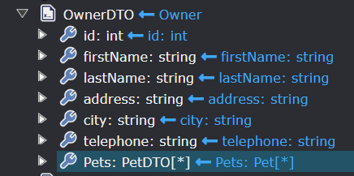

## Add Operations to Services

Right click on the `OwnerRestController` to add a new `getOwners` operation. Set the return type of `OwnerDTO` (as a collection) and set the HTTP Verb to `GET`.

>[!WARNING]
>You might find that your list of DTOs in the `DTOs` package may not always appear immediately. As a workaround, ensure you have saved your work and navigate away to another designer/screen then come back to the Services designer.

<p><video style="max-width: 100%" muted="true" loop="true" autoplay="true" src="videos/services-add-get-owners.mp4"></video></p>

In the `DTOs` package, create a `OwnerCreateDTO` and manually add the following fields to it to look like this:

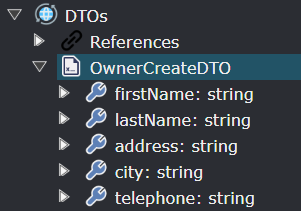

Next create an operation called `addOwner` on the `OwnerRestController`.
It should have a `dto` parameter of type `OwnerCreateDTO` and an HTTP Verb `POST`.

<p><video style="max-width: 100%" muted="true" loop="true" autoplay="true" src="videos/services-add-add-owner.mp4"></video></p>

## Generate the Code

Run the `Software Factory Execution` by clicking on the Play button located on the top right part of the screen.

<p><video style="max-width: 100%" muted="true" loop="true" autoplay="true" src="videos/software-factory-run.mp4"></video></p>

Once the `Diff` view comes into view, to demonstrate the changes that are going to be applied click on the `OwnerRestController.cs` file in the list shown below.

>[!TIP]
>You can also filter the files list by typing in the name of the file you're looking for in the filter text box located top left of the Software Factory Execution Pop up.

You will notice three files. Click on the one located in the `Implementation` folder.

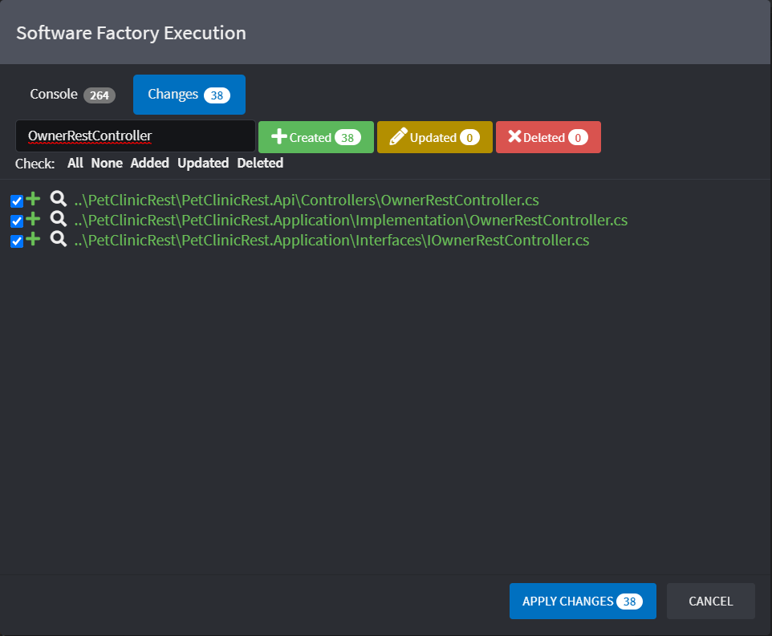

The default editor should present itself (i.e. VSCode) to show you a `diff` of all the changes where a class is being generated with the two operations that you added in the `Services` designer.

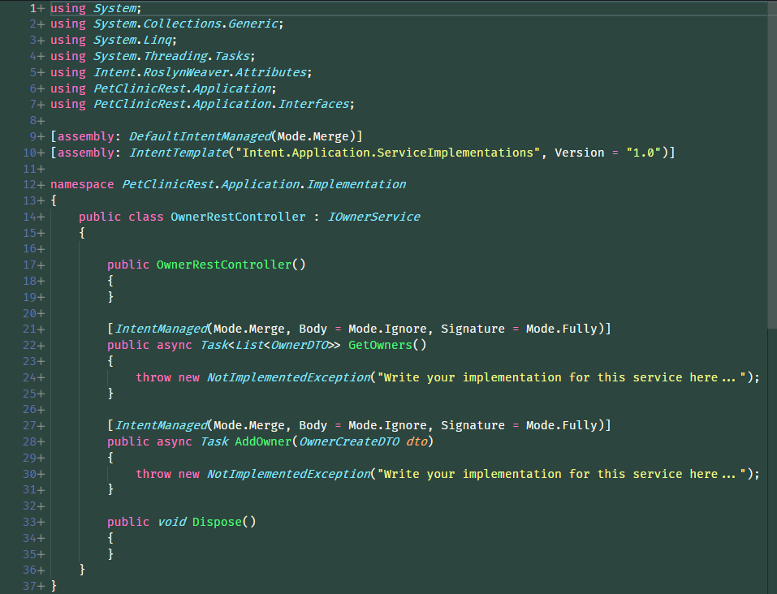

To conclude this demonstration, click on `CANCEL` and click on the `Modules` section located on the left of the screen.

Install the following modules:

- `Intent.EntityFrameworkCore.Repositories`
- `Intent.Application.ServiceImplementations.Conventions.CRUD`

Execute the Software Factory again and click again on the file `OwnerService`.

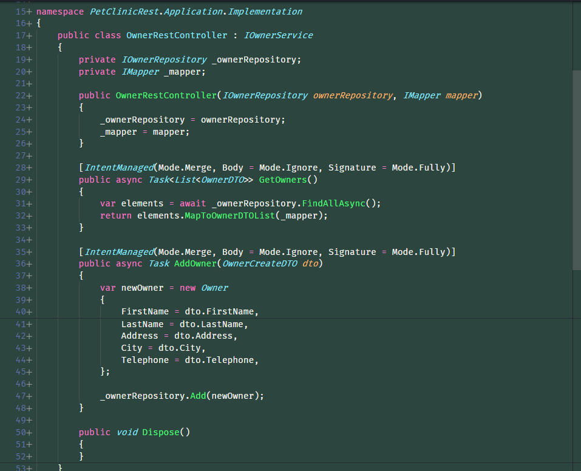

>[!NOTE]
>Notice that the operations are now populated with code that will facilitate CRUD operations.
>The installed modules will only implement the code for you on CRUD based operations and not for more complicated service operations.
>[!WARNING]
>It is always recommended to inspect the changes that Intent Architect wants to make to your codebase before applying the them.

In Intent Architect on the `Execute Software Factory` dialog, click on `APPLY`.

## Test your application back-end

Compile your application in Visual Studio and Run it.

Once its running, a browser window will appear. Append in the address bar `/swagger` and `ENTER` to be directed to the swagger page.

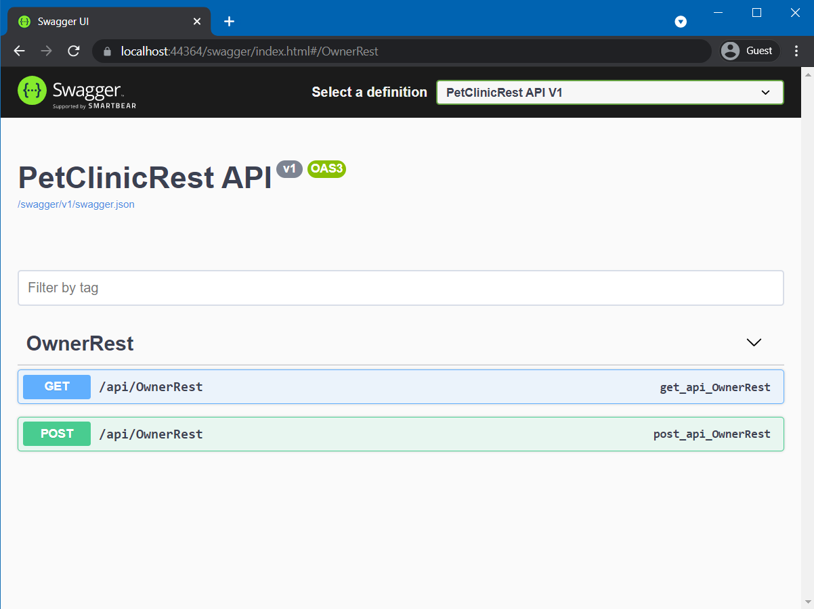

Click on the `POST` version of the `/api/OwnerRest` panel and then click on the `Try it out` button.

Paste the following in the request body text box:

```json
{
  "firstName": "Sherlock",
  "lastName": "Holmes",
  "address": "221B Baker Street",
  "city": "London",
  "telephone": "020 7234 3456"
}
```

Next click on the `Execute` blue button.

It should come back with success.

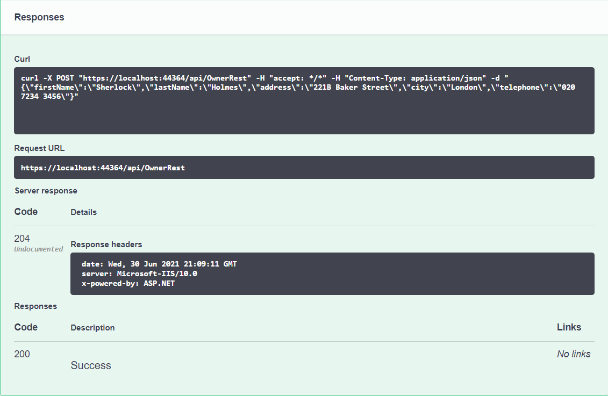

Next let's try and query all the Owners by going to the `GET` version of the `/api/OwnerRest` panel and click on the `Try it out` button followed by clicking on the blue `Execute` button.

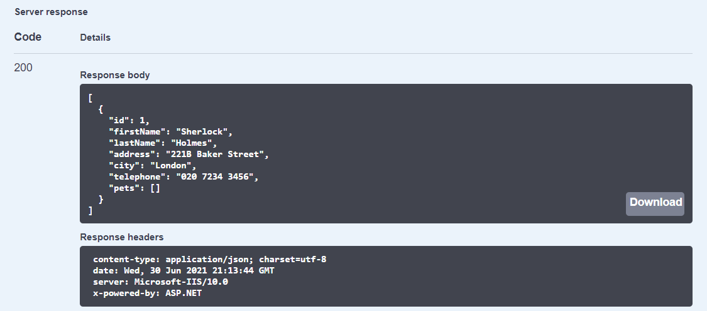

It should also come back with success.

## What's Next

### Finish the Implementation

You have only implemented a small portion of the application in order to get acquainted with Intent Architect.

You are welcome to try and implement the rest of the services yourself so that you can have `Pets` with `Owners` and `Pets` make `Visits` to the `Vet`, etc.

Alternatively you may choose to go to the next tutorial.

### [Tutorial: Create a Module (.NET)](xref:tutorials.create-a-module.introduction)

Tutorials on how to create a Module and install it into an Application.

Modules are the building blocks for how to automate your infrastructural and architectural patterns.
