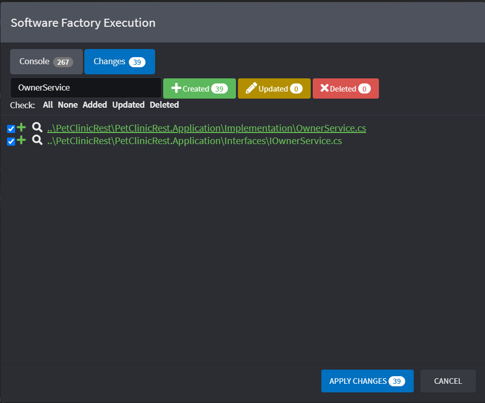

# Create Pet Clinic for the .NET C# Technology Stack

## Prerequisites

- Ensure Intent Architect has been [installed](xref:getting-started.get-the-application).
- The latest [Microsoft Visual Studio for Windows/Mac](https://visualstudio.microsoft.com/), [JetBrains Rider](https://www.jetbrains.com/rider/download/) or any other IDE capable of working with .NET Core projects.

## Create a new Application

On the home screen click `Create a new application`.

Select the `Web Application ASP.NET Core 5.0` Application Template.

Fill in a `Name` (such as `PetClinicRest`), review/change the `Location` as desired and click `NEXT`.

Ensure that the following Modules are selected:

- `ASP.NET Core RESTful Api`
- `OpenAPI (Swashbuckle)`
- `Basic Service Implementation`
- `Entities`
- `Entity Framework Core`
- `Visual Studio Integration`

An `Application Installation` dialogue will pop up showing the progress of downloading and installing Modules and Metadata for the Application, once it's finished it will show `Process complete.` and you can click the `CLOSE` button:

<p><video style="max-width: 100%" muted="true" loop="true" autoplay="true" src="videos/create-new-app.mp4"></video></p>

## Create a package for the Domain designer

Click on `Domain` on the left of the screen to enter the designer.

Click `CREATE NEW PACKAGE`.

Leave the name with its default value of `Domain` and click `DONE`.

This is where the "business domain" will be modelled using a [UML](https://en.wikipedia.org/wiki/Unified_Modeling_Language) class relationship diagram which Intent Architect will use to generate C# classes and ultimately a database schema.

<p><video style="max-width: 100%" muted="true" loop="true" autoplay="true" src="videos/create-domain-package.mp4"></video></p>

### Create the Domain Entities

This PetClinic application's business domain requires the following [entities](https://en.wikipedia.org/wiki/Domain-driven_design#Building_blocks) (concepts) to be modelled:

- `Pet`
- `Owner` (to which a `Pet` "belongs to")
- `Visit` (to represent each visit by a `Pet` to the PetClinic)

Entities can be added to the domain modeler by right-clicking on the background of it and clicking the `New Class` option. Alternatively, they can also be added in the tree view by right-clicking on a folder and similarly clicking the `New Class` option.

Create a `Pet` entity and then right-click it (on either the visual diagram's block, or the tree view element) and click the `Add Attribute` option to add the following attributes:

- `id` of type `int`
- `name` of type `string`
- `birthDate` of type `date`

<p><video style="max-width: 100%" muted="true" loop="true" autoplay="true" src="videos/create-entity-pet.mp4"></video></p>

Right-click on the `id` field and select `Add Stereotype`. Select the `Primary Key` [stereotype](xref:references.stereotypes) from the list.


Create an `Owner` entity with the following attributes:

- `id` of type `int` (Primary Key)
- `firstName` of type `string`
- `lastName` of type `string`
- `address` of type `string`
- `city` of type `string`
- `telephone` of type `string`


## Specify the relationships between entities

Specifying [relationships](https://en.wikipedia.org/wiki/Class_diagram#Instance-level_relationships) between entities in the Intent Architect modelers are initiated by right-clicking an entity in the visual diagram, then clicking the `New Association` option and then completed by clicking on the other class which you want to be the target of the relationship.

> [!NOTE]
> To learn more about these associations, visit [this article](xref:references.domain-designer.associations) for more information.

Create an association between `Owner` and `Pet`:

- Right-click on `Owner` entity.
- Click on the `New Association` option.
- Click on the `Pet` entity which completes the creation of the association.
- In the property pane (in the bottom-right corner of the screen) within the `Target End` section ensure that `Is Collection` is checked.
- In the property pane within the `Source End` section ensure that `Is Collection` is *un*checked and that `Navigable` is checked.

<p><video style="max-width: 100%" muted="true" loop="true" autoplay="true" src="videos/add-owner-pet-association.mp4"></video></p>

Create an association between `Owner` and `Pet`:

- Right-click on `Owner` entity.
- Click on the `New Association` option.
- Click on the `Pet` entity which completes the creation of the association.
- In the property pane (in the bottom-right corner of the screen) within the `Target End` section ensure that `Is Collection` is checked.
- In the property pane within the `Source End` section ensure that `Is Collection` is *un*checked and that `Navigable` is checked.


## Create a package for the Services designer

Click on the `Services` designer located in the left panel. This is where API Services can be modelled to interact with the entities modelled in the domain designer.

Click `CREATE NEW PACKAGE`.

Leave the name with its default value of `Services` and click `DONE`.

<p><video style="max-width: 100%" muted="true" loop="true" autoplay="true" src="videos/create-services-package.mp4"></video></p>

Create the `OwnerRestController` service in the `Services` package by right clicking on the `Services` package and clicking the `New Service` option.


Create a new Package in which [DTO](https://en.wikipedia.org/wiki/Data_transfer_object)s will be modelled:

- Right-click the background of the modeller and click the `Create new package` option.
- Give it the name `DTOs`.
- Click on the `Save` button.
- Right-click on the `References` element located in the `Services` Package and click on the `Add Package Reference...` option.
- On the modal which pops up check the `DTOs` entry.
- Click on `Save` again.

<p><video style="max-width: 100%" muted="true" loop="true" autoplay="true" src="videos/create-services-dtos-package.mp4"></video></p>

Right-click on the `DTOs` package and create a new `DTO` with a name of `OwnerDTO`.

Also create also the following:

- `PetDTO`
- `PetVisitDTO`


## Map Domain Entities to DTOs

- Right-click the `PetVisitDTO` element and click on the `Mapping...` option.
- Pull down the `Select an element to map from` dropdown and observe that it has a list of the modelled domain entities.
- Choose the `Visit` Entity.

Use the check-boxes to select the following attributes:

- `id`
- `visitDate`
- `description`

<p><video style="max-width: 100%" muted="true" loop="true" autoplay="true" src="videos/service-mapping-pet-visit.mp4"></video></p>

Similarly, right-click on the `PetDTO` and select `Mapping...`, choose the `Pet` Entity from the bottom drop-down and ensure that the following fields are checked:

- `id`
- `name`
- `birthDate`
- `Visit`

On the `Pet` entity, expand the `PetType` field and check the `id` and `name` fields. Do the same for `Owner` with the `id`, `firstName` and `lastName` fields.
Click on `DONE`.

When the `Visits` field highlights in red, click on it and select the `PetVisitDTO` type in the `Type` field located on the right of the screen.

Locate the fields that you have mapped by looking at the text next to it (separated by an arrow), this shows the field where it is mapped from, and rename the fields that are mapped from `PetType.id`, `PetType.name`, `Owner.id`, `Owner.firstName` and `Owner.lastName` to have the corresponding prefix: If it is mapped from `PetType` add `petType` and if it is from `Owner`, add `owner`.

> [!NOTE]
> As you prefix those attributes with lowercase letters it may be important to still retain [Camel casing](https://en.wikipedia.org/wiki/Camel_case) for consistency reasons.

<p><video style="max-width: 100%" muted="true" loop="true" autoplay="true" src="videos/service-mapping-pet.mp4"></video></p>

Lastly we need to map the `OwnerDTO` to look as follows:


## Add Operations to Services

- Right-click on the `OwnerRestController` element and click the `Add Operation` option.
- Give it a name of `getOwners` and set the return type to `OwnerDTO`.
- In the bottom-right properties pane:
  - Ensure `Is Collection` is checked.
  - Change the `HTTP Verb` to `GET`.

> [!WARNING]
> If found that the list of DTOs in the `DTOs` package does not immediately appear. Save your work, navigate to another designer/screen (such as the Domain) then navigate back to the Services designer.

<p><video style="max-width: 100%" muted="true" loop="true" autoplay="true" src="videos/services-add-get-owners.mp4"></video></p>

In the `DTOs` package, create an `OwnerCreateDTO` and manually add the following fields to it so that it looks as follows:


- Right-click on the `OwnerRestController` element and click the `Add Operation` option.
- Give it a name of `addOwner` and leave the return type blank.
- Right-click the `addOwner` element and click the `Add parameter` option.
- Give the parameter a name of `dto` and set its type to `OwnerCreateDTO`.
- In the bottom-right properties pane:
  - Ensure `Is Collection` is checked.
  - Change the `HTTP Verb` to `POST`.

<p><video style="max-width: 100%" muted="true" loop="true" autoplay="true" src="videos/services-add-add-owner.mp4"></video></p>

## Generate the Code

Run the `Software Factory Execution` by clicking on the Play button located on the top right part of the screen.

<p><video style="max-width: 100%" muted="true" loop="true" autoplay="true" src="videos/software-factory-run.mp4"></video></p>

Once the staged `Changes` comes into view, you can review the proposed code changes, for example, the `OwnerService.cs`.

> [!TIP]
> The `Filter` box near the top-right of the `Software Factory Execution` modal can be used to help quickly locate particular files.

Click on the file located in the `Implementation` folder.



On clicking the file, Intent Architect will start up an external "diff" tool which you can use to review the changes. The diff tool used by Intent Architect can be configured manually or alternatively Intent Architect will try see if Visual Studio Code is already installed and use it.


For the purposes of this tutorial, don't apply the changes at this time and instead click `CANCEL`.

Click the `Modules` option located in the left pane of the window and install the following modules:

- `Intent.EntityFrameworkCore.Repositories`
- `Intent.Application.ServiceImplementations.Conventions.CRUD`

Execute the Software Factory again, click the file `OwnerService` in the changes and observe how its output has changed from the previous run..


> [!NOTE]
> Observe that the operations are now populated with code that will facilitate CRUD operations.
>
> The `Intent.Application.ServiceImplementations.Conventions.CRUD` module automatically checked for operations which followed simple conventions and generated basic implementations where found.
>
> Anything not meeting these conventions was ignored and no implementations were generated.

> [!WARNING]
>
> It is strongly recommended that one _always_ reviews all files in the `Changes` tab of the Software Factory Execution to ensure that all changes that will be applied are what you expect.


Click `APPLY CHANGES`.

## Test your application back-end

Open your Application in your preferred .NET capable IDE, ensure that the startup project is set to the `.WebApi` one, then compile and run the solution.

If you're running Visual Studio, it should automatically open the website in your browser. Append `/swagger` to the URL and press your return key to navigate to it.


Click on the `POST` version of the `/api/OwnerRest` panel and then click on the `Try it out` button.

Paste the following in the request body text box:

```json
{
  "firstName": "Sherlock",
  "lastName": "Holmes",
  "address": "221B Baker Street",
  "city": "London",
  "telephone": "020 7234 3456"
}
```

Click on the blue `Execute` button.

It should show a success result which means that the application should have added an entry with the above details to its database.


To see the database record inserted above, in Swagger now click on the `GET` version of the `/api/OwnerRest` panel and click on the `Try it out` button followed by clicking on the blue `Execute` button.


It should also have come back with success as well as an array of JSON results including the entry you created above.

## What's Next

### Finish the Implementation

If you wish to continue exploring the concepts covered by this tutorial you can make new services, operations and DTOs to cover additional use cases towards a complete implementation of the PetClinic.

### [Tutorial: Create a Module (.NET)](xref:tutorials.create-a-module.introduction)

A tutorial on how to create a Module and install it into an Application.
