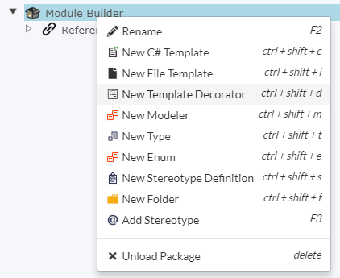
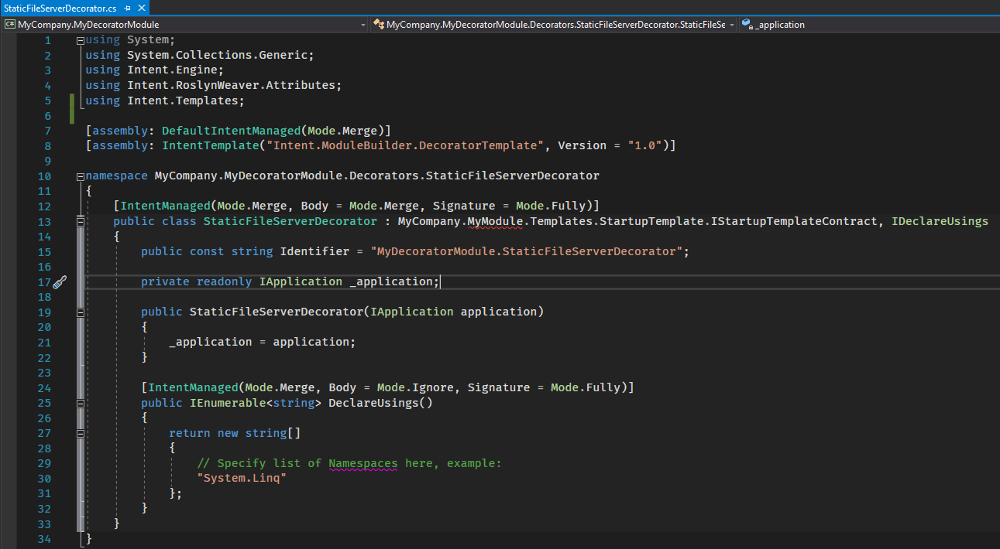

# Creating a Decorator

Once you have a Template that is able to receive [Decorators](xref:Decorator), you can now go and create your technology dependent Decorator that will inject code during code-generation time to your file that you wish to generate.

>[!TIP]
>Please ensure that you have done [this tutorial](xref:MakeTemplateExtensibleThroughDecorators) before completing this one.

## Create a Decorator Project

Using the the Intent Architect Application's Module Builder, it's easy to scaffold and wire up a new decorator.


Start by creating an Application in Intent Architect that will be used to create the Module that will contain the new Decorator for the `StartupTemplate`.

Once the application creation is complete, right-click on the `Module Builder` node to create a new Decorator called `StaticFileServerDecorator`.



We need to specify the Contract name for that Decorator so that it will know for which Template it is meant to Decorate.

To recap, the Template we're trying to Decorate is the `StartupTemplate` and it requires a Decorator that adheres to this interface:

[!code-csharp[IStartupTemplateContract](~/source_code/samples/create-new-decorator/MyModule/MyCompany.MyModule/Templates/StartupTemplate/IStartupTemplateContract.cs)]

It has a Full Namespace of: `MyCompany.MyModule.Templates.StartupTemplate.IStartupTemplateContract`

So that is the value that we need to specify in the `Full TypeName` field for that Decorator.

Ensure the `Decorator Settings`'s `Declare Usings` box is checked.


Run the software factory.


Open Visual Studio and navigate to where the code has been generated and open up the `MyCompany.MyDecoratorModule` solution.

You will notice that it has generated a Decorator as well as a Registration for the Decorator.


Although, you will notice that the IDE reports a problem with our namespace we gave it.



## Ensure the "blueprint" (or contract) assembly is referenced

To fix this issue, we need to make sure that we reference the assembly that contains `IStartupTemplateContract`.

In our case this is simple. We add a project reference to that solution.


Let's add that module as an existing project into our current solution.


Now we add that project as a reference to our new module project.

## Implement the Decorator

Add the following code to implement the `MyCompany.MyModule.Templates.StartupTemplate.IStartupTemplateContract` interface:

> [!TIP]
> You use Visual Studio's light-bulb can generate interface implementations for you:
> 

```csharp
public int Priority => 0;

public string ConfigureCode()
{
    throw new NotImplementedException();
}
```

The Priority helps to clarify in which order the Decorator gets applied. You will notice in the [Aggregate method](xref:MakeTemplateExtensibleThroughDecorators#aggregate-all-the-decorators-output) of that Template that it does an order by `Priority`.

So in our case, we want to put this at an arbitrary order and supply the value `1`.

As for the Code that we want to generate, we will write the following lines inside the `ConfigureCode` method:

[!code-csharp[StaticFileServerDecorator](~/source_code/samples/create-new-decorator/MyDecoratorModule/MyCompany.MyDecoratorModule/Decorators/StaticFileServerDecorator/StaticFileServerDecorator.cs#ConfigureCode)]

Also, with the Declare Usings section, we need to specify some namespaces that our Decorator will need to successfully apply code that will compile.

Add the following to the class to override the `DeclareUsings` method:

[!code-csharp[StaticFileServerDecorator](~/source_code/samples/create-new-decorator/MyDecoratorModule/MyCompany.MyDecoratorModule/Decorators/StaticFileServerDecorator/StaticFileServerDecorator.cs#DeclareUsings)]

We now need to add a dependency on the original Template.

Open up the `MyCompany.MyDecoratorModule.imodspec` file in Visual Studio.

You will see something resembling this:

[!code-xml[imodspec](~/source_code/samples/create-new-decorator/MyDecoratorModule/MyCompany.MyDecoratorModule/MyCompany.MyDecoratorModule.imodspec)]

In the `dependencies` section we need to add a dependency to our original Template Module.

```xml
<dependencies>
    <dependency id="Intent.Common" version="2.0.0" />
    <dependency id="Intent.Common.Types" version="2.0.0" />
    <dependency id="MyCompany.MyModule" version="1.0.0" />
</dependencies>
```

Where did we get this info?
Open up the `MyCompany.MyModule.imodspec` file in the project we imported.

At the top of that XML file you will see this:

```xml
<?xml version="1.0" encoding="utf-8"?>
<package>
  <id>MyCompany.MyModule</id>
  <version>1.0.0</version>
```

We only need the `id` and `version` fields and that gets used to specify module dependencies.

Now I can compile the solution.

## Install the Decorator Module in your application

Open up the `Test.App` in Intent Architect, click on the `Modules` on the side panel.

Click on the "gear" icon located to the right. Add the location to the new Module.


**Name**: MyDecoratorModule
**Address**: ./MyDecoratorModule/Intent.Modules

Now, select the `MyDecoratorModule` in the dropdown.


Locate the `MyCompany.MyDecoratorModule` and click on the `Install` button (located to the right).

The decorator is ready, run the software factory and you should see it showing that `Startup.cs` is to be updated:


Click the file to review the proposed changes:


Press `Apply Changes` in the software factory execution window to commit the proposed changes to your disk.

## Final steps and verification

Go to the Test.App Visual Studio solution and create a folder named `MyStaticFiles`. Create a text file `sample.txt` inside it with the content:

>This is a sample file


Once you run the solution and navigate to this URL:

>http://localhost:63681/StaticFiles/sample.txt
(port number may vary)

You should get this outcome:


