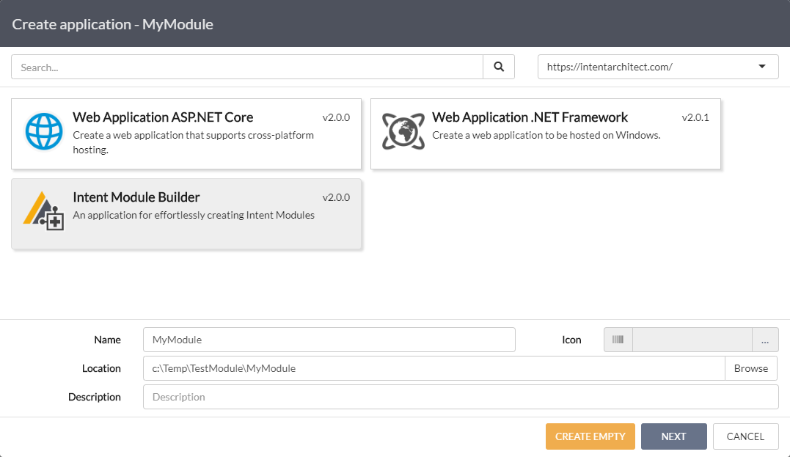
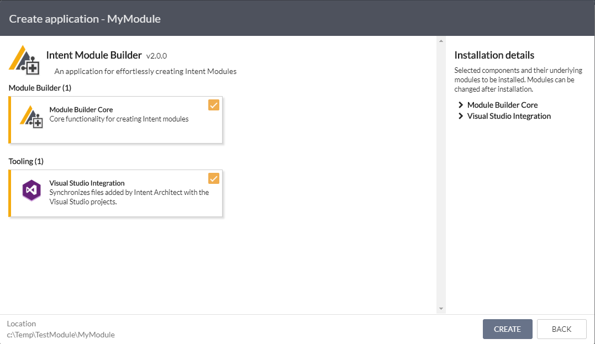
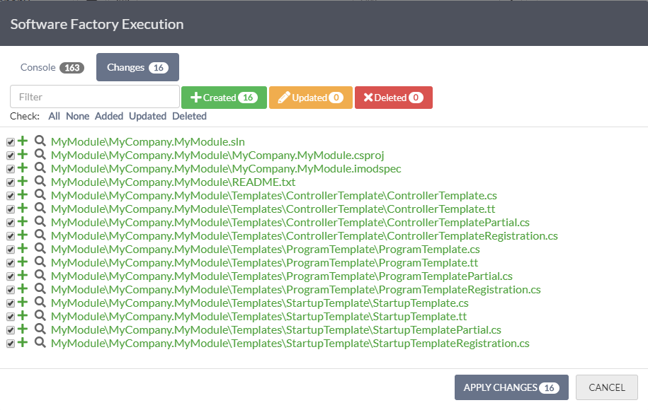
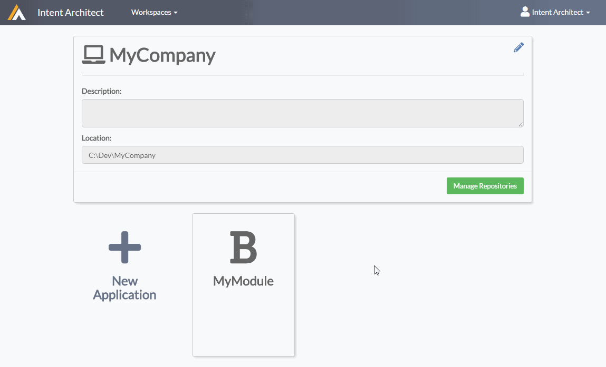
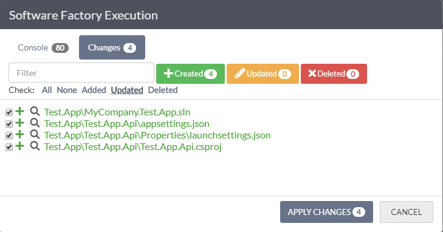
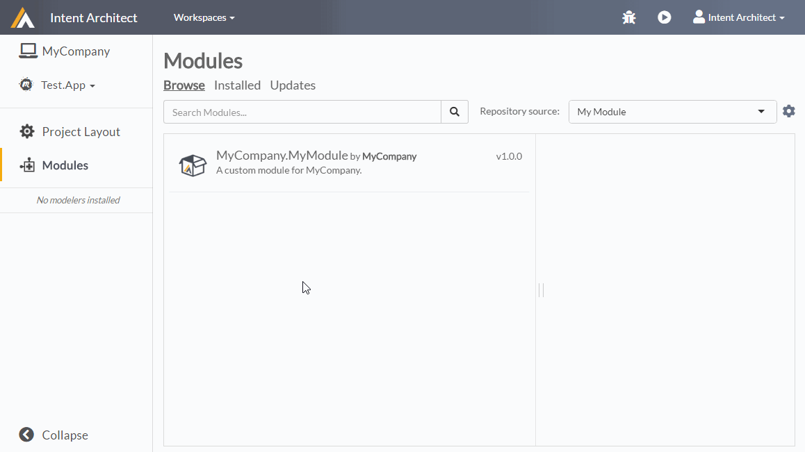
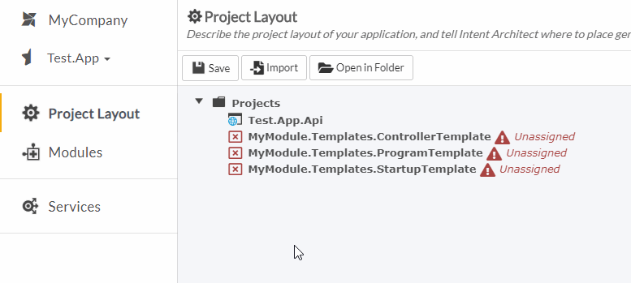

# Create your own Module

Modules are the building blocks and extension points of Intent Architect. They typically encapsulate _how_ your metadata should be realized as code in your application. 

By creating modules to automate the repetitive coding tasks that you as a developer do, you effectively save yourself (and your team!) all that time and effort. In addition, you no longer have to manage each instance of the pattern, but rather can upgrade the Module and update all instances at once.

_**"Automation is to your time, what compounding interest is to your money"** ~ Rory Vaden_

This guide will take you through the process of creating an Intent Architect Module using the _Intent Module Builder_ application template. It aims to create a Module to automate the setup of ASP.NET Core web services. While we will be codifying a basic C# pattern, it is worth noting that the Intent Module system can generate _ANY_ type of text file, which means that **_Modules can be created to generate code for ANY programming language!_**

>[!TIP]
>A basic knowledge of Intent Architect is required for this guide. If you are new to Intent Architect, it is recommended that you do the [Create an ASP.NET Core web app](create_an_aspnetcore_web_app.md) tutorial before attempting this one.

***
## Prerequisites

This guide has the following prerequisites:
 - Visual Studio 2015 or later
 - Intent Architect is installed. [See here for installation instructions](create_an_aspnetcore_web_app.md#1-installing-and-running-intent-architect).
 - A workspace has been created. [See this for how to create a workspace](create_an_aspnetcore_web_app.md#2-create-a-workspace).

***
## 1. Creating an Intent Module Builder application

To create an Intent Module Builder application, **click the New Application tile from within the workspace.**

A `Create application` wizard will be displayed, presenting a set of `application templates`.

- Select the `Intent Module Builder` application template.
- Capture the Name, Location, Icon and Description (option) of your Module Builder application.


*Select the Intent Module Builder application template*

**Click `NEXT`.**

The `Intent Module Builder` application template provides a set of components which are required for the module builder to work out the box.

**Leave all components selected and click `CREATE`.**


*Select the Intent Module Builder application template*

Intent Architect will download the necessary Modules, and once complete the application will open automatically. You can **close the Installation Manager** once this process is complete.

***
## 2. Defining Templates

For a basic ASP.NET web application, we need your Module to create the following classes when executed:
 - `Program.cs` - the standard ASP.NET Core Program class
 - `Startup.cs` - the standard ASP.NET Core Startup class
 - `{Service.Name}Controller.cs` - a controller for every service that we define within the Intent Architect `Services` modeler.

To do this we must navigate to the `Module Builder` modeler and **create a `C# Template` for each of the above.** 

>[!TIP]
>Templates represent file outputs that a Module must make. The Intent Module Builder supports two types of templates:
>1.	**File Templates** – any text file can be created using this template types.
>2.	**C# Templates** – since Intent supports intelligent weaving in C# files, this template type wires this up. It is recommended to use this type of template for all C# classes as the weaving systems allow user-managed code to co-exist with Intent-managed code within the same file.
     

Both the `Program.cs` and `Startup.cs` files are single files. To ensure that only a single file is created we need to set the `Creation Mode` template setting to `Single File (No Model)`. On the contrary, the `Controller` template must create a class for every Service that we create. We therefore set the `Creation Mode` to `File per Model` and the `Modeler` setting to `Services`.

How to do this is illustrated below:


*Create C# Templates in the Module Builder*

>[!TIP]
>The `Creation Mode` setting of a template determines what metadata format the template expects, and how files from a template must be created:
>1.	**Single File (No Model)** – create a single file without any additional metadata needed. A standalone C# class or ReadMe file would be examples of this template setting. 
>2.	**Single File (Model List)** – create a single file which takes in a list of metadata models. This is useful for creating classes which register other classes.
>3.	**File per Model** – create a file per metadata model. This is useful for creating a file based on a model such as a Domain class, Service, or DTO.
>4. **Custom** – you're on your own on this one. A `Registration` class (responsible for constructing template instances) won't be created for this template. You will have to create one yourself. This is useful when you want to create instances of a file in ways that are not supported by the previous options.

>The `Modeler` setting determines which _type_ of modeler the metadata should be fetched from for the template. This can be `Domain`, `Services`, `Eventing`, etc. When setting up your Module, the `Intent Module Builder` will automatically add the modeler dependency depending on which `Modeler` you have selected. Nice :)

***
## 3. Run the `Software Factory`

To run the `Software Factory`, **click the _'play'_ button** in the top right hand corner (or press F5).

The following outputs are staged before being applied:


*Software Factory Execution - staged outputs*

**Click the `APPLY CHANGES` button.**

The `Software Factory` will apply the staged code changes from the list, and install the required NuGet packages. Once the NuGet packages have been installed, we can close the `Software Factory Execution` window.

**Click the `CLOSE` button.**

Your module has now been created and wired up. Next, we need to implement our templates to give the desired output.

***
## 4. Implementing and packaging the Module

**Open the generated Module solution in Visual Studio.** The Visual Studio Solution (`.sln`) file is located in the application folder. A shortcut to navigate here is to click on the 'Open in Folder' button in the 'Project Layout' view the application.

The solution will be layed out as follows:


*Module layout in Visual Studio*

>[!TIP]
>In the solution we will find an [Intent Module Specification](../modules/imodspec_file.md) (`.imodspec`) file, a `README.txt` file, and our three templates under the 'Templates' folder.

>Notice that each template has three files:
>1.	**T4 Template file** – defines the template logic and output. [Learn more about T4 Templates.](https://docs.microsoft.com/en-us/visualstudio/modeling/code-generation-and-t4-text-templates?view=vs-2017)
>2.	**Template Partial file** – this is a partial class to the T4 template and is responsible for defining the settings of the template and any ‘code-behind’ methods for the T4.
>3.	**Template Registration file** – this file determines how the template is created (i.e. it determines how many output instances must be created, and what _metadata_ should be loaded and passed to each template instance.)

### 4.1 Implementing the `ProgramTemplate`:

Let's begin with the ProgramTemplate. **Open the `ProgramTemplate.tt` T4 file**. The file is generated as follows:

```csharp
<#@ template language="C#" inherits="IntentRoslynProjectItemTemplateBase<object>" #>
<#@ assembly name="System.Core" #>
<#@ import namespace="System.Collections.Generic" #>
<#@ import namespace="System.Linq" #>
<#@ import namespace="Intent.Modules.Common" #>
<#@ import namespace="Intent.Modules.Common.Templates" #>
<#@ import namespace="Intent.Metadata.Models" #>

using System;
<#=DependencyUsings#>
// Mode.Fully will overwrite file on each run. 
// Add in explicit [IntentManaged.Ignore] attributes to class or methods. Alternatively change to Mode.Merge (additive) or Mode.Ignore (once-off)
[assembly: DefaultIntentManaged(Mode.Fully)]

namespace <#= Namespace #>
{
    public class <#= ClassName #>
    {
    }
}
```

The template above will simply output an empty C# class. The `ClassName` and `Namespace` are determined by the Template's metadata, which can be found by opening the `ProgramTemplatePartial.cs` file and viewing the `DefineRoslynDefaultFileMetaData` method:

```cs
protected override RoslynDefaultFileMetaData DefineRoslynDefaultFileMetaData()
{
    return new RoslynDefaultFileMetaData(
        overwriteBehaviour: OverwriteBehaviour.Always,
        fileName: "Program",
        fileExtension: "cs",
        defaultLocationInProject: "",
        className: "Program",
        @namespace: "${Project.Name}"
    );
}
```

Here we can see that the `ClassName` will be `"Program"`, and the namespace will be dynamically set to the name of the project in which it is outputted (`${Project.Name}`). [Learn more about template configuration.](../templates/configuration.md)

>[!TIP]
>Visual Studio unfortunately doesn't offer syntax highlighting on T4 files out the box. We recommend installing the [tangible T4 Editor](https://t4-editor.tangible-engineering.com/T4-Editor-Visual-T4-Editing.html) extension for Visual Studio.

>It isn't required to implement Templates using T4, although we do recommend it. If you'd like to implement a template using a `StringBuilder` or other technology, delete the T4 file and implement the `string TransformText()` method in the Template Partial file.


**Update the contents of the `ProgramTemplate.tt` as follows:**

```csharp
<#@ template language="C#" inherits="IntentRoslynProjectItemTemplateBase<object>" #>
<#@ assembly name="System.Core" #>
<#@ import namespace="System.Collections.Generic" #>
<#@ import namespace="System.Linq" #>
<#@ import namespace="Intent.Modules.Common" #>
<#@ import namespace="Intent.Modules.Common.Templates" #>
<#@ import namespace="Intent.Metadata.Models" #>

using Intent.RoslynWeaver.Attributes;
using Microsoft.AspNetCore;
using Microsoft.AspNetCore.Hosting;
<#=DependencyUsings#>

[assembly: DefaultIntentManaged(Mode.Fully)] // Overwrite this file on each Software Factory run.

namespace <#= Namespace #>
{
    public class <#= ClassName #>
    {
        public static void Main(string[] args)
        {
            BuildWebHost(args).Run();
        }

        public static IWebHost BuildWebHost(string[] args) =>
            WebHost.CreateDefaultBuilder(args)
                .UseStartup<Startup>()
                .Build();
    }
}
```


### 4.2 Implementing the `StartupTemplate`:

Next, **update the contents of the `StartupTemplate.tt` as follows:**

```csharp
<#@ template language="C#" inherits="IntentRoslynProjectItemTemplateBase<object>" #>
<#@ assembly name="System.Core" #>
<#@ import namespace="System.Collections.Generic" #>
<#@ import namespace="System.Linq" #>
<#@ import namespace="Intent.Modules.Common" #>
<#@ import namespace="Intent.Modules.Common.Templates" #>
<#@ import namespace="Intent.Metadata.Models" #>

using Intent.RoslynWeaver.Attributes;
using Microsoft.AspNetCore.Builder;
using Microsoft.AspNetCore.Hosting;
using Microsoft.Extensions.Configuration;
using Microsoft.Extensions.DependencyInjection;
<#=DependencyUsings#>

[assembly: DefaultIntentManaged(Mode.Fully)] // Overwrite this file on each Software Factory run.

namespace <#= Namespace #>
{
    public class <#= ClassName #>
    {
        public <#= ClassName #>(IConfiguration configuration)
        {
            Configuration = configuration;
        }

        public IConfiguration Configuration { get; }

        // [IntentManaged(Mode.Ignore)] // Uncomment to take over configuring services
        public void ConfigureServices(IServiceCollection services)
        {
            services.AddMvc();
        }

        // [IntentManaged(Mode.Ignore)] // Uncomment to take over configuring the HTTP request pipeline
        public void Configure(IApplicationBuilder app, IHostingEnvironment env)
        {
            if (env.IsDevelopment())
            {
                app.UseDeveloperExceptionPage();
            }

            app.UseMvc();
        }
    }
}
```

### 4.3 Implementing the `ControllerTemplate`:

Lastly, **update the contents of the `ControllerTemplate.tt` as follows:**

```csharp
<#@ template language="C#" inherits="IntentRoslynProjectItemTemplateBase<IClass>" #>
<#@ assembly name="System.Core" #>
<#@ import namespace="System.Collections.Generic" #>
<#@ import namespace="System.Linq" #>
<#@ import namespace="Intent.Modules.Common" #>
<#@ import namespace="Intent.Modules.Common.Templates" #>
<#@ import namespace="Intent.Metadata.Models" #>

using Intent.RoslynWeaver.Attributes;
using Microsoft.AspNetCore.Mvc;
<#=DependencyUsings#>

[assembly: DefaultIntentManaged(Mode.Merge)] // Allowing additive updating of this file, while keeping user implementations

namespace <#= Namespace #>
{
    [Route("api/[controller]")]
    public class <#= ClassName #> : Controller
    {

<#  foreach(var operation in Model.Operations) { #>
        [HttpGet("[action]")]
        public IActionResult <#= operation.Name.ToPascalCase() #>(<#= string.Join(", ", operation.Parameters.Select(x => string.Format("{0} {1}", Types.Get(x.Type), x.Name))) #>)
        {
            return Ok("It's working!");
        }

<#  } #>
    }
}
```

>[!TIP]
>Notice the parameter type is provided by calling `Types.Get(x.Type)`. This is the Intent _Types_ system that simplifies converting types specified in the modeler to actual C#, Typescript, Java, etc. types. This system is enabled automatically by installing the `Intent.Common.Types` module (_which is set as a dependency by default for this module. See the `.imodspec` file, under dependencies._)

For the controllers, we want the class name to have `Controller` appended to the service name. To do this we need to **update the `ControllerTemplatePartial.cs` file as follows:**

```csharp
using Intent.Metadata.Models;
using Intent.Modules.Common.Templates;
using Intent.RoslynWeaver.Attributes;
using Intent.SoftwareFactory.Engine;
using Intent.SoftwareFactory.Templates;

[assembly: DefaultIntentManaged(Mode.Merge)]
[assembly: IntentTemplate("Intent.ModuleBuilder.RoslynProjectItemTemplate.Partial", Version = "1.0")]

namespace MyCompany.MyModule.Templates.ControllerTemplate
{
    [IntentManaged(Mode.Merge, Body = Mode.Merge, Signature = Mode.Fully)]
    partial class ControllerTemplate : IntentRoslynProjectItemTemplateBase<IClass>
    {
        public const string TemplateId = "MyModule.ControllerTemplate";

        public ControllerTemplate(IProject project, IClass model) : base(TemplateId, project, model)
        {
        }

        public override RoslynMergeConfig ConfigureRoslynMerger()
        {
            return new RoslynMergeConfig(new TemplateMetaData(Id, "1.0"));
        }

        [IntentManaged(Mode.Merge, Body = Mode.Ignore, Signature = Mode.Fully)]
        protected override RoslynDefaultFileMetaData DefineRoslynDefaultFileMetaData()
        {
            return new RoslynDefaultFileMetaData(
                overwriteBehaviour: OverwriteBehaviour.Always,
                fileName: "${Model.Name}Controller",
                fileExtension: "cs",
                defaultLocationInProject: "Controllers",
                className: "${Model.Name}Controller",
                @namespace: "${Project.ProjectName}.Controllers"
            );
        }
    }
}
```
### 4.4 Packaging the Module

To package the module, we simply **build the solution** (_Build -> Build Solution_).

This will create a `MyCompany.MyModule.1.0.0.imod` file in the `${SolutionFolder}/Intent.Modules` folder.

>[!TIP]
>Notice that the Module file name contains the version number `1.0.0`. This is specified in the `.imodspec` file. Each time we build the solution, this file will be overwritten. To create a new version, update the `.imodspec` version number and rebuild.

*Your Module is packaged and ready for use. Now to test it...*

***

## 5. Testing the Module

To test your Module, we need to do the following:
 1. **Create a Test Application** - a _sandbox_ application for us to test your Module's output.
 2. **Configure local Module repository** - so that we can find your Module in Intent Architect.
 3. **Install your Module** - find your Module and install it.
 4. **Create a test Service** - so that your `ControllerTemplate` has some Services metadata.
 5. **Run the Software Factory** - to see your Module in action
 6. **Open and run the Test Application** - test that the generated code works!

### 5.1 Create a Test Application
Before we install the Module, let's create an empty application so that the outputs of your Module are obvious. 

**Navigate back to the workspace** by clicking `MyCompany` in the left side menu.

**Click the `New Application` tile** then in the `Create Application` wizard, **fill out the application's name and click `CREATE EMPTY`**. When prompted to confirm you wish to create an empty application, **click `YES`**.



*Create Empty Application*

>[!TIP]
>An `Empty Application` contains no Modules or Project Layout. It's a clean slate and allows you to pick and choose every Module you wish to install, and configure your project layout from scratch.

We will need a Project to install your Module outputs into. Since we're working in .NET Core and Visual Studio, let's **install the `Intent.VisualStudio.Projects` module.** To do this, navigate to the `Modules` view and type search for 'Intent.VisualStudio.Projects' by typing it into the search bar and clicking search. The `Intent.VisualStudio.Projects` Module will appear. Click it and in the details window on the right, click the `Install` button. Once the Module has been installed, **navigate back to the `Project Layout` view**.

**Add an `ASP.NET Core Web Application` project to your `Project Layout`** by right clicking on the `Projects` folder and clicking `New Project...`. Select the `ASP.NET Core Web Application` project option, fill in the project name, and click `CREATE`.


*Add ASP.NET Core Web Application project*

**Run the `Software Factory` to set generate the this project.**



*Software Factory Execution to create test application*

**Click `APPLY CHANGED` and close the `Software Factory Execution` dialog.**

### 5.2 Configure local Module repository
Next, we need to configure your local Module repository (_where our Module was created_) so that we can find it from within Intent Architect. **Navigate to the `Modules` view and click the _'cog'_ icon to the right of the `Repository source` dropdown. Add our local repository location as a full or relative path:**


*Add a local Module repository*

**Click `SAVE`.**

>[!TIP]
>You can add full paths, relative paths and even network locations as repositories. This makes it very easy to share your Modules with other developers in your organization.

### 5.3 Install your Module
Now **select your local repository** from the `Repository source` dropdown. The modules list will automatically refresh and your Module should appear. If it does not, ensure that you have successfully rebuild the Module in Visual Studio and that the path to the local repository is correct.

**Select your Module and install it**. Notice that _unassigned_ `Roles` were added as part of the installation. These represent the output targets that your module has created. `Roles` allow you to specify where in your codebase you would like the Module to place outputs. This is configured in the `Project Layout`.


*Installing your Module*

**Navigate to the `Project Layout` view** and assign them to our `ASP.NET Core Web Application` project by dragging them onto it.



*Assign Roles*

>[!TIP] 
>Select multiple elements in any of the modelers by holding down _shift_ or _ctrl_.

### 5.4 Create a test Service
You may have noticed that the `Services` modeler is installed with your Module. This is because a dependency on the `Intent.Modelers.Services` module (_which installs the `Services` modeler_) is configured in the `.imodspec` file. **Navigate to the `Services` modeler and create a `TestService` service with a `TestMe` operation:**


*Test Service*

### 5.5 Run the Software Factory

**Run the `Software Factory` to run your Module.** The following will be outputted:


*Module output*

**Click `APPLY CHANGED` and close the `Software Factory Execution` dialog.**

### 5.6 Open and run the Test Application

Finally, we can test that your Module is creating code that actually works. Test this by performing the following steps:
1. **Open the generated application in Visual Studio.** Open the generated classes to confirm that the code was outputted correctly. For example, the `TestServiceController.cs` file should look as follows:
    ```csharp
    using Intent.RoslynWeaver.Attributes;
    using Microsoft.AspNetCore.Mvc;


    [assembly: DefaultIntentManaged(Mode.Merge)] // Allowing additive updating of this file, while keeping user implementations
    [assembly: IntentTemplate("MyModule.ControllerTemplate", Version = "1.0")]

    namespace Test.App.Api.Controllers
    {
        [Route("api/[controller]")]
        public class TestServiceController : Controller
        {

            [HttpGet("[action]")]
            public IActionResult TestMe()
            {
                return Ok("It's working!");
            }

        }
    }
    ```
2. **Build and run the solution** (_press F5_). The web application will launch in the browser.
3. **Append `/api/testservice/testme` to the url** to test that our service works.
    We should get the following response:

    

    *Hitting the `TestService` in from the browser*

***
## Summary

In this guide we created a Module that creates simple ASP.NET Core Controllers for services that we describe in Intent Architect. While we would not recommend using a pattern like this one in a production system, it serves to illustrate how a pattern can be codified and packaged into a Module for reuse.

>[!TIP]
>The Intent Module system is incredibly versatile and is not limited to creating C# classes. Any text file can be generated, which means that any programming language can be generated!