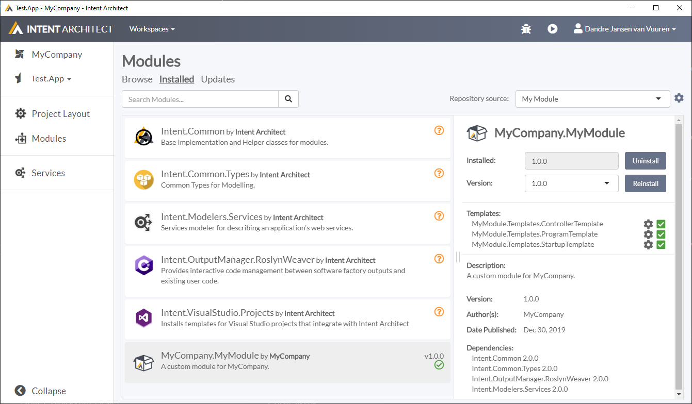

# Making a Template Decorator Ready

You will notice that templates, by themselves, are quite static in nature. If you have created a template that generates a file for a specific technology configuration, you will have to update the template again if you want to add another kind of technology configuration. We will show you how to overcome this by using [Decorators](xref:Decorator).

>[!TIP]
>Please make sure you have done [this tutorial](xref:TutorialCreateModule) before completing this one.

## Create "blueprint" (or contract)

So we want to update the `StartupTemplate` to be extensible for new kinds of configurations installed by Intent Architect Modules.
Open up Visual Studio and open up the solution containing the `StartupTemplate` Template that you wish to update.

First, we need a "blueprint" (or contract for enterprise developers).
You can create an abstract class or interface, depending on what you need, in one of two ways:
- Create it inside the current Module.
- Create a separate project to host this class/interface.

For simplicity, we will host this in the same module as what we're modifying.

Let's create an interface called `IStartupTemplateContract`. You may need to add the using namespace "using Intent.Templates;" at the top of the file.

[!code-csharp[IStartupTemplateContract](~/source_code/samples/make-template-decorator-ready/MyModule/MyCompany.MyModule/Templates/StartupTemplate/IStartupTemplateContract.cs)]

Make note to copy the namespace and the interface name for what we're about to do next.

## Add Expose Decorator Contract Stereotype

Open up the Module project in Intent Architect and go to the `Module Builder` modeler.


Right click on the `StartupTemplate` item (as above) and add the `Exposes Decorator Contract` stereotype.


Paste in the namespace and interface name in the `Type FullName` field.

> MyCompany.MyModule.Templates.StartupTemplate.IStartupTemplateContract

Run the Software Factory in Intent Architect and apply the change.


In the `StartupTemlateParial.cs` file, you will notice the following changes being made:

- `IHasDecorators<MyCompany.MyModule.Templates.StartupTemplate.IStartupTemplateContract>` has been added to the class's inheritance list.
- The definition of that interface has been populated for you:

```csharp
private ICollection<MyCompany.MyModule.Templates.StartupTemplate.IStartupTemplateContract> _decorators = new List<MyCompany.MyModule.Templates.StartupTemplate.IStartupTemplateContract>();

[IntentManaged(Mode.Fully)]
public void AddDecorator(MyCompany.MyModule.Templates.StartupTemplate.IStartupTemplateContract decorator)
{
    _decorators.Add(decorator);
}

[IntentManaged(Mode.Fully)]
public IEnumerable<MyCompany.MyModule.Templates.StartupTemplate.IStartupTemplateContract> GetDecorators()
{
    return _decorators;
}
```

## Aggregate all the Decorators output

Let's create a method that will aggregate all the Decorator output into a single string in that same class:

[!code-csharp[StartupTemplatePartial](~/source_code/samples/make-template-decorator-ready/MyModule/MyCompany.MyModule/Templates/StartupTemplate/StartupTemplatePartial.cs#GetConfigureCode)]

## Generate the injected code in Template

Now lets go to the `StartupTemplate.tt` file and make a call to this newly defined method:

```csharp
// [IntentManaged(Mode.Ignore)] // Uncomment to take over configuring services
public void Configure(IApplicationBuilder app, IHostingEnvironment env)
{
    if (env.IsDevelopment())
    {
        app.UseDeveloperExceptionPage();
    }

    <#= GetConfigureCode() #>
    app.UseMvc();
}
```

This will now allow a Decorator to use the interface being provided to inject new code into this Template.

Recompile this project to ensure the Module is built.

## Re-install that Module in your application

Open up the `Test.App` in Intent Architect, click on the `Modules` on the side panel and then on the `Installed` link at the top of the page.

In the Repository dropdown, select `My Module`.



Locate the `MyCompany.MyModule` and click on the `Reinstall` button located on the right-side panel.

When you click on the Code Generation run, there will be one change that it will attempt to make which is an empty line. This is ok. Just proceed to apply.

This concludes this Tutorial. If you need to create a Decorator for this Template, please follow the Tutorial located [here](xref:CreateNewDecorator).