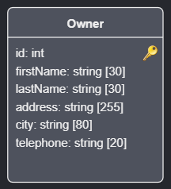
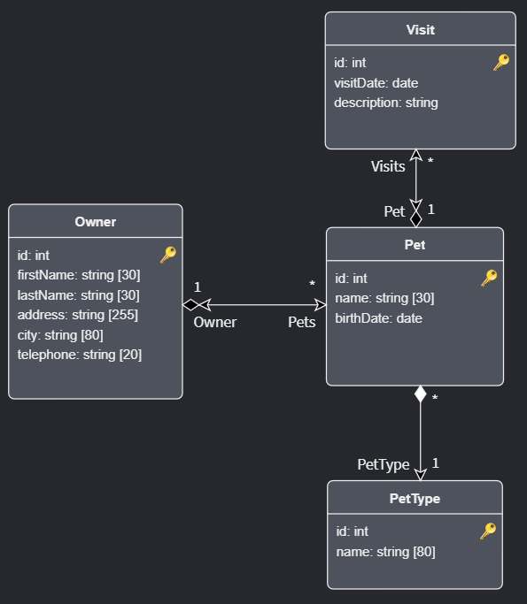

# Create Pet Clinic for the .NET C# Technology Stack

## Prerequisites

- Ensure Intent Architect has been [installed](xref:getting-started.get-the-application).
- The latest [Microsoft Visual Studio for Windows/Mac](https://visualstudio.microsoft.com/), [JetBrains Rider](https://www.jetbrains.com/rider/download/) or any other IDE capable of working with .NET Core projects.

## Create a Sample Pet Clinic Application

On the home screen click `Create a new application`.

Choose the .NET 5.0 Core Application Template.
Fill in a `Name` (such as `PetClinicRest`), review/change the `Location` as desired and click `NEXT`.

You can glance over the modules that it wants to install but you can just continue to click on `CREATE`.

An `Application Installation` dialogue will pop up showing the progress of downloading and installing Modules and Metadata for the Application, once it's finished it will show `Process complete.` and you can click the `CLOSE` button:

<p><video style="max-width: 100%" muted="true" loop="true" autoplay="true" src="videos/create-new-app.mp4"></video></p>

## Setting up the Domain

Starting off, we want to create the Pet Clinic domain since this will form part of the core application logic and how we will persist the data in the backend.
Click on the `Domain` designer located on the left panel.

You will be prompted with a dialog box asking you for a name for this Domain package. You can go ahead and create with the Default name.

<p><video style="max-width: 100%" muted="true" loop="true" autoplay="true" src="videos/create-domain-package.mp4"></video></p>

### Creating the Domain Entities

In this little Pet Clinic application, there will be the concept of a `Pet` that needs to `Visit` a `Vet` and a `Pet` belongs to an `Owner`.

Add a `Pet` Entity by right clicking on the diagram and selecting `New Class` _or_ you can even right click on the tree-view (on the right hand side) on the `Domain` package item and also selecting `New Class`.

Add the following fields to this `Pet` Entity by also right clicking on the `Pet` diagram element _or_ on the `Pet` tree-view element and then selecting `Add Attribute`.

Add the attributes:
 * `id` of type `int`
 * `name` of type `string`
 * `birthDate` of type `date`

<p><video style="max-width: 100%" muted="true" loop="true" autoplay="true" src="videos/create-entity-pet.mp4"></video></p>

Before the `Pet` is complete, there are two minor adjustments that would need to be made to help indicate to the backend persistence layer (i.e. the Database) that the `id` attribute will act as a `Primary Key` and another concern is to limit the length of the `name` field to 30 characters. This can be achieved by adding [Stereotypes](xref:references.stereotypes) to Class attributes.

To do this, right click on the `id` attribute and select `Add Stereotype`. This will present a list of stereotypes for you to add. Select the `Primary Key` stereotype from the list.

Next select the `name` attribute and add the `Text Constraints` stereotype.
Once added, you will need to specify the `Max Length` to be 30.

<p><video style="max-width: 100%" muted="true" loop="true" autoplay="true" src="videos/add-pet-stereotypes.mp4"></video></p>

Next, create an Entity `Owner` and supply the fields:
 * `id` of type `int` (Primary Key)
 * `firstName` of type `string` (Max Length: 30 characters)
 * `lastName` of type `string` (Max Length: 30 characters)
 * `address` of type `string` (Max Length: 255 characters)
 * `city` of type `string` (Max Length: 80 characters)
 * `telephone` of type `string` (Max Length: 20 characters)

This is how it should look like:


Next you need to add a composite association so that an `Owner` would have one-or-many `Pets`.
To do this, you need to start with the `Owner` Entity and right click on it and selecting `New Association`.
Notice that a dynamic arrow will appear, starting from the `Owner` entity and following your mouse cursor. Left click on the `Pet` Entity in order to finalize the association. It will now show a straight line with a many-to-one association. This is not the association that you are looking for, instead click on that arrow line and move your attention to the right-hand panel. In the `Target End` you need to ensure that the `Is Collection` is checked and in the `Source End` you need to ensure that the `Navigable` is checked and the `Is Collection` is not.

<p><video style="max-width: 100%" muted="true" loop="true" autoplay="true" src="videos/add-owner-pet-association.mp4"></video></p>

>[!NOTE]
>To learn more about these associations, visit [this article](xref:references.domain-designer.associations) for more information.

As an exercise to the reader, try to create the following diagram:



## Creating API Services

Now that you have defined your domain, it would be useful to be able to interact with it especially from an API Services perspective.
Click on the `Services` designer located on the left panel.

You will be prompted with a dialog box asking you for a name for this Services package. You can go ahead and create with the Default name.

<p><video style="max-width: 100%" muted="true" loop="true" autoplay="true" src="videos/create-services-package.mp4"></video></p>

In this designer you will notice that its more simple to work with than the Domain designer since all we need to do is setup Services and their Data Contracts (usually referred to as DTOs - or Data Transfer Objects).

Start off by creating a `OwnerRestController` service in the `Services` package by right clicking on the `Services` package and selecting `New Service`.
It should look like this:


Before we continue with adding Service operations, let's first define a few Data Contracts that will give structure to our Service operations.
Let's create a new Package and call it `DTOs`.
Right click somewhere in the background and select `Create new package`. Give it the name `DTOs`. Click on the `Save` button. Click on the References section of the `Services` package and select the newly created `DTOs` package. Click on `Save` again.

<p><video style="max-width: 100%" muted="true" loop="true" autoplay="true" src="videos/create-services-dtos-package.mp4"></video></p>

Go ahead and right click on the `DTOs` package and create a new `DTO`. Name the DTO, `OwnerDTO`. To preempt the rest, create also the following:
 * `PetDTO`
 * `PetVisitDTO`

It should look like this in the end:


The next section will outline some of the features of Intent Architect which entails doing Domain to DTO mapping.

Starting with the `PetVisitDTO`, right click on it and select `Mapping...`.
Click on the dropdown saying `Select an element to map from`.
Notice that you will now see all your Domain Entities in that dropdown.
Choose the `Visit` Entity.
Select only the top-most attributes to map from.

<p><video style="max-width: 100%" muted="true" loop="true" autoplay="true" src="videos/service-mapping-pet-visit.mp4"></video></p>

The following DTO mapping will feature some more advanced capabilities that Intent Architect has to offer. Right click on the `PetDTO` and select `Mapping...`.
Select the `Pet` Entity from the empty dropdown.
Select the top-most attributes and then in the `PetType` association, expand it and select its `id` and `name` fields. Select the Owner association, expand it and select the `id`, `firstName` and `lastName` fields. Lastly, choose the `Visit` association in its entirety. You will notice that it will highlight an error as you will need to choose the DTO that it needs to map to. This is why you had to do the `PetVisitDTO` first since you can now select that DTO in this case.

Once the mapping is completed, you're not done yet. Notice that you have fields that have the same name on this DTO. This will never work in the implementation layer. You will also find that with each field in the DTO there are arrow icons and text that follow it. This is Intent Architect's notation to indicate which fields from the Domain Entity will map to the DTO fields. Locate the attribute that is mapped from the `PetType` Entity.
Rename those fields to be prefixed with `petType`. For the `Owner` attributes, prefix them with `owner`.

>[!NOTE]
>As you prefix those attributes with lowercase letters it may be important to still retain Camel casing for consistency reasons

<p><video style="max-width: 100%" muted="true" loop="true" autoplay="true" src="videos/service-mapping-pet.mp4"></video></p>

Lastly we need to map the `OwnerDTO` to look like this:


Now you are ready to create a service operation. Right click on the `OwnerRestController` to add the new `getOwners` service. Make sure it has a return type of `OwnerDTO` (as a collection) and set the HTTP Verb to `GET`.

>[!WARNING]
>You might find that your list of DTOs in the `DTOs` package may not always appear immediately. As a workaround, ensure you have saved your work and navigate away to another designer/screen then come back to the Services designer.

<p><video style="max-width: 100%" muted="true" loop="true" autoplay="true" src="videos/services-add-get-owners.mp4"></video></p>

Now that you have a service that can return all the owners, you need a way to add a new owner via the API services. So go ahead and create that service.
First go to the `DTOs` package and create a `OwnerCreateDTO` and manually add the following fields to it to look like this:


Next create a service called `addOwner`. It should have a `dto` parameter of type `OwnerCreateDTO` and an HTTP Verb `POST`.

<p><video style="max-width: 100%" muted="true" loop="true" autoplay="true" src="videos/services-add-add-owner.mp4"></video></p>

## Generate the code

At this point you might be eager to see what the outcome would look like from all the modeling that has been done already. Go ahead and click on the big Play button located on the top right part of the screen. This will be referred to as doing a `Software Factory Execution`. Go ahead and perform this action.

<p><video style="max-width: 100%" muted="true" loop="true" autoplay="true" src="videos/software-factory-run.mp4"></video></p>

You will notice a dialog presenting itself with a long list of information about the Software Factory Execution that will eventually present the list of files that it wants to affect. This part of the process is called the staging area where you can inspect the output before you apply it.
Go ahead and locate a file called `OwnerRestController` (you're welcome to try and search for it).


You will notice three files. Click on the one located in the `Implementation` folder.


By default it will open up VSCode to show you a `diff` view of the changes. Here you can clearly see how it wants to create a Class that includes the two operations we made for that service we created in the `Services` designer. It doesn't look very promising to think that for our basic CRUD application that we have to do the implementation ourselves. So go back to Intent Architect and cancel the Software Factory Execution.

Open up the Modules section on the left panel and locate the following Modules to install:

 * Intent.EntityFrameworkCore.Repositories
 * Intent.Application.ServiceImplementations.Conventions.CRUD

After installing those modules, execute the Software Factory again and click on the file `OwnerService`.


Notice anything different? The service operations has been implemented for you. 

>[!IMPORTANT]
>The installed modules will only implement the code for you on CRUD based operations and not for more complicated service operations

## Test your application backend

You are actually now in a good position to apply these changes, compile your project and run it.

Once you have managed to get it up and running, a browser window will appear. In the address bar, type `/swagger` to be directed to the swagger page.


Click on the `POST` version of the `/api/OwnerRest` panel and then click on the `Try it out` button.

Paste the following in the request body text box:

```json
{
  "firstName": "Sherlock",
  "lastName": "Holmes",
  "address": "221B Baker Street",
  "city": "London",
  "telephone": "020 7234 3456"
}
```

Next click on the `Execute` blue button.

It should come back with success.


Next let's try and query all the Owners by going to the `GET` version of the `/api/OwnerRest` panel and click on the `Try it out` button followed by clicking on the blue `Execute` button.


It should also come back with success.

## What's Next

### Finish the Implementation

You have only implemented a small portion of the application in order to get acquainted with Intent Architect.

You are welcome to try and implement the rest of the services yourself so that you can have `Pets` with `Owners` and `Pets` make `Visits` to the `Vet`, etc.

Alternatively you may choose to go to the next tutorial.

### [Tutorial: Create a Module (.NET)](xref:tutorials.create-a-module.introduction)

Tutorials on how to create a Module and install it into an Application.

Modules are the building blocks for how to automate your infrastructural and architectural patterns